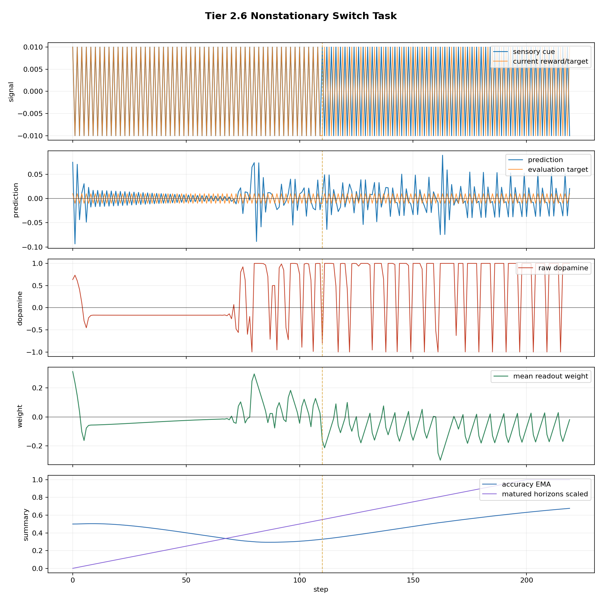

# Tier 2 Controlled Learning Findings

- Generated: `2026-04-26T19:27:15+00:00`
- Backend: `nest`
- Overall status: **STOPPED**
- Steps per run: `220`
- Base seed: `42`
- Fixed population: `True`
- Output directory: `/Users/james/Kimi_Agent_Spinnaker Neuromorphic Design/controlled_test_output/_phase3_probe_noecology`

Tier 2 is a positive-control tier. These tests check whether the organism can learn causal cue/outcome structure, delayed consequence, and a switched rule after Tier 1 ruled out obvious fake learning.

## Artifact Index

- JSON manifest: `tier2_results.json`
- Summary CSV: `tier2_summary.csv`

## Summary

| Test | Status | Key metric | Notes |
| --- | --- | --- | --- |
| `nonstationary_switch` | **FAIL** | pre=0.75, post_final=0.833333, recovery=0 | Failed criteria: pre-switch accuracy |

## nonstationary_switch

Status: **FAIL**

Criteria:

| Criterion | Value | Rule | Pass |
| --- | ---: | --- | --- |
| pre-switch accuracy | 0.75 | >= 0.8 | no |
| post-switch disruption | 0.833333 | <= 0.9 | yes |
| final post-switch accuracy | 0.833333 | >= 0.8 | yes |
| recovery time | 0 | <= 60 | yes |
| final inverse readout weight | -0.018634 | <= 0 | yes |

Artifacts:

- `timeseries_csv`: `nonstationary_switch_timeseries.csv`
- `plot_png`: `nonstationary_switch_timeseries.png`

## Stop Condition

Execution stopped after `nonstationary_switch` because `--stop-on-fail` was enabled.
