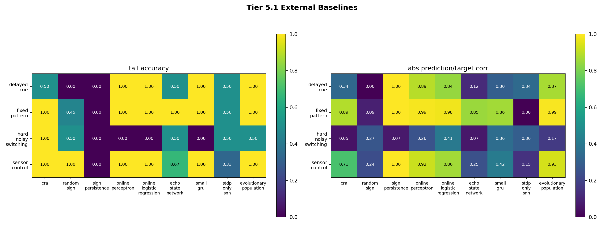
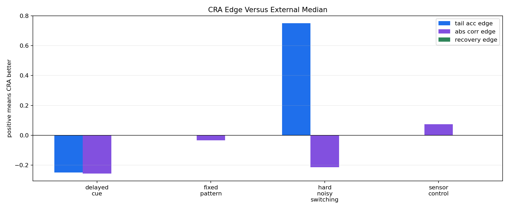

# Tier 5.1 External Baselines Findings

- Generated: `2026-04-27T03:25:15+00:00`
- Status: **PASS**
- CRA backend: `mock`
- Seeds: `42`
- Steps per task: `80`
- Output directory: `controlled_test_output/_tier5_1_smoke`

Tier 5.1 compares CRA against simpler learners under identical online streams. Every model predicts before seeing the label; delayed tasks only update when consequence feedback matures.

## Claim Boundary

- This is a controlled external-baseline comparison, not a hardware result.
- Success does not require CRA to win every task or every metric.
- The claim is limited to whether CRA shows a defensible advantage under delay, sensor/control transfer, noise, nonstationarity, or recovery versus the external median while documenting best external competitors.

## Models

- `cra` (CRA)
- `random_sign` (chance)
- `sign_persistence` (rule)
- `online_perceptron` (linear)
- `online_logistic_regression` (linear)
- `echo_state_network` (reservoir)
- `small_gru` (recurrent)
- `stdp_only_snn` (snn_ablation)
- `evolutionary_population` (population)

## Aggregate Summary

| Task | Model | Family | Tail acc | Overall acc | Corr | Recovery | Runtime s |
| --- | --- | --- | ---: | ---: | ---: | ---: | ---: |
| delayed_cue | `cra` | CRA | 0.5 | 0.3 | -0.336557 | None | 0.20844 |
| delayed_cue | `echo_state_network` | reservoir | 0.5 | 0.5 | -0.118455 | None | 0.00198788 |
| delayed_cue | `evolutionary_population` | population | 1 | 0.9 | 0.869925 | None | 0.00216708 |
| delayed_cue | `online_logistic_regression` | linear | 1 | 0.8 | 0.840846 | None | 0.000902416 |
| delayed_cue | `online_perceptron` | linear | 1 | 0.8 | 0.894427 | None | 0.00064225 |
| delayed_cue | `random_sign` | chance | 0 | 0.5 | 0 | None | 0.00097425 |
| delayed_cue | `sign_persistence` | rule | 0 | 0 | -1 | None | 0.000528875 |
| delayed_cue | `small_gru` | recurrent | 1 | 0.6 | 0.303215 | None | 0.00215054 |
| delayed_cue | `stdp_only_snn` | snn_ablation | 0.5 | 0.5 | 0.344539 | None | 0.000952292 |
| fixed_pattern | `cra` | CRA | 1 | 0.962025 | 0.886326 | None | 0.203849 |
| fixed_pattern | `echo_state_network` | reservoir | 1 | 0.898734 | 0.848815 | None | 0.0018825 |
| fixed_pattern | `evolutionary_population` | population | 1 | 1 | 0.991235 | None | 0.00932162 |
| fixed_pattern | `online_logistic_regression` | linear | 1 | 0.974684 | 0.977776 | None | 0.00100742 |
| fixed_pattern | `online_perceptron` | linear | 1 | 0.974684 | 0.987259 | None | 0.000754042 |
| fixed_pattern | `random_sign` | chance | 0.45 | 0.455696 | -0.0891597 | None | 0.00139821 |
| fixed_pattern | `sign_persistence` | rule | 0 | 0 | -1 | None | 0.000655583 |
| fixed_pattern | `small_gru` | recurrent | 1 | 0.924051 | 0.861329 | None | 0.00226821 |
| fixed_pattern | `stdp_only_snn` | snn_ablation | 0.5 | 0.506329 | -0.0039003 | None | 0.00108383 |
| hard_noisy_switching | `cra` | CRA | 1 | 0.545455 | 0.0470713 | 21 | 0.188907 |
| hard_noisy_switching | `echo_state_network` | reservoir | 0.5 | 0.545455 | -0.0654657 | 2 | 0.0010205 |
| hard_noisy_switching | `evolutionary_population` | population | 0.5 | 0.454545 | -0.170105 | 21 | 0.00216804 |
| hard_noisy_switching | `online_logistic_regression` | linear | 0 | 0.272727 | -0.405072 | 21 | 0.00055075 |
| hard_noisy_switching | `online_perceptron` | linear | 0 | 0.272727 | -0.255953 | 21 | 0.000498417 |
| hard_noisy_switching | `random_sign` | chance | 0.5 | 0.636364 | 0.266667 | 2 | 0.000995459 |
| hard_noisy_switching | `sign_persistence` | rule | 0 | 0.545455 | 0.0690066 | 21 | 0.000432875 |
| hard_noisy_switching | `small_gru` | recurrent | 0 | 0.272727 | -0.356263 | 21 | 0.00207771 |
| hard_noisy_switching | `stdp_only_snn` | snn_ablation | 0.5 | 0.454545 | 0.299446 | 2 | 0.00169383 |
| sensor_control | `cra` | CRA | 1 | 0.846154 | 0.712255 | None | 0.231149 |
| sensor_control | `echo_state_network` | reservoir | 0.666667 | 0.538462 | 0.247192 | None | 0.00237842 |
| sensor_control | `evolutionary_population` | population | 1 | 1 | 0.934818 | None | 0.002214 |
| sensor_control | `online_logistic_regression` | linear | 1 | 0.846154 | 0.861268 | None | 0.000798417 |
| sensor_control | `online_perceptron` | linear | 1 | 0.846154 | 0.919171 | None | 0.00103846 |
| sensor_control | `random_sign` | chance | 1 | 0.384615 | -0.238095 | None | 0.00175413 |
| sensor_control | `sign_persistence` | rule | 0 | 0 | -1 | None | 0.00074375 |
| sensor_control | `small_gru` | recurrent | 1 | 0.692308 | 0.415563 | None | 0.00184733 |
| sensor_control | `stdp_only_snn` | snn_ablation | 0.333333 | 0.461538 | -0.145073 | None | 0.000854291 |

## CRA Versus External Baselines

| Task | CRA tail | Best external tail | Best external model | CRA edge vs median tail | CRA abs corr edge vs median | Recovery edge vs median |
| --- | ---: | ---: | --- | ---: | ---: | ---: |
| delayed_cue | 0.5 | 1 | `evolutionary_population` | -0.25 | -0.256136 | None |
| fixed_pattern | 1 | 1 | `echo_state_network` | 0 | -0.0332267 | None |
| hard_noisy_switching | 1 | 0.5 | `echo_state_network` | 0.75 | -0.214238 | 0 |
| sensor_control | 1 | 1 | `evolutionary_population` | 0 | 0.0738396 | None |

## Criteria

| Criterion | Value | Rule | Pass | Note |
| --- | --- | --- | --- | --- |
| full task/model/seed matrix completed | 36 | == 36 | yes |  |
| simple external baseline learns fixed-pattern task | 1 | >= 0.85 | yes | This catches a broken baseline harness. |
| CRA has hard-task advantage versus external median | 2 | >= 2 | yes | Advantage may be tail accuracy, abs correlation, or recovery versus the external median. |
| CRA is not dominated on every hard task by best external baseline | 2 | >= 2 | yes | Best-external comparison is documented separately; this criterion prevents overclaiming if CRA is broadly dominated. |

## Artifacts

- `tier5_1_results.json`: machine-readable manifest.
- `tier5_1_summary.csv`: aggregate task/model metrics.
- `tier5_1_comparisons.csv`: CRA-vs-external comparison table.
- `tier5_1_task_model_matrix.png`: task/model heatmap.
- `tier5_1_cra_edges.png`: CRA edge versus external median.
- `*_timeseries.csv`: per-task/per-model/per-seed online traces.

## Plots

