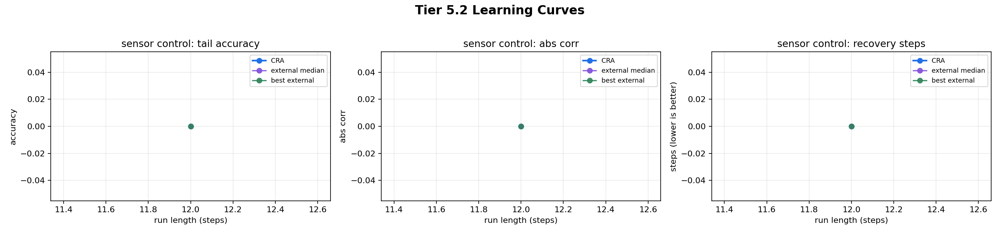
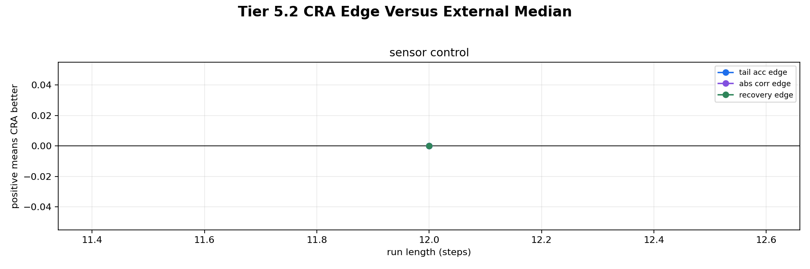
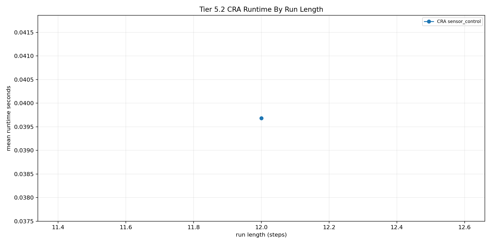

# Tier 5.2 Learning Curve / Run-Length Sweep Findings

- Generated: `2026-04-27T03:44:52+00:00`
- Status: **PASS**
- CRA backend: `mock`
- Seeds: `42`
- Run lengths: `12`
- Tasks: `sensor_control`
- Models: `cra,random_sign`
- Output directory: `controlled_test_output/_tier5_2_smoke`

Tier 5.2 extends Tier 5.1 by repeating the same CRA and external-baseline comparison across multiple online run lengths. It answers whether CRA's hard-task edge grows, disappears, or remains mixed as the stream gets longer.

## Claim Boundary

- This is controlled software evidence, not hardware evidence.
- Passing this tier means the learning curves are complete and interpretable; it does not require CRA to win every task.
- A simple learner beating CRA is recorded as a scientific finding, not hidden as a harness failure.
- Tier 4.16 hardware should use the strongest task identified here, not a task chosen without evidence.

## Task-Level Interpretation

| Task | Classification | Final CRA tail | Final best external tail | Best model | Final tail edge vs median | Final corr edge vs median | Final recovery edge |
| --- | --- | ---: | ---: | --- | ---: | ---: | ---: |
| sensor_control | `mixed_or_neutral` | None | None | `random_sign` | 0 | 0 | 0 |

## Final-Length Comparison

Final length: `12` steps.

| Task | CRA tail | External median tail | Best external tail | Best external model | CRA runtime s | External median runtime s |
| --- | ---: | ---: | ---: | --- | ---: | ---: |
| sensor_control | None | 0 | None | `random_sign` | 0.0396815 | 0.000761834 |

## All Curve Points

| Steps | Task | CRA tail | External median tail | Tail edge | CRA abs corr | External median abs corr | Corr edge | Recovery edge |
| ---: | --- | ---: | ---: | ---: | ---: | ---: | ---: | ---: |
| 12 | sensor_control | None | 0 | 0 | 0 | 0 | 0 | None |

## Criteria

| Criterion | Value | Rule | Pass | Note |
| --- | --- | --- | --- | --- |
| full run-length/task/model/seed matrix completed | 2 | == 2 | yes |  |
| all requested run lengths represented | [12] | == [12] | yes |  |
| all aggregate curve cells produced | 2 | == 2 | yes |  |
| task-level learning-curve interpretations produced | 1 | == 1 | yes |  |
| runtime recorded for every aggregate cell | 2 | == 2 | yes |  |

## Artifacts

- `tier5_2_results.json`: machine-readable manifest.
- `tier5_2_summary.csv`: aggregate task/model/run-length metrics.
- `tier5_2_comparisons.csv`: CRA-vs-external comparison for every task and run length.
- `tier5_2_curve_analysis.csv`: task-level interpretation of whether CRA's edge grows, persists, fades, or remains mixed.
- `tier5_2_learning_curves.png`: CRA vs external median/best curves.
- `tier5_2_cra_edges_by_length.png`: CRA edge versus external median by run length.
- `tier5_2_runtime_by_length.png`: CRA runtime by run length.
- `*_timeseries.csv`: per-task/per-model/per-seed/per-length online traces.

## Plots

