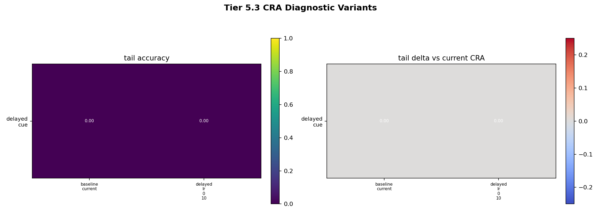
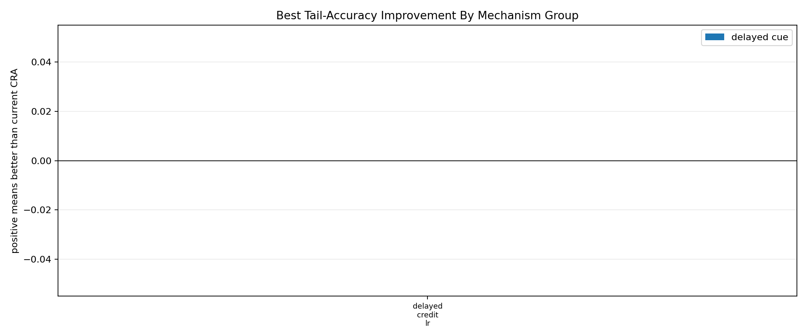

# Tier 5.3 CRA Failure Analysis / Learning Dynamics Debug Findings

- Generated: `2026-04-27T09:56:20+00:00`
- Status: **PASS**
- CRA backend: `mock`
- Steps: `24`
- Seeds: `42`
- Tasks: `delayed_cue`
- Variants: `baseline_current,delayed_lr_0_10`
- Output directory: `controlled_test_output/_tier5_3_smoke`

Tier 5.3 is diagnostic, not a new hardware or superiority claim. It asks which CRA learning-dynamics knobs move the failing Tier 5.2 tasks, using Tier 5.2 external baselines as reference.

## Claim Boundary

- This is controlled software tuning/failure-analysis evidence only.
- A pass means the diagnostic matrix completed and produced interpretable findings.
- It does not mean CRA is competitively recovered unless a variant beats the external reference.
- `sensor_control` is removed from advantage claims because Tier 5.2 showed it saturates for both CRA and baselines.

## Task Diagnoses

| Task | Likely diagnosis | Best variant | Best tail | Delta vs current CRA | Delta vs external median | Recovered vs external median? |
| --- | --- | --- | ---: | ---: | ---: | --- |
| delayed_cue | no single tested mechanism clearly explains delayed-cue weakness | `baseline_current` | None | 0 | None | no |

## Variant Comparisons

| Task | Variant | Group | Tail acc | Delta vs current CRA | Delta vs external median | Abs corr delta vs current | Recovery delta vs current |
| --- | --- | --- | ---: | ---: | ---: | ---: | ---: |
| delayed_cue | `baseline_current` | `control` | None | 0 | None | 0 | None |
| delayed_cue | `delayed_lr_0_10` | `delayed_credit_lr` | None | 0 | None | -0.630535 | None |

## Criteria

| Criterion | Value | Rule | Pass | Note |
| --- | --- | --- | --- | --- |
| full CRA diagnostic matrix completed | 2 | == 2 | yes |  |
| all aggregate diagnostic cells produced | 2 | == 2 | yes |  |
| task-level diagnoses produced | 1 | == 1 | yes |  |
| sensor_control removed from advantage probe | True | == True | yes | Tier 5.2 saturated sensor_control, so Tier 5.3 should not use it as a CRA advantage task. |
| comparison rows generated | 2 | == 2 | yes |  |

## Artifacts

- `tier5_3_results.json`: machine-readable manifest.
- `tier5_3_summary.csv`: aggregate task/variant metrics.
- `tier5_3_comparisons.csv`: variant comparisons versus current CRA and Tier 5.2 external references.
- `tier5_3_findings.csv`: task-level diagnoses.
- `tier5_3_variant_matrix.png`: tail accuracy and deltas by variant.
- `tier5_3_group_effects.png`: best mechanism-group improvements.
- `*_timeseries.csv`: per-task/per-variant/per-seed CRA traces.

## Plots

