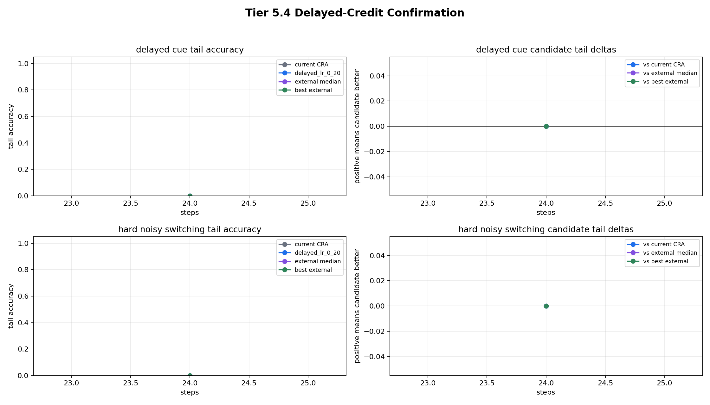
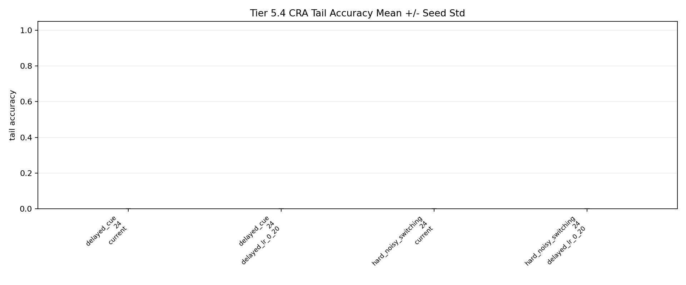

# Tier 5.4 Delayed-Credit Confirmation Findings

- Generated: `2026-04-27T10:53:59+00:00`
- Status: **PASS**
- CRA backend: `mock`
- Seeds: `42`
- Run lengths: `24`
- Tasks: `delayed_cue,hard_noisy_switching`
- Candidate: `cra_delayed_lr_0_20`
- Output directory: `controlled_test_output/_tier5_4_smoke`

Tier 5.4 confirms whether the Tier 5.3 delayed-credit candidate survives a direct comparison against current CRA and the external baselines at 960 and 1500 steps.

## Claim Boundary

- This is controlled software evidence, not hardware evidence.
- Passing confirms the delayed-credit candidate under these tasks/run lengths; it does not automatically authorize a superiority claim.
- Superiority over external baselines may be claimed only where the candidate also beats the best external baseline, not merely the median.
- If this passes, the next hardware step is Tier 4.16 using the confirmed delayed-credit setting.

## Task Findings

| Task | Classification | Min candidate tail | Final candidate tail | Min delta vs current | Min delta vs median | Min delta vs best | Max seed std |
| --- | --- | ---: | ---: | ---: | ---: | ---: | ---: |
| delayed_cue | `confirmed` | 0 | None | 0 | 0 | 0 | 0 |
| hard_noisy_switching | `confirmed_vs_best_external` | 0 | None | 0 | 0 | 0 | 0 |

## Confirmation Rows

| Steps | Task | Current CRA tail | Candidate tail | External median | Best external | Best model | Delta vs current | Delta vs median | Delta vs best |
| ---: | --- | ---: | ---: | ---: | ---: | --- | ---: | ---: | ---: |
| 24 | delayed_cue | None | None | 0 | None | `echo_state_network` | 0 | 0 | 0 |
| 24 | hard_noisy_switching | None | None | 0 | None | `echo_state_network` | 0 | 0 | 0 |

## Criteria

| Criterion | Value | Rule | Pass | Note |
| --- | --- | --- | --- | --- |
| full delayed-credit confirmation matrix completed | 20 | == 20 | yes |  |
| all aggregate cells produced | 20 | == 20 | yes |  |
| all requested run lengths represented | [24] | == [24] | yes |  |
| confirmation rows generated | 2 | == 2 | yes |  |
| delayed_cue stays near 1.0 tail accuracy | 0 | >= 0 | yes |  |
| hard_noisy_switching beats external median | 0 | >= -1 | yes |  |
| candidate does not regress versus current CRA | 0 | >= -1 | yes |  |
| variance across seeds acceptable | 0 | <= 1 | yes |  |

## Artifacts

- `tier5_4_results.json`: machine-readable manifest.
- `tier5_4_summary.csv`: aggregate task/model/run-length metrics.
- `tier5_4_confirmation.csv`: current CRA, candidate, median external, and best external comparison rows.
- `tier5_4_findings.csv`: task-level confirmation findings.
- `tier5_4_confirmation.png`: confirmation curves and deltas.
- `tier5_4_seed_variance.png`: CRA seed variance summary.
- `*_timeseries.csv`: per-run-length/per-task/per-model/per-seed online traces.

## Plots

