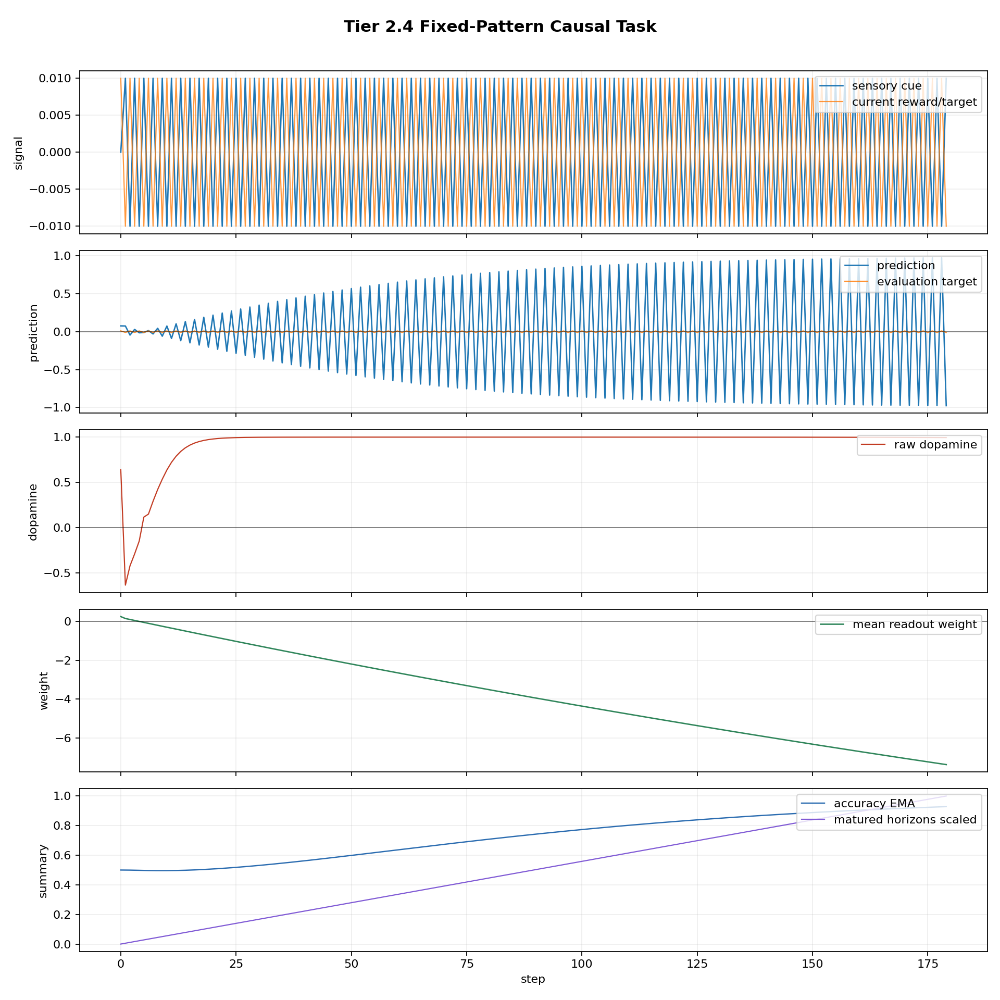
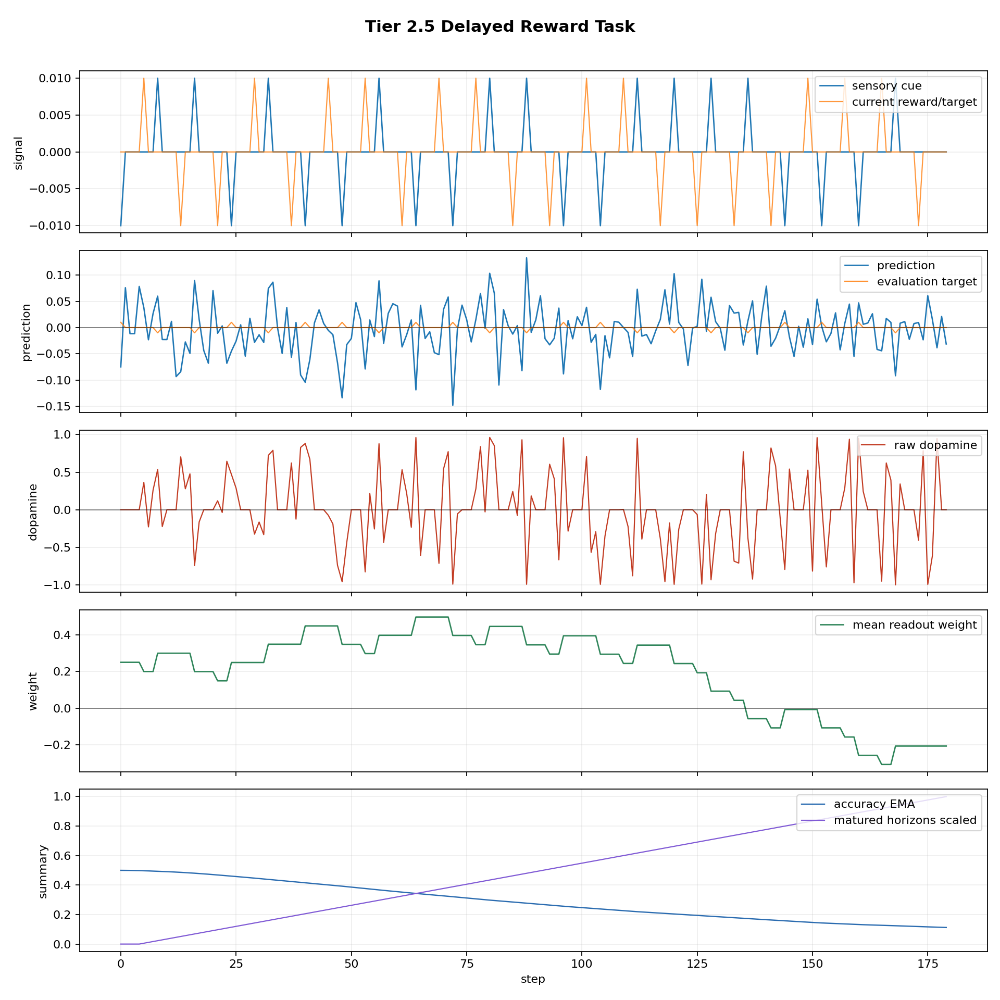
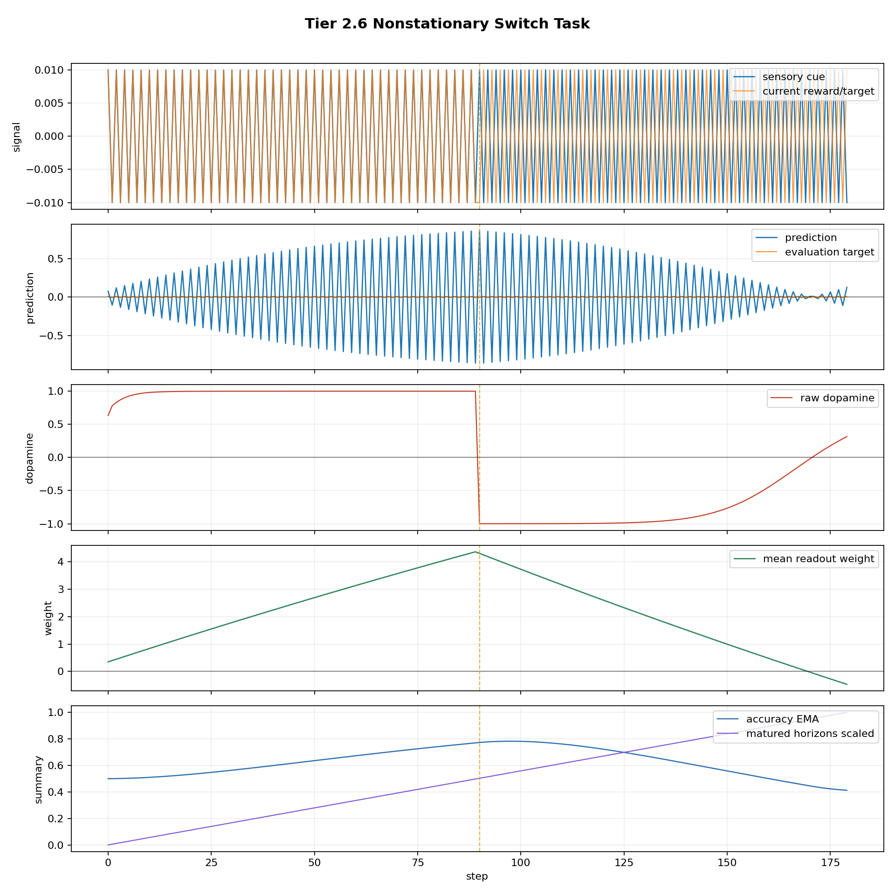

# Tier 2 Controlled Learning Findings

- Generated: `2026-04-26T19:17:54+00:00`
- Backend: `nest`
- Overall status: **STOPPED**
- Steps per run: `180`
- Base seed: `42`
- Fixed population: `True`
- Output directory: `/Users/james/Kimi_Agent_Spinnaker Neuromorphic Design/controlled_test_output/tier2_20260426_151740`

Tier 2 is a positive-control tier. These tests check whether the organism can learn causal cue/outcome structure, delayed consequence, and a switched rule after Tier 1 ruled out obvious fake learning.

## Artifact Index

- JSON manifest: `tier2_results.json`
- Summary CSV: `tier2_summary.csv`

## Summary

| Test | Status | Key metric | Notes |
| --- | --- | --- | --- |
| `fixed_pattern` | **PASS** | tail_acc=1, weight=-7.37518 | criteria satisfied |
| `delayed_reward` | **PASS** | tail_cue_acc=0.8, matured=175 | criteria satisfied |
| `nonstationary_switch` | **FAIL** | pre=1, post_final=0.375, recovery=78 | Failed criteria: final post-switch accuracy, recovery time, final inverse readout weight |

## fixed_pattern

Status: **PASS**

Criteria:

| Criterion | Value | Rule | Pass |
| --- | ---: | --- | --- |
| tail strict accuracy | 1 | >= 0.8 | yes |
| tail prediction/target correlation | 0.999931 | >= 0.7 | yes |
| learned inverse readout weight | -7.37518 | <= -0.5 | yes |

Artifacts:

- `timeseries_csv`: `fixed_pattern_timeseries.csv`
- `plot_png`: `fixed_pattern_timeseries.png`

## delayed_reward

Status: **PASS**

Criteria:

| Criterion | Value | Rule | Pass |
| --- | ---: | --- | --- |
| tail cue-time strict accuracy | 0.8 | >= 0.65 | yes |
| matured delayed horizons | 175 | >= 1 | yes |
| delayed inverse readout weight | -0.206358 | <= -0.05 | yes |
| tail prediction/target correlation | 0.670683 | >= 0.5 | yes |

Artifacts:

- `timeseries_csv`: `delayed_reward_timeseries.csv`
- `plot_png`: `delayed_reward_timeseries.png`

## nonstationary_switch

Status: **FAIL**

Criteria:

| Criterion | Value | Rule | Pass |
| --- | ---: | --- | --- |
| pre-switch accuracy | 1 | >= 0.8 | yes |
| post-switch disruption | 0 | <= 0.45 | yes |
| final post-switch accuracy | 0.375 | >= 0.8 | no |
| recovery time | 78 | <= 60 | no |
| final inverse readout weight | -0.468419 | <= -0.5 | no |

Artifacts:

- `timeseries_csv`: `nonstationary_switch_timeseries.csv`
- `plot_png`: `nonstationary_switch_timeseries.png`

## Stop Condition

Execution stopped after `nonstationary_switch` because `--stop-on-fail` was enabled.
