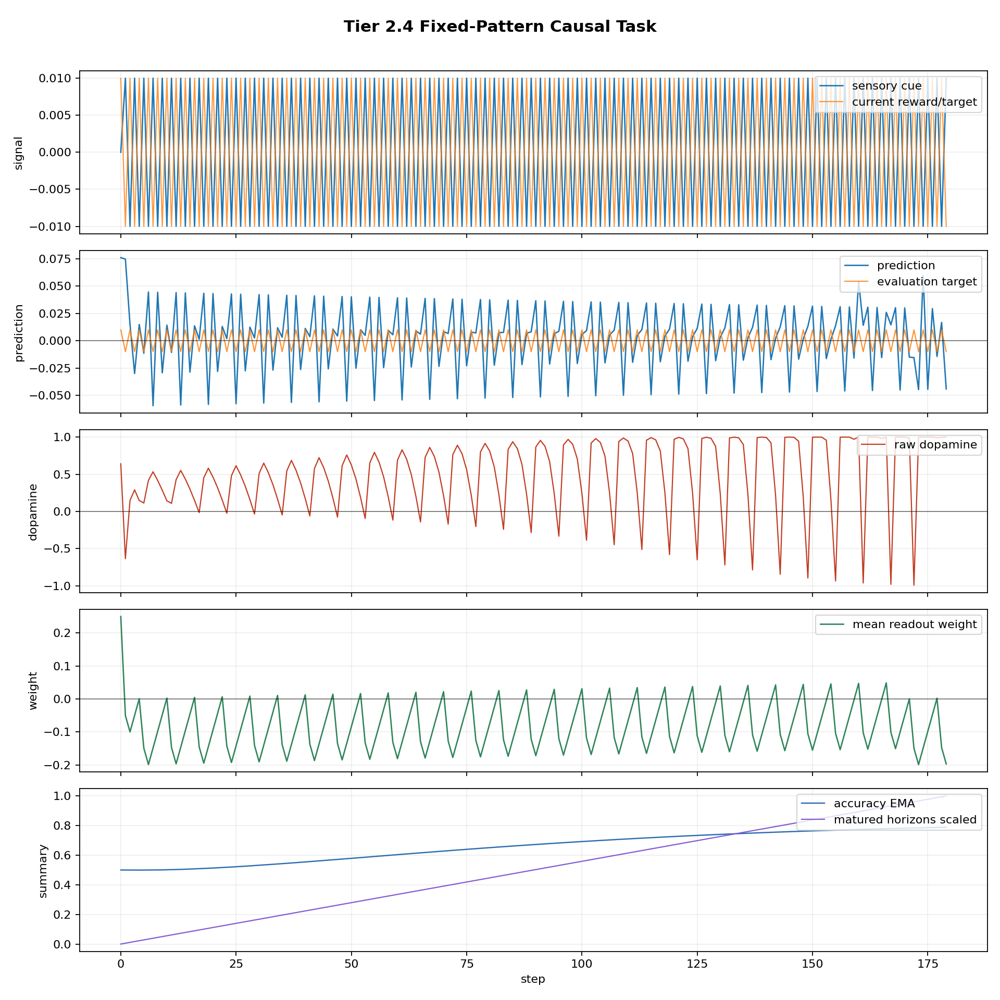

# Tier 2 Controlled Learning Findings

- Generated: `2026-04-26T19:18:52+00:00`
- Backend: `nest`
- Overall status: **STOPPED**
- Steps per run: `180`
- Base seed: `42`
- Fixed population: `True`
- Output directory: `/Users/james/Kimi_Agent_Spinnaker Neuromorphic Design/controlled_test_output/tier2_20260426_151847`

Tier 2 is a positive-control tier. These tests check whether the organism can learn causal cue/outcome structure, delayed consequence, and a switched rule after Tier 1 ruled out obvious fake learning.

## Artifact Index

- JSON manifest: `tier2_results.json`
- Summary CSV: `tier2_summary.csv`

## Summary

| Test | Status | Key metric | Notes |
| --- | --- | --- | --- |
| `fixed_pattern` | **FAIL** | tail_acc=0.844444, weight=-0.197052 | Failed criteria: learned inverse readout weight |

## fixed_pattern

Status: **FAIL**

Criteria:

| Criterion | Value | Rule | Pass |
| --- | ---: | --- | --- |
| tail strict accuracy | 0.844444 | >= 0.8 | yes |
| tail prediction/target correlation | 0.738159 | >= 0.7 | yes |
| learned inverse readout weight | -0.197052 | <= -0.5 | no |

Artifacts:

- `timeseries_csv`: `fixed_pattern_timeseries.csv`
- `plot_png`: `fixed_pattern_timeseries.png`

## Stop Condition

Execution stopped after `fixed_pattern` because `--stop-on-fail` was enabled.
