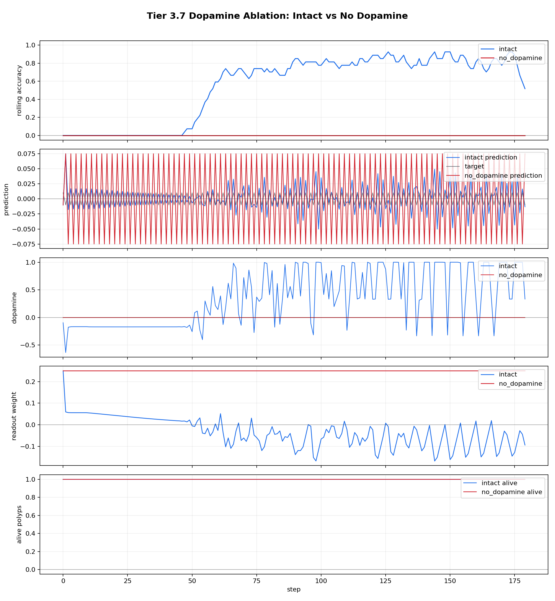
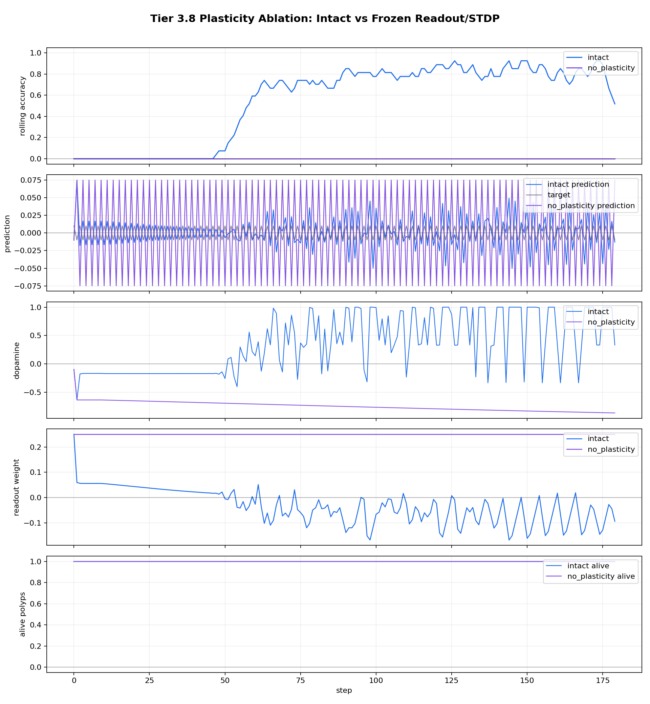
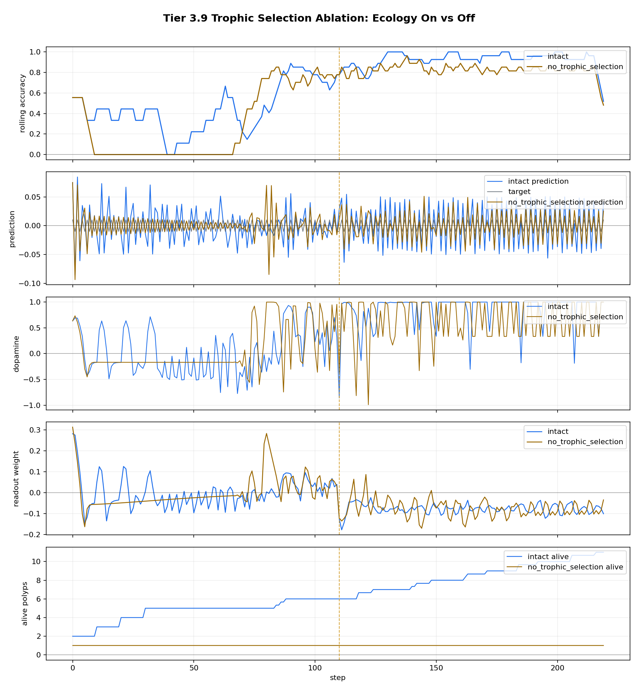

# Tier 3 Controlled Architecture Ablation Findings

- Generated: `2026-04-26T19:34:10+00:00`
- Backend: `nest`
- Overall status: **PASS**
- Seeds: `42, 43, 44`
- Fixed-pattern steps: `180`
- Ecology steps: `220`
- Output directory: `/Users/james/Kimi_Agent_Spinnaker Neuromorphic Design/controlled_test_output/tier3_20260426_153145`

Tier 3 asks whether named architecture mechanisms are actually doing work. Each result compares an intact organism against a targeted ablation under the same controlled task.

## Artifact Index

- JSON manifest: `tier3_results.json`
- Summary CSV: `tier3_summary.csv`

## Summary

| Test | Status | Key result | Interpretation |
| --- | --- | --- | --- |
| `no_dopamine_ablation` | **PASS** | intact_tail=0.837037, no_da_tail=0, delta=0.837037 | Dopamine-gated learning matters. |
| `no_plasticity_ablation` | **PASS** | intact_tail=0.837037, frozen_tail=0, delta=0.837037 | Plasticity is required, not just inference. |
| `no_trophic_selection_ablation` | **PASS** | births=30, tail_delta=0.127273, alive_delta=10 | Ecology adds measurable value on the switch stressor. |

## no_dopamine_ablation

Status: **PASS**

Criteria:

| Criterion | Value | Rule | Pass |
| --- | ---: | --- | --- |
| intact learns fixed pattern | 0.837037 | >= 0.75 | yes |
| no-dopamine fails fixed pattern | 0 | <= 0.55 | yes |
| dopamine ablation performance drop | 0.837037 | >= 0.2 | yes |
| ablated dopamine is zero | 0 | <= 1e-09 | yes |
| ablated readout remains frozen | 0 | <= 0.01 | yes |

Case aggregates:

- `intact`: tail_acc_mean=0.837037, max_da_mean=1, births_sum=0, final_alive_mean=1, final_weight_mean=-0.0934068
- `no_dopamine`: tail_acc_mean=0, max_da_mean=0, births_sum=0, final_alive_mean=1, final_weight_mean=0.25

Artifacts:

- `comparison_plot_png`: `no_dopamine_ablation_comparison.png`

## no_plasticity_ablation

Status: **PASS**

Criteria:

| Criterion | Value | Rule | Pass |
| --- | ---: | --- | --- |
| intact learns fixed pattern | 0.837037 | >= 0.75 | yes |
| no-plasticity fails fixed pattern | 0 | <= 0.55 | yes |
| plasticity ablation performance drop | 0.837037 | >= 0.2 | yes |
| dopamine still present under plasticity ablation | 0.86291 | >= 0.5 | yes |
| ablated readout remains frozen | 0 | <= 0.01 | yes |

Case aggregates:

- `intact`: tail_acc_mean=0.837037, max_da_mean=1, births_sum=0, final_alive_mean=1, final_weight_mean=-0.0934068
- `no_plasticity`: tail_acc_mean=0, max_da_mean=0.86291, births_sum=0, final_alive_mean=1, final_weight_mean=0.25

Artifacts:

- `comparison_plot_png`: `no_plasticity_ablation_comparison.png`

## no_trophic_selection_ablation

Status: **PASS**

Criteria:

| Criterion | Value | Rule | Pass |
| --- | ---: | --- | --- |
| intact trophic selection produces births | 30 | >= 1 | yes |
| ablated selection has no births | 0 | == 0 | yes |
| ablated selection has no deaths | 0 | == 0 | yes |
| trophic selection expands population | 10 | >= 1 | yes |
| trophic selection improves tail accuracy | 0.127273 | >= 0.05 | yes |

Case aggregates:

- `intact`: tail_acc_mean=0.957576, max_da_mean=1, births_sum=30, final_alive_mean=11, final_weight_mean=-0.100667
- `no_trophic_selection`: tail_acc_mean=0.830303, max_da_mean=1, births_sum=0, final_alive_mean=1, final_weight_mean=-0.0344846

Artifacts:

- `comparison_plot_png`: `no_trophic_selection_ablation_comparison.png`

