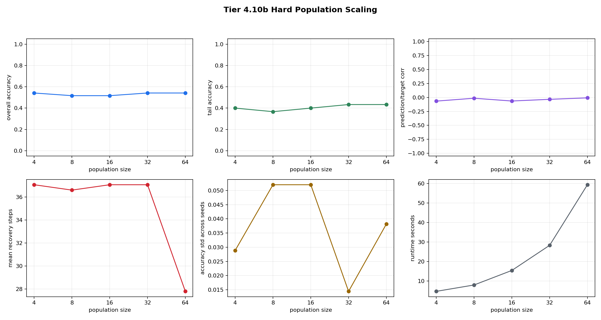
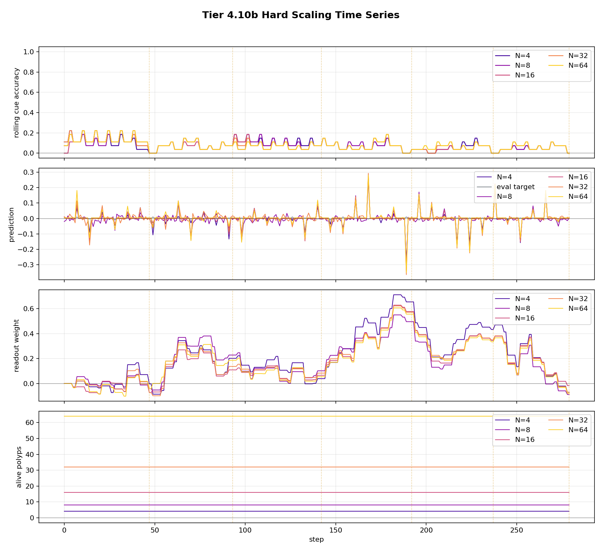

# Tier 4.10b Hard Population Scaling Findings

- Generated: `2026-04-26T20:18:39+00:00`
- Backend: `nest`
- Overall status: **PASS**
- Population sizes: `4, 8, 16, 32, 64`
- Seeds: `42, 43, 44`
- Steps per run: `280`
- Noise probability: `0.15`
- Delay range: `3-5`
- Switch interval range: `40-50`
- Output directory: `<repo>/controlled_test_output/tier4_10b_20260426_161251`

Tier 4.10b asks whether larger fixed populations add value when the task is harder: delayed rewards, irregular switches, and noisy outcomes. Births/deaths are disabled to control N, but trophic/energy dynamics still run.

## Evidence Trail Position

The original validation plan has 12 numbered core tests. Tier 4.10b is an added addendum after core test 10, bringing the expanded tracked evidence suite to 13 entries: tests 1-10, 10b, 11, and 12.

## Artifact Index

- JSON manifest: `tier4_10b_results.json`
- Summary CSV: `tier4_10b_summary.csv`
- `summary_plot_png`: `hard_population_scaling_summary.png`
- `timeseries_plot_png`: `hard_population_scaling_timeseries.png`

## Summary

| N | Overall acc | Acc std | Tail acc | Corr | Recovery steps | Runtime s |
| ---: | ---: | ---: | ---: | ---: | ---: | ---: |
| 4 | 0.541667 | 0.0288675 | 0.4 | -0.0656838 | 37.0556 | 4.61383 |
| 8 | 0.516667 | 0.0520416 | 0.366667 | -0.0141432 | 36.5889 | 7.88789 |
| 16 | 0.516667 | 0.0520416 | 0.4 | -0.0638944 | 37.0556 | 15.3614 |
| 32 | 0.541667 | 0.0144338 | 0.433333 | -0.0336836 | 37.0556 | 28.2835 |
| 64 | 0.541667 | 0.0381881 | 0.433333 | -0.00737304 | 27.8 | 59.4301 |

## Scaling Value

- Best larger-N accuracy delta vs N=4: `1.11022e-16`
- Best larger-N correlation delta vs N=4: `0.0583108`
- Best larger-N recovery improvement vs N=4: `9.25556` steps
- Best larger-N variance reduction vs N=4: `0.0144338`
- N=64 overall accuracy delta vs N=4: `0`

Interpretation: a hard-scaling pass does not require a large raw-accuracy jump. Scaling value can appear as better prediction/target correlation, faster recovery after switches, or lower seed-to-seed variance.

## Criteria

| Criterion | Value | Rule | Pass |
| --- | --- | --- | --- |
| no extinction/collapse | True | == True | yes |
| fixed population has no births/deaths | True | == True | yes |
| all sizes above random overall accuracy | 0.516667 | >= 0.51 | yes |
| larger N does not degrade sharply | 0 | >= -0.08 | yes |
| larger N shows some scaling value | {'accuracy_delta': 1.1102230246251565e-16, 'corr_delta': 0.05831076587033512, 'recovery_delta': 9.255555555555556, 'variance_delta': 0.014433756729740592} | any >= {'accuracy': 0.015, 'corr': 0.03, 'recovery': 1.0, 'variance': 0.002} | yes |

## Plots

