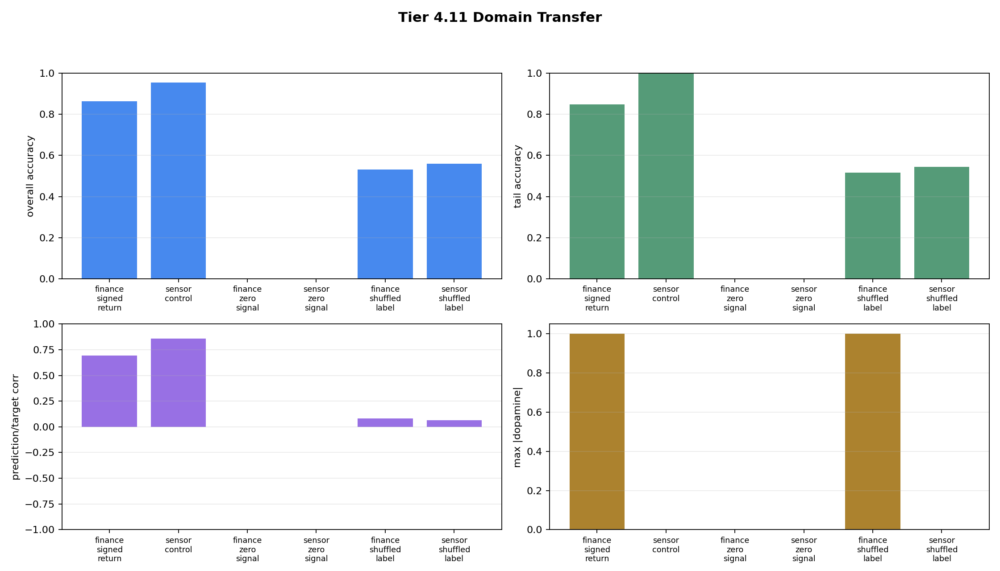

# Tier 4.11 Domain Transfer Findings

- Generated: `2026-04-26T20:49:35+00:00`
- Backend: `nest`
- Overall status: **PASS**
- Population size: `8` fixed polyps
- Seeds: `42, 43, 44`
- Steps per run: `220`
- Delay: `3` steps
- Output directory: `/Users/james/Kimi_Agent_Spinnaker Neuromorphic Design/controlled_test_output/tier4_11_20260426_164655`

Tier 4.11 tests whether the same CRA core and learning manager transfer from the controlled finance/signed-return path to a non-finance `sensor_control` TaskAdapter under the same NEST backend and fixed population settings.

## Artifact Index

- JSON manifest: `tier4_11_results.json`
- Summary CSV: `tier4_11_summary.csv`
- Summary plot: `domain_transfer_summary.png`

## Summary

| Case | Status | Domain | Adapter | Bridge? | Overall acc | Tail acc | Corr | Max |DA| |
| --- | --- | --- | --- | ---: | ---: | ---: | ---: | ---: |
| finance_signed_return | pass | finance | TradingBridge | True | 0.863636 | 0.848485 | 0.692416 | 1 |
| sensor_control | pass | sensor_control | SensorControlAdapter | False | 0.954545 | 1 | 0.856941 | 0 |
| finance_zero_signal | pass | finance | TradingBridge | True | None | None | None | 0 |
| sensor_zero_signal | pass | sensor_control | SensorControlAdapter | False | None | None | None | 0 |
| finance_shuffled_label | pass | finance | TradingBridge | True | 0.530303 | 0.515152 | 0.0837492 | 1 |
| sensor_shuffled_label | pass | sensor_control | SensorControlAdapter | False | 0.560606 | 0.545455 | 0.064466 | 0 |

## Criteria

### finance_signed_return

| Criterion | Value | Rule | Pass |
| --- | --- | --- | --- |
| no extinction/collapse | 8 | == 8 | yes |
| fixed population has no births/deaths | {'births': 0, 'deaths': 0} | == {'births': 0, 'deaths': 0} | yes |
| learns above baseline overall accuracy | 0.863636 | >= 0.58 | yes |
| learns above baseline tail accuracy | 0.848485 | >= 0.62 | yes |
| prediction/target relationship emerges | 0.772561 | >= abs 0.05 | yes |
| delayed horizons mature | 200 | > 0 | yes |

### sensor_control

| Criterion | Value | Rule | Pass |
| --- | --- | --- | --- |
| no extinction/collapse | 8 | == 8 | yes |
| fixed population has no births/deaths | {'births': 0, 'deaths': 0} | == {'births': 0, 'deaths': 0} | yes |
| adapter path does not construct TradingBridge | False | == False | yes |
| learns above baseline overall accuracy | 0.954545 | >= 0.58 | yes |
| learns above baseline tail accuracy | 1 | >= 0.62 | yes |
| prediction/target relationship emerges | 0.994744 | >= abs 0.05 | yes |
| delayed horizons mature | 200 | > 0 | yes |

### finance_zero_signal

| Criterion | Value | Rule | Pass |
| --- | --- | --- | --- |
| no extinction/collapse | 8 | == 8 | yes |
| fixed population has no births/deaths | {'births': 0, 'deaths': 0} | == {'births': 0, 'deaths': 0} | yes |
| zero control has no evaluation labels | None | is None | yes |
| zero control has no dopamine | 0 | <= 1e-12 | yes |

### sensor_zero_signal

| Criterion | Value | Rule | Pass |
| --- | --- | --- | --- |
| no extinction/collapse | 8 | == 8 | yes |
| fixed population has no births/deaths | {'births': 0, 'deaths': 0} | == {'births': 0, 'deaths': 0} | yes |
| adapter path does not construct TradingBridge | False | == False | yes |
| zero control has no evaluation labels | None | is None | yes |
| zero control has no dopamine | 0 | <= 1e-12 | yes |

### finance_shuffled_label

| Criterion | Value | Rule | Pass |
| --- | --- | --- | --- |
| no extinction/collapse | 8 | == 8 | yes |
| fixed population has no births/deaths | {'births': 0, 'deaths': 0} | == {'births': 0, 'deaths': 0} | yes |
| shuffled control stays near chance | 0.530303 | <= 0.62 | yes |
| shuffled control has low abs correlation | 0.0837492 | <= 0.25 | yes |

### sensor_shuffled_label

| Criterion | Value | Rule | Pass |
| --- | --- | --- | --- |
| no extinction/collapse | 8 | == 8 | yes |
| fixed population has no births/deaths | {'births': 0, 'deaths': 0} | == {'births': 0, 'deaths': 0} | yes |
| adapter path does not construct TradingBridge | False | == False | yes |
| shuffled control stays near chance | 0.560606 | <= 0.62 | yes |
| shuffled control has low abs correlation | 0.064466 | <= 0.25 | yes |

## Interpretation

- Finance and sensor_control use the same CRA organism core, learning manager, backend, seeds, and fixed population settings.
- The sensor_control cases run through `train_adapter_step(...)` with `use_default_trading_bridge=False`, so no TradingBridge is constructed for the non-finance adapter path.
- A pass means the non-finance adapter learns while zero and shuffled controls do not show fake learning.
- In sparse delayed-control cases, useful learning can appear through matured delayed-consequence credit rather than same-step raw dopamine telemetry; read `max_matured_horizons` alongside `raw_dopamine`.

## Plots

