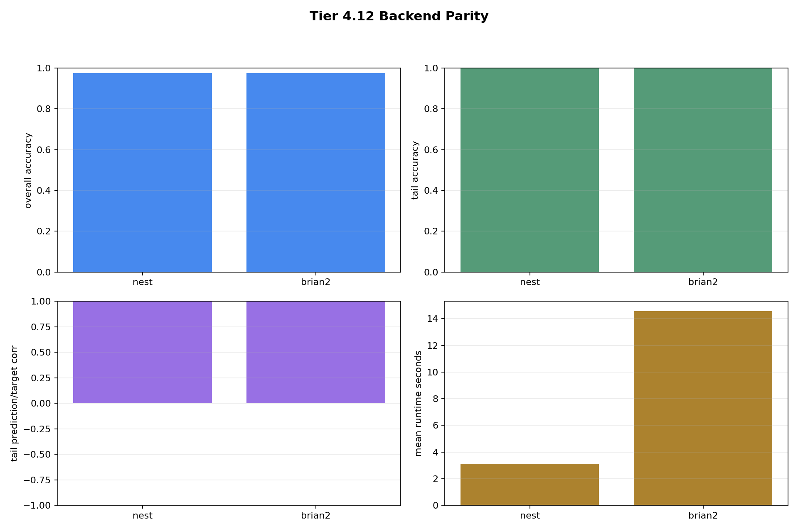

# Tier 4.12 Backend Parity Findings

- Generated: `2026-04-26T21:09:05+00:00`
- Overall status: **PASS**
- Backends: `nest, brian2`
- Population size: `8` fixed polyps
- Seeds: `42, 43, 44`
- Steps per run: `120`
- Output directory: `/Users/james/Kimi_Agent_Spinnaker Neuromorphic Design/controlled_test_output/tier4_12_20260426_170808`

Tier 4.12 checks whether the fixed-pattern learning result survives movement from NEST to Brian2, while rejecting any synthetic spike fallback. The SpiNNaker item is a readiness prep smoke only; no hardware `sim.run()` is claimed here.

## Artifact Index

- JSON manifest: `tier4_12_results.json`
- Summary CSV: `tier4_12_summary.csv`
- Summary plot: `backend_parity_summary.png`

## Summary

| Test | Status | Key metric | Diagnostics |
| --- | --- | --- | --- |
| `nest_fixed_pattern` | **PASS** | all=0.97479, tail=1, corr=0.99999 | fallbacks=0, sim_fail=0, read_fail=0 |
| `brian2_fixed_pattern` | **PASS** | all=0.97479, tail=1, corr=0.99999 | fallbacks=0, sim_fail=0, read_fail=0 |
| `nest_brian2_parity` | **PASS** | tail_delta=0, corr_delta=0 | runtime_ratio=4.6713 |
| `spinnaker_pynn_prep` | **PASS** | factory=sPyNNaker, setup=True | hardware_run_attempted=False |

## Criteria

### nest_fixed_pattern

| Criterion | Value | Rule | Pass |
| --- | --- | --- | --- |
| backend sim.run has no failures | 0 | == 0 | yes |
| backend summary read has no failures | 0 | == 0 | yes |
| no synthetic spike fallback | 0 | == 0 | yes |
| real spike readback is active | 202159 | > 0 | yes |
| fixed population has no births/deaths | {'births': 0, 'deaths': 0} | == {'births': 0, 'deaths': 0} | yes |
| no extinction/collapse | 8 | == 8 | yes |
| overall strict accuracy | 0.97479 | >= 0.65 | yes |
| tail strict accuracy | 1 | >= 0.75 | yes |
| tail prediction/target correlation | 0.99999 | >= 0.6 | yes |
| inverse readout weight learned | -10.5496 | <= -0.05 | yes |

### brian2_fixed_pattern

| Criterion | Value | Rule | Pass |
| --- | --- | --- | --- |
| backend sim.run has no failures | 0 | == 0 | yes |
| backend summary read has no failures | 0 | == 0 | yes |
| no synthetic spike fallback | 0 | == 0 | yes |
| real spike readback is active | 313753 | > 0 | yes |
| fixed population has no births/deaths | {'births': 0, 'deaths': 0} | == {'births': 0, 'deaths': 0} | yes |
| no extinction/collapse | 8 | == 8 | yes |
| overall strict accuracy | 0.97479 | >= 0.65 | yes |
| tail strict accuracy | 1 | >= 0.75 | yes |
| tail prediction/target correlation | 0.99999 | >= 0.6 | yes |
| inverse readout weight learned | -10.5496 | <= -0.05 | yes |

### nest_brian2_parity

| Criterion | Value | Rule | Pass |
| --- | --- | --- | --- |
| NEST case exists | True | == True | yes |
| Brian2 case exists | True | == True | yes |
| NEST backend case passes | pass | == pass | yes |
| Brian2 backend case passes | pass | == pass | yes |
| overall accuracy parity delta | 0 | <= 0.25 | yes |
| tail accuracy parity delta | 0 | <= 0.25 | yes |
| tail correlation parity delta | 0 | <= 0.5 | yes |

### spinnaker_pynn_prep

| Criterion | Value | Rule | Pass |
| --- | --- | --- | --- |
| pyNN.spiNNaker imports | True | == True | yes |
| spynnaker.pyNN alias imports | True | == True | yes |
| pyNN.spiNNaker setup/end smoke | {'setup_ok': True, 'end_ok': True} | == {'setup_ok': True, 'end_ok': True} | yes |
| BackendFactory maps to sPyNNaker | sPyNNaker | == sPyNNaker | yes |
| factory exposes live spike packet support | True | == True | yes |
| factory marks dynamic projections unsupported | False | == False | yes |
| factory marks fixed-point backend | True | == True | yes |
| native neuromodulation STDP path available | True | == True | yes |

## Interpretation

- NEST is the baseline backend for this stage.
- Brian2 must pass the same learning thresholds and stay within bounded NEST/Brian2 parity deltas.
- `synthetic_fallbacks`, `sim_run_failures`, and `summary_read_failures` must remain zero for the real backend cases.
- SpiNNaker PyNN readiness is not a hardware result; it verifies local module/setup/factory readiness before a later controlled `sim.run()` or board run.

## Plots

