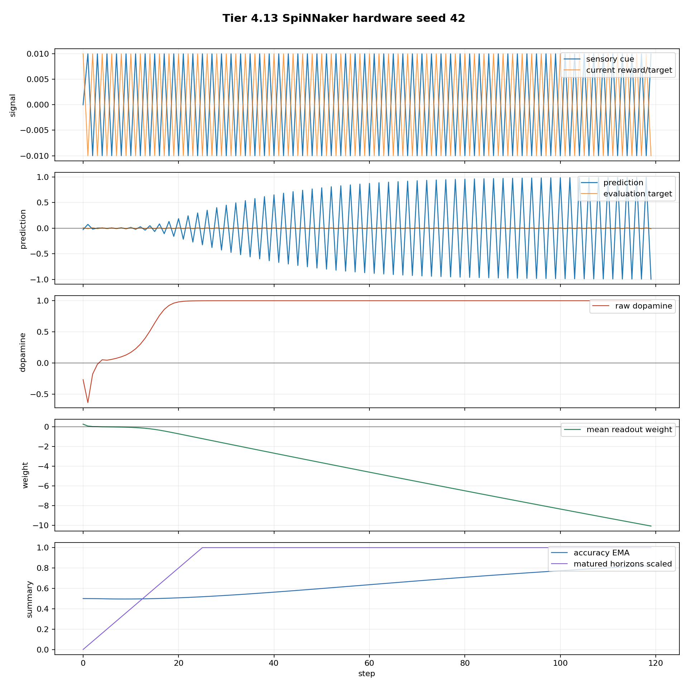

# Tier 4.13 SpiNNaker Hardware Capsule - Canonical Hardware Pass

- Canonical local run id: `tier4_13_20260427_011912_hardware_pass`
- Source generated at: `2026-04-27T00:33:33+00:00`
- Imported/canonicalized at: `2026-04-27T00:46:26.855544+00:00`
- Source remote output directory: `<jobmanager_tmp>`
- Status: **PASS**

## What This Proves

This run passes Tier 4.13: the minimal fixed-pattern CRA capsule executed through `pyNN.spiNNaker`, produced real spike readback, avoided synthetic fallback, and met the fixed-pattern learning thresholds.

It supports the claim that the CRA minimal learning capsule can execute on SpiNNaker hardware and preserve expected fixed-pattern behavior.

## What This Does Not Prove

This is not yet a full hardware-scaling or full-organism hardware claim. The run used one seed (`42`), `N=8`, 120 steps, and a fixed population. Treat it as the first real hardware capsule pass, not as proof that all larger Tier 4 workloads are hardware-ready.

`hardware_target_configured` is `False` in the summary because the local/JobManager environment detector did not expose a hardware config flag. The run is still treated as a pass because `hardware_run_attempted=True`, `sim.run` completed, synthetic fallback stayed at `0`, and real spike readback was nonzero.

## Key Metrics

| Metric | Value |
| --- | ---: |
| backend | `pyNN.spiNNaker` |
| hardware_run_attempted | `True` |
| hardware_target_configured | `False` |
| runs | `1` |
| seed | `42` |
| overall strict accuracy | `0.97479` |
| tail strict accuracy | `1` |
| overall prediction-target correlation | `0.891733` |
| tail prediction-target correlation | `0.999984` |
| total step spikes | `283903` |
| mean step spikes | `2365.858333` |
| synthetic fallbacks | `0` |
| sim.run failures | `0` |
| summary-read failures | `0` |
| final alive polyps | `8` |
| births / deaths | `0 / 0` |
| runtime seconds | `858.620106` |

## Canonical Artifacts

- `tier4_13_results.json`: source machine-readable pass manifest
- `study_data.json`: normalized study record for this local evidence bundle
- `tier4_13_report.md`: source human-readable report exported by the hardware capsule
- `tier4_13_summary.csv`: compact metrics table
- `spinnaker_hardware_seed42_timeseries.csv`: per-step telemetry
- `hardware_capsule_summary.png`: summary plot
- `spinnaker_hardware_seed42_timeseries.png`: telemetry plot
- `spinnaker_reports/2026-04-27-01-19-12-390038/`: extracted sPyNNaker provenance
- `raw_reports/spinnaker_reports_2026-04-27-01-19-12-390038.zip`: raw reports archive

## Intake Notes

The successful `20:35` Downloads artifacts were promoted into this folder. Older blocked/failure leftovers from earlier hardware attempts were moved to `_quarantine_noncanonical/` so they remain available for debugging history but cannot be confused with the pass evidence.

