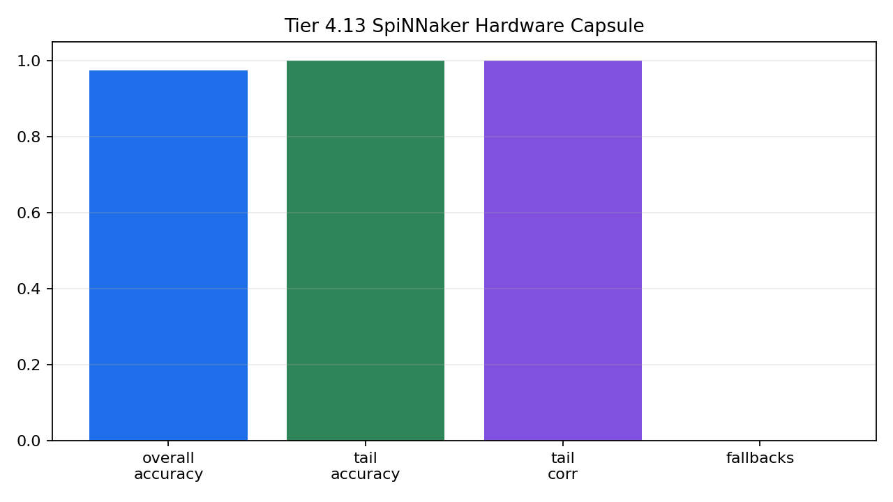

# Tier 4.13 SpiNNaker Hardware Capsule Findings

- Generated: `2026-04-27T00:33:33+00:00`
- Mode: `run-hardware`
- Status: **PASS**
- Output directory: `<jobmanager_tmp>`

Tier 4.13 is separate from Tier 4.12. It is the hardware capsule step: a minimal fixed-pattern CRA task intended to run on real SpiNNaker hardware through EBRAINS/JobManager.

## Claim Boundary

- `PREPARED` means the capsule package exists locally; it is not a hardware pass.
- `PASS` requires a real `pyNN.spiNNaker` run with zero synthetic fallback, zero `sim.run` failures, zero summary-read failures, real spike readback, and learning metrics above threshold.
- SpiNNaker virtual-board or setup-only results must not be described as hardware learning.

## Summary

- hardware_run_attempted: `True`
- hardware_target_configured: `False`
- all_accuracy_mean: `0.97479`
- tail_accuracy_mean: `1`
- tail_prediction_target_corr_mean: `0.999984`
- synthetic_fallbacks_sum: `0`
- sim_run_failures_sum: `0`
- summary_read_failures_sum: `0`
- jobmanager_cli: `None`
- failure_step: `None`

## Criteria

| Criterion | Value | Rule | Pass |
| --- | --- | --- | --- |
| sim.run has no failures | 0 | == 0 | yes |
| summary read has no failures | 0 | == 0 | yes |
| no synthetic fallback | 0 | == 0 | yes |
| real spike readback is active | 283903 | > 0 | yes |
| fixed population has no births/deaths | {'births': 0, 'deaths': 0} | == {'births': 0, 'deaths': 0} | yes |
| no extinction/collapse | 8 | == 8 | yes |
| overall strict accuracy | 0.97479 | >= 0.65 | yes |
| tail strict accuracy | 1 | >= 0.75 | yes |
| tail prediction/target correlation | 0.999984 | >= 0.6 | yes |

## Artifacts

- `manifest_json`: `<jobmanager_tmp>`
- `summary_csv`: `<jobmanager_tmp>`
- `seed_42_timeseries_csv`: `<jobmanager_tmp>`
- `seed_42_timeseries_png`: `<jobmanager_tmp>`
- `hardware_summary_png`: `<jobmanager_tmp>`
- `spinnaker_report_1`: `<jobmanager_tmp>`

