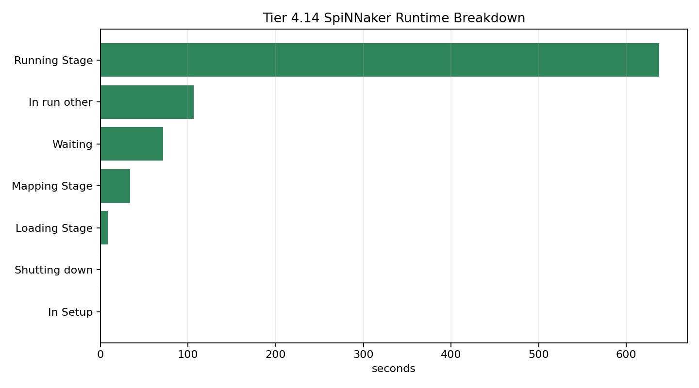

# Tier 4.14 Hardware Runtime Characterization Findings

- Generated: `2026-04-27T01:34:30+00:00`
- Mode: `characterize-existing`
- Status: **PASS**
- Output directory: `<repo>/controlled_test_output/tier4_14_20260426_213430`
- Source hardware bundle: `<repo>/controlled_test_output/tier4_13_20260427_011912_hardware_pass`

Tier 4.14 is not a new learning claim. It characterizes the wall-clock and sPyNNaker provenance costs behind the Tier 4.13 minimal hardware capsule.

## Claim Boundary

- `PASS` means the hardware-pass bundle has enough runtime/provenance telemetry to explain where time went.
- This does not prove multi-seed hardware repeatability, harder hardware learning, or hardware scaling.
- If mode is `characterize-existing`, the evidence is derived from the canonical Tier 4.13 hardware pass rather than a new hardware execution.

## Summary

- source_tier4_13_status: `pass`
- runtime_seconds: `858.62`
- simulated_biological_seconds: `6`
- wall_to_simulated_ratio: `143.103`
- steps: `120`
- mean_wall_per_step_seconds: `7.15517`
- dominant_category: `Running Stage`
- dominant_category_seconds: `637.742`
- dominant_category_fraction: `0.742177`
- dominant_algorithm: `Application runner`
- dominant_algorithm_work: `Running`
- dominant_algorithm_seconds: `87.3755`
- application_runner_seconds: `87.3755`
- application_runner_seconds_per_step: `0.728129`
- buffer_extractor_seconds: `32.7861`
- buffer_extractor_seconds_per_step: `0.273218`
- provenance_total_category_seconds: `859.286`
- category_timer_rows: `7`
- algorithm_timer_rows: `73`
- synthetic_fallbacks_sum: `0`
- sim_run_failures_sum: `0`
- summary_read_failures_sum: `0`

## Criteria

| Criterion | Value | Rule | Pass |
| --- | --- | --- | --- |
| source hardware result passed | pass | == pass | yes |
| zero synthetic fallback preserved | 0 | == 0 | yes |
| zero sim.run failures preserved | 0 | == 0 | yes |
| zero summary-read failures preserved | 0 | == 0 | yes |
| runtime wall-clock measured | 858.62 | > 0 | yes |
| simulated task duration measured | 6 | > 0 | yes |
| category provenance timers parsed | 7 | > 0 | yes |
| algorithm provenance timers parsed | 73 | > 0 | yes |
| dominant runtime category identified | Running Stage | is not None | yes |

## Interpretation

The important empirical separation is simulated task time versus orchestration wall time. The minimal capsule simulates only a few biological seconds, but the Python/sPyNNaker/hardware loop repeatedly reloads, runs, extracts buffers, and synchronizes each short step. That overhead is real engineering data for the paper, but it should not be confused with evidence that the neural substrate itself is slow.

The next engineering implication is to batch more closed-loop work per hardware run, reduce readback cadence, or move more of the adaptation loop on-chip before making larger hardware-scaling claims.

## Artifacts

- `manifest_json`: `<repo>/controlled_test_output/tier4_14_20260426_213430/tier4_14_results.json`
- `summary_csv`: `<repo>/controlled_test_output/tier4_14_20260426_213430/tier4_14_summary.csv`
- `category_timers_csv`: `<repo>/controlled_test_output/tier4_14_20260426_213430/tier4_14_category_timers.csv`
- `top_algorithms_csv`: `<repo>/controlled_test_output/tier4_14_20260426_213430/tier4_14_top_algorithms.csv`
- `runtime_breakdown_csv`: `<repo>/controlled_test_output/tier4_14_20260426_213430/tier4_14_runtime_breakdown.csv`
- `runtime_breakdown_png`: `<repo>/controlled_test_output/tier4_14_20260426_213430/tier4_14_runtime_breakdown.png`
- `source_provenance_sqlite`: `<repo>/controlled_test_output/tier4_13_20260427_011912_hardware_pass/spinnaker_reports/2026-04-27-01-19-12-390038/global_provenance.sqlite3`
- `source_timeseries_csv`: `<repo>/controlled_test_output/tier4_13_20260427_011912_hardware_pass/spinnaker_hardware_seed42_timeseries.csv`
- `source_tier4_13_results`: `<repo>/controlled_test_output/tier4_13_20260427_011912_hardware_pass/tier4_13_results.json`

