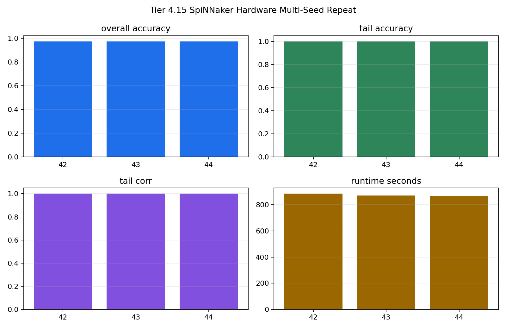

# Tier 4.15 SpiNNaker Hardware Multi-Seed Repeat Findings

- Generated: `2026-04-27T02:48:50+00:00`
- Mode: `run-hardware`
- Status: **PASS**
- Output directory: `<jobmanager_tmp>`
- Requested seeds: `[42, 43, 44]`

Tier 4.15 repeats the same minimal fixed-pattern hardware capsule from Tier 4.13 across multiple seeds. It is repeatability evidence, not a harder task and not hardware scaling.

## Claim Boundary

- `PREPARED` means the JobManager package exists locally; it is not hardware evidence.
- `PASS` requires every requested seed to run through real `pyNN.spiNNaker` with zero fallback/failures, nonzero spike readback, and learning metrics above threshold.
- A pass supports repeatability of the minimal capsule only; it does not prove full hardware scaling or full CRA hardware deployment.

## Summary

- hardware_run_attempted: `True`
- hardware_target_configured: `False`
- runs: `3`
- all_accuracy_mean: `0.97479`
- all_accuracy_std: `0`
- all_accuracy_min: `0.97479`
- tail_accuracy_mean: `1`
- tail_accuracy_std: `0`
- tail_prediction_target_corr_mean: `0.99999`
- tail_prediction_target_corr_min: `0.999984`
- total_step_spikes_mean: `291104`
- runtime_seconds_mean: `873.634`
- runtime_seconds_std: `10.0965`
- synthetic_fallbacks_sum: `0`
- sim_run_failures_sum: `0`
- summary_read_failures_sum: `0`
- all_seed_statuses_pass: `True`
- jobmanager_cli: `None`

## Per-Seed Summary

| Seed | Overall Acc | Tail Acc | Tail Corr | Spikes | Runtime s | Fallbacks | Status |
| --- | ---: | ---: | ---: | ---: | ---: | ---: | --- |
| 42 | 0.97479 | 1 | 0.999984 | 284154 | 884.898 | 0 | pass |
| 43 | 0.97479 | 1 | 0.999993 | 293636 | 870.607 | 0 | pass |
| 44 | 0.97479 | 1 | 0.999994 | 295521 | 865.398 | 0 | pass |

## Criteria

| Criterion | Value | Rule | Pass |
| --- | --- | --- | --- |
| all requested seeds completed | 3 | == 3 | yes |
| all per-seed criteria pass | True | == True | yes |
| sim.run failures sum | 0 | == 0 | yes |
| summary read failures sum | 0 | == 0 | yes |
| synthetic fallback sum | 0 | == 0 | yes |
| real spike readback in every seed | 284154 | > 0 | yes |
| fixed population has no births/deaths | {'births': 0, 'deaths': 0} | == {'births': 0, 'deaths': 0} | yes |
| no extinction/collapse in any seed | 8 | == 8 | yes |
| minimum overall strict accuracy | 0.97479 | >= 0.65 | yes |
| minimum tail strict accuracy | 1 | >= 0.75 | yes |
| minimum tail prediction/target correlation | 0.999984 | >= 0.6 | yes |
| runtime documented for every seed | 865.398 | > 0 | yes |

## Artifacts

- `manifest_json`: `<jobmanager_tmp>`
- `summary_csv`: `<jobmanager_tmp>`
- `seed_42_timeseries_csv`: `<jobmanager_tmp>`
- `seed_42_timeseries_png`: `<jobmanager_tmp>`
- `seed_43_timeseries_csv`: `<jobmanager_tmp>`
- `seed_43_timeseries_png`: `<jobmanager_tmp>`
- `seed_44_timeseries_csv`: `<jobmanager_tmp>`
- `seed_44_timeseries_png`: `<jobmanager_tmp>`
- `seed_summary_csv`: `<jobmanager_tmp>`
- `multi_seed_summary_png`: `<jobmanager_tmp>`
- `spinnaker_report_1`: `<jobmanager_tmp>`
- `spinnaker_report_2`: `<jobmanager_tmp>`
- `spinnaker_report_3`: `<jobmanager_tmp>`

