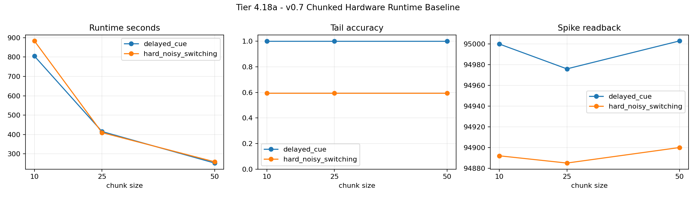

# Tier 4.18a v0.7 Chunked Hardware Runtime Baseline Findings

- Generated: `2026-04-28T01:28:22+00:00`
- Mode: `run-hardware`
- Status: **PASS**
- Output directory: `/tmp/job3949139242826171397.tmp/CRA_test_418/controlled_test_output/tier4_18a_20260428_013742_run_hardware`

Tier 4.18a characterizes runtime/resource cost for the v0.7 chunked-host hardware path that already passed Tier 4.16a and Tier 4.16b.

## Claim Boundary

- `PREPARED` means the JobManager capsule exists locally; it is not hardware evidence.
- `PASS` requires real `pyNN.spiNNaker`, zero fallback/failures, real spike readback, documented runtime/call counts, and task metrics above threshold.
- This is runtime/resource characterization, not hardware scaling, not on-chip learning, and not a new superiority claim.

## Summary

- hardware_run_attempted: `True`
- hardware_target_configured: `False`
- backend: `pyNN.spiNNaker`
- tasks: `['delayed_cue', 'hard_noisy_switching']`
- seeds: `[42]`
- chunk_sizes: `[10, 25, 50]`
- runs: `6`
- steps: `1200`
- population_size: `8`
- runtime_mode: `chunked`
- learning_location: `host`
- sim_run_failures_sum: `0`
- summary_read_failures_sum: `0`
- synthetic_fallbacks_sum: `0`
- scheduled_input_failures_sum: `0`
- spike_readback_failures_sum: `0`
- total_step_spikes_min: `94885`
- runtime_seconds_mean: `504.048`
- recommended_chunk_size: `50`
- recommendation_reason: `fastest viable chunk across requested tasks`
- jobmanager_cli: `None`

## Runtime Matrix

| Task | Chunk | Runs | sim.run Calls | Runtime Mean | Tail Acc Mean | Tail Acc Min | Spike Min |
| --- | ---: | ---: | ---: | ---: | ---: | ---: | ---: |
| `delayed_cue` | 10 | 1 | 120 | 805.046 | 1 | 1 | 95000 |
| `delayed_cue` | 25 | 1 | 48 | 415.252 | 1 | 1 | 94976 |
| `delayed_cue` | 50 | 1 | 24 | 252.291 | 1 | 1 | 95003 |
| `hard_noisy_switching` | 10 | 1 | 120 | 883.365 | 0.595238 | 0.595238 | 94892 |
| `hard_noisy_switching` | 25 | 1 | 48 | 409.642 | 0.595238 | 0.595238 | 94885 |
| `hard_noisy_switching` | 50 | 1 | 24 | 258.694 | 0.595238 | 0.595238 | 94900 |

## Criteria

| Criterion | Value | Rule | Pass |
| --- | --- | --- | --- |
| all requested task/chunk/seed runs completed | 6 | == 6 | yes |
| sim.run failures sum | 0 | == 0 | yes |
| summary read failures sum | 0 | == 0 | yes |
| synthetic fallback sum | 0 | == 0 | yes |
| scheduled input failures sum | 0 | == 0 | yes |
| spike readback failures sum | 0 | == 0 | yes |
| real spike readback in every run | 94885 | > 0 | yes |
| runtime documented in every run | 252.291 | is finite True | yes |
| confirmed delayed-credit setting used | 0.2 | == 0.2 | yes |
| chunk 10 sim.run calls match plan | [120.0, 120.0] | == 120 | yes |
| chunk 25 sim.run calls match plan | [48.0, 48.0] | == 48 | yes |
| chunk 50 sim.run calls match plan | [24.0, 24.0] | == 24 | yes |
| delayed_cue tail accuracy remains above repaired threshold | 1 | >= 0.85 | yes |
| hard_noisy_switching tail accuracy remains above transfer threshold | 0.595238 | >= 0.5 | yes |
| hard_noisy_switching tail correlation is finite | [0.05827046543382765, 0.05827046543382765, 0.05827046543382765] | is finite True | yes |
| chunk 10 tail accuracy close to chunk 25 baseline | 0 | <= 0.1 | yes |
| chunk 25 tail accuracy close to chunk 25 baseline | 0 | <= 0.1 | yes |
| chunk 50 tail accuracy close to chunk 25 baseline | 0 | <= 0.1 | yes |

## Artifacts

- `manifest_json`: `/tmp/job3949139242826171397.tmp/CRA_test_418/controlled_test_output/tier4_18a_20260428_013742_run_hardware/tier4_18a_results.json`
- `summary_csv`: `/tmp/job3949139242826171397.tmp/CRA_test_418/controlled_test_output/tier4_18a_20260428_013742_run_hardware/tier4_18a_summary.csv`
- `runtime_matrix_csv`: `/tmp/job3949139242826171397.tmp/CRA_test_418/controlled_test_output/tier4_18a_20260428_013742_run_hardware/tier4_18a_runtime_matrix.csv`
- `delayed_cue_chunk10_seed42_timeseries_csv`: `/tmp/job3949139242826171397.tmp/CRA_test_418/controlled_test_output/tier4_18a_20260428_013742_run_hardware/spinnaker_hardware_delayed_cue_chunk10_seed42_timeseries.csv`
- `delayed_cue_chunk10_seed42_timeseries_png`: `/tmp/job3949139242826171397.tmp/CRA_test_418/controlled_test_output/tier4_18a_20260428_013742_run_hardware/spinnaker_hardware_delayed_cue_chunk10_seed42_timeseries.png`
- `delayed_cue_chunk25_seed42_timeseries_csv`: `/tmp/job3949139242826171397.tmp/CRA_test_418/controlled_test_output/tier4_18a_20260428_013742_run_hardware/spinnaker_hardware_delayed_cue_chunk25_seed42_timeseries.csv`
- `delayed_cue_chunk25_seed42_timeseries_png`: `/tmp/job3949139242826171397.tmp/CRA_test_418/controlled_test_output/tier4_18a_20260428_013742_run_hardware/spinnaker_hardware_delayed_cue_chunk25_seed42_timeseries.png`
- `delayed_cue_chunk50_seed42_timeseries_csv`: `/tmp/job3949139242826171397.tmp/CRA_test_418/controlled_test_output/tier4_18a_20260428_013742_run_hardware/spinnaker_hardware_delayed_cue_chunk50_seed42_timeseries.csv`
- `delayed_cue_chunk50_seed42_timeseries_png`: `/tmp/job3949139242826171397.tmp/CRA_test_418/controlled_test_output/tier4_18a_20260428_013742_run_hardware/spinnaker_hardware_delayed_cue_chunk50_seed42_timeseries.png`
- `hard_noisy_switching_chunk10_seed42_timeseries_csv`: `/tmp/job3949139242826171397.tmp/CRA_test_418/controlled_test_output/tier4_18a_20260428_013742_run_hardware/spinnaker_hardware_hard_noisy_switching_chunk10_seed42_timeseries.csv`
- `hard_noisy_switching_chunk10_seed42_timeseries_png`: `/tmp/job3949139242826171397.tmp/CRA_test_418/controlled_test_output/tier4_18a_20260428_013742_run_hardware/spinnaker_hardware_hard_noisy_switching_chunk10_seed42_timeseries.png`
- `hard_noisy_switching_chunk25_seed42_timeseries_csv`: `/tmp/job3949139242826171397.tmp/CRA_test_418/controlled_test_output/tier4_18a_20260428_013742_run_hardware/spinnaker_hardware_hard_noisy_switching_chunk25_seed42_timeseries.csv`
- `hard_noisy_switching_chunk25_seed42_timeseries_png`: `/tmp/job3949139242826171397.tmp/CRA_test_418/controlled_test_output/tier4_18a_20260428_013742_run_hardware/spinnaker_hardware_hard_noisy_switching_chunk25_seed42_timeseries.png`
- `hard_noisy_switching_chunk50_seed42_timeseries_csv`: `/tmp/job3949139242826171397.tmp/CRA_test_418/controlled_test_output/tier4_18a_20260428_013742_run_hardware/spinnaker_hardware_hard_noisy_switching_chunk50_seed42_timeseries.csv`
- `hard_noisy_switching_chunk50_seed42_timeseries_png`: `/tmp/job3949139242826171397.tmp/CRA_test_418/controlled_test_output/tier4_18a_20260428_013742_run_hardware/spinnaker_hardware_hard_noisy_switching_chunk50_seed42_timeseries.png`
- `runtime_matrix_png`: `/tmp/job3949139242826171397.tmp/CRA_test_418/controlled_test_output/tier4_18a_20260428_013742_run_hardware/tier4_18a_runtime_matrix.png`
- `spinnaker_report_1`: `/tmp/job3949139242826171397.tmp/CRA_test_418/controlled_test_output/tier4_18a_20260428_013742_run_hardware/spinnaker_reports/2026-04-28-01-37-42-908415`
- `spinnaker_report_2`: `/tmp/job3949139242826171397.tmp/CRA_test_418/controlled_test_output/tier4_18a_20260428_013742_run_hardware/spinnaker_reports/2026-04-28-01-51-10-320460`
- `spinnaker_report_3`: `/tmp/job3949139242826171397.tmp/CRA_test_418/controlled_test_output/tier4_18a_20260428_013742_run_hardware/spinnaker_reports/2026-04-28-01-58-07-935047`
- `spinnaker_report_4`: `/tmp/job3949139242826171397.tmp/CRA_test_418/controlled_test_output/tier4_18a_20260428_013742_run_hardware/spinnaker_reports/2026-04-28-02-02-22-568637`
- `spinnaker_report_5`: `/tmp/job3949139242826171397.tmp/CRA_test_418/controlled_test_output/tier4_18a_20260428_013742_run_hardware/spinnaker_reports/2026-04-28-02-17-08-597699`
- `spinnaker_report_6`: `/tmp/job3949139242826171397.tmp/CRA_test_418/controlled_test_output/tier4_18a_20260428_013742_run_hardware/spinnaker_reports/2026-04-28-02-24-00-542410`

