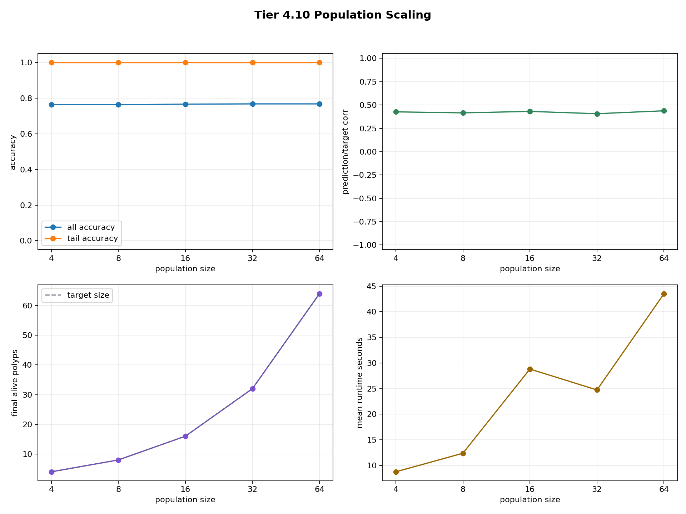
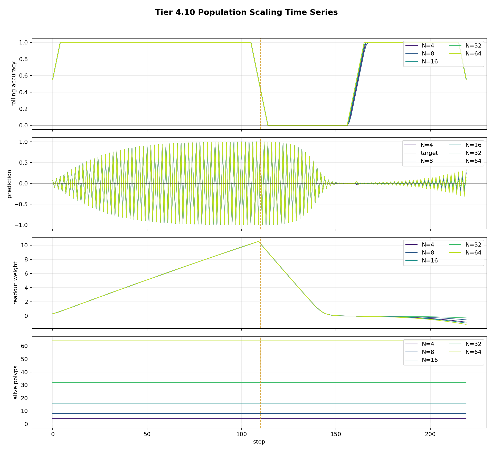

# Tier 4 Population Scaling Findings

- Generated: `2026-04-26T19:57:00+00:00`
- Backend: `nest`
- Overall status: **PASS**
- Population sizes: `4, 8, 16, 32, 64`
- Seeds: `42, 43, 44`
- Steps per run: `220`
- Output directory: `<repo>/controlled_test_output/tier4_20260426_155103`

Tier 4.10 runs the same nonstationary switch task at exact fixed colony sizes. Reproduction and apoptosis are disabled so the population-size axis is controlled.

## Artifact Index

- JSON manifest: `tier4_results.json`
- Summary CSV: `tier4_summary.csv`
- `summary_plot_png`: `population_scaling_summary.png`
- `timeseries_plot_png`: `population_scaling_timeseries.png`

## Summary

| Population | Tail acc | Overall acc | Pred/target corr | Final alive | Mean runtime s |
| ---: | ---: | ---: | ---: | ---: | ---: |
| 4 | 1 | 0.765152 | 0.426631 | 4 | 8.74834 |
| 8 | 1 | 0.763636 | 0.415919 | 8 | 12.3752 |
| 16 | 1 | 0.766667 | 0.431348 | 16 | 28.8173 |
| 32 | 1 | 0.768182 | 0.406827 | 32 | 24.7365 |
| 64 | 1 | 0.768182 | 0.438151 | 64 | 43.5373 |

## Criteria

| Criterion | Value | Rule | Pass |
| --- | ---: | --- | --- |
| all sizes preserve exact population | True | == True | yes |
| no lifecycle churn in fixed scaling mode | True | == True | yes |
| minimum tail accuracy across sizes | 1 | >= 0.8 | yes |
| minimum overall accuracy across sizes | 0.763636 | >= 0.7 | yes |
| minimum prediction/target correlation | 0.406827 | >= 0.3 | yes |
| largest population does not collapse versus smallest | 0.0030303 | >= -0.08 | yes |
| some larger population improves or matches smallest | 0.0030303 | >= -0.02 | yes |

## Plots

