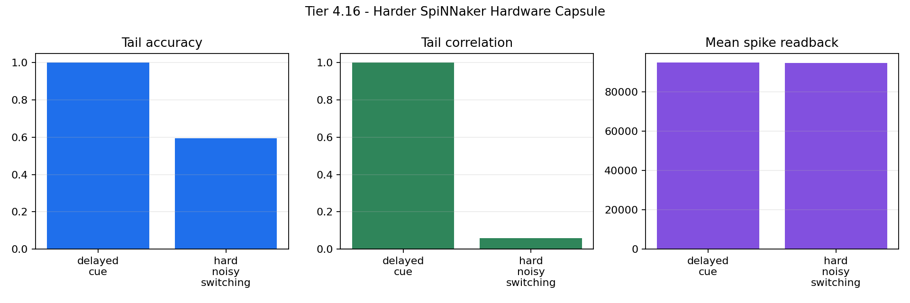

# Tier 4.16 Harder SpiNNaker Hardware Capsule Findings

- Generated: `2026-04-30T03:41:16+00:00`
- Mode: `run-hardware`
- Status: **PASS**
- Output directory: `<jobmanager_tmp>`

Tier 4.16 tests whether the Tier 5.4 confirmed delayed-credit setting survives on real SpiNNaker hardware.

## Claim Boundary

- `PREPARED` means the JobManager capsule exists locally; it is not hardware evidence.
- `PASS` requires real `pyNN.spiNNaker`, zero synthetic fallback, zero `sim.run` failures, zero summary-read failures, real spike readback, and task metrics above threshold.
- This is not full hardware scaling and not a superiority claim over external baselines.

## Summary

- hardware_run_attempted: `True`
- hardware_target_configured: `False`
- backend: `pyNN.spiNNaker`
- tasks: `['delayed_cue', 'hard_noisy_switching']`
- seeds: `[42]`
- runs: `2`
- total_step_spikes_min: `94900`
- total_step_spikes_mean: `94951.5`
- sim_run_failures_sum: `0`
- summary_read_failures_sum: `0`
- synthetic_fallbacks_sum: `0`
- runtime_seconds_mean: `279.216`
- jobmanager_cli: `None`
- failure_step: `None`

## Task Summary

| Part | Task | Runs | Tail Acc Mean | Tail Acc Min | Tail Corr Mean | Spike Min | Runtime Mean |
| --- | --- | ---: | ---: | ---: | ---: | ---: | ---: |
| 4.16a | `delayed_cue` | 1 | 1 | 1 | 1 | 95003 | 286.354 |
| 4.16b | `hard_noisy_switching` | 1 | 0.595238 | 0.595238 | 0.0582705 | 94900 | 272.077 |

## Criteria

| Criterion | Value | Rule | Pass |
| --- | --- | --- | --- |
| all requested task/seed hardware runs completed | 2 | == 2 | yes |
| sim.run failures sum | 0 | == 0 | yes |
| summary read failures sum | 0 | == 0 | yes |
| synthetic fallback sum | 0 | == 0 | yes |
| real spike readback in every run | 94900 | > 0 | yes |
| fixed population has no births/deaths | {'births': 0, 'deaths': 0} | == {'births': 0, 'deaths': 0} | yes |
| 4.16a delayed_cue tail accuracy | 1 | >= 0.85 | yes |
| 4.16b hard_noisy_switching tail accuracy | 0.595238 | >= 0.5 | yes |
| 4.16b hard_noisy_switching tail correlation is finite | 0.0582705 | is finite True | yes |
| confirmed delayed-credit setting used | 0.2 | == 0.2 | yes |

## Artifacts

- `manifest_json`: `<jobmanager_tmp>`
- `summary_csv`: `<jobmanager_tmp>`
- `task_summary_csv`: `<jobmanager_tmp>`
- `delayed_cue_seed_42_timeseries_csv`: `<jobmanager_tmp>`
- `delayed_cue_seed_42_timeseries_png`: `<jobmanager_tmp>`
- `hard_noisy_switching_seed_42_timeseries_csv`: `<jobmanager_tmp>`
- `hard_noisy_switching_seed_42_timeseries_png`: `<jobmanager_tmp>`
- `hardware_summary_png`: `<jobmanager_tmp>`
- `spinnaker_report_1`: `<jobmanager_tmp>`
- `spinnaker_report_2`: `<jobmanager_tmp>`

