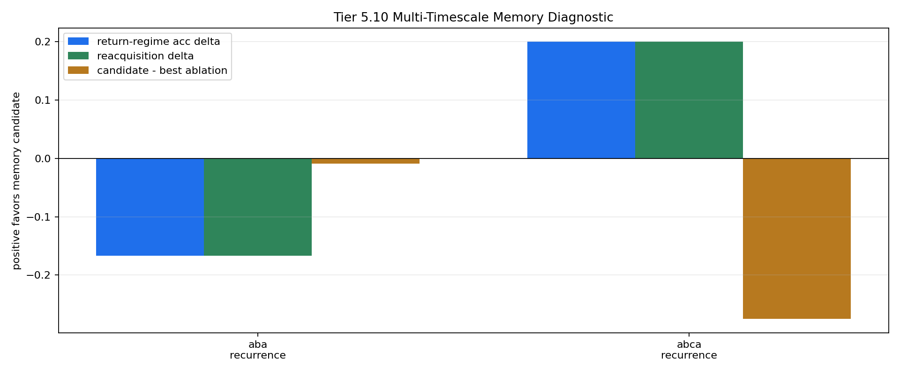

# Tier 5.10 Multi-Timescale Memory Diagnostic Findings

- Generated: `2026-04-28T22:13:10+00:00`
- Status: **PASS**
- Backend: `mock`
- Steps: `160`
- Seeds: `42`
- Tasks: `aba_recurrence,abca_recurrence`
- Variants: `all`
- Selected baselines: `sign_persistence,online_perceptron`
- Smoke mode: `True`
- Output directory: `/Users/james/JKS:CRA/controlled_test_output/tier5_10_20260428_181304`

Tier 5.10 tests whether existing fast/slow/structural memory knobs help CRA retain or reacquire old regimes after they disappear and return.

## Claim Boundary

- This is software diagnostic evidence, not hardware evidence.
- The candidate is a proxy memory-timescale configuration, not sleep/replay and not a full learned memory store.
- v1.4 remains the frozen architecture baseline unless the candidate passes this gate and then survives compact regression.
- A failed run is still useful: it identifies that recurrence/forgetting needs a sharper mechanism before promotion.

## Task Comparisons

| Task | v1.4 tail | Memory tail | Tail delta | v1.4 return acc | Memory return acc | Return delta | Reacq delta | Recovery delta | Best ablation | Candidate-ablation delta | External return edge |
| --- | ---: | ---: | ---: | ---: | ---: | ---: | ---: | ---: | --- | ---: | ---: |
| aba_recurrence | 0.8 | 0.6 | -0.2 | 0.666667 | 0.5 | -0.166667 | -0.166667 | -4 | `no_slow_memory` | -0.00855036 | -0.25 |
| abca_recurrence | 0.6 | 0.8 | 0.2 | 0.6 | 0.8 | 0.2 | 0.2 | -10.6667 | `overrigid_memory` | -0.275333 | -0.2 |

## Aggregate Matrix

| Task | Model | Family | Group | Tail acc | Return acc | Reacq delta | Return corr | Recovery | Runtime s |
| --- | --- | --- | --- | ---: | ---: | ---: | ---: | ---: | ---: |
| aba_recurrence | `multi_timescale_memory` | CRA | candidate | 0.6 | 0.5 | -0.0714286 | 0.178314 | 12.5 | 0.394801 |
| aba_recurrence | `no_bocpd_unlock` | CRA | memory_ablation | 0.6 | 0.5 | -0.0714286 | 0.178314 | 12.5 | 0.395652 |
| aba_recurrence | `no_slow_memory` | CRA | memory_ablation | 0.6 | 0.5 | -0.0714286 | 0.235317 | 12.5 | 0.392566 |
| aba_recurrence | `no_structural_memory` | CRA | memory_ablation | 0.6 | 0.5 | -0.0714286 | 0.178314 | 12.5 | 0.40835 |
| aba_recurrence | `overrigid_memory` | CRA | memory_ablation | 0.6 | 0.5 | -0.357143 | 0.417284 | 24.5 | 0.388859 |
| aba_recurrence | `v1_4_pending_horizon` | CRA | frozen_baseline | 0.8 | 0.666667 | 0.0952381 | 0.485622 | 8.5 | 0.40341 |
| aba_recurrence | `online_perceptron` | linear |  | 0.6 | 0.5 | 0.0714286 | -0.314335 | 16.5 | 0.00118429 |
| aba_recurrence | `sign_persistence` | rule |  | 1 | 1 | 0.142857 | 1 | 28.5 | 0.000861167 |
| abca_recurrence | `multi_timescale_memory` | CRA | candidate | 0.8 | 0.8 | 0 | None | 21.3333 | 0.424028 |
| abca_recurrence | `no_bocpd_unlock` | CRA | memory_ablation | 0.8 | 0.8 | 0 | None | 21.3333 | 0.430057 |
| abca_recurrence | `no_slow_memory` | CRA | memory_ablation | 0.8 | 0.8 | 0 | None | 21.3333 | 0.489481 |
| abca_recurrence | `no_structural_memory` | CRA | memory_ablation | 0.8 | 0.8 | 0 | None | 21.3333 | 0.449855 |
| abca_recurrence | `overrigid_memory` | CRA | memory_ablation | 1 | 1 | 0.2 | None | 18.6667 | 0.448006 |
| abca_recurrence | `v1_4_pending_horizon` | CRA | frozen_baseline | 0.6 | 0.6 | -0.2 | None | 10.6667 | 0.834363 |
| abca_recurrence | `online_perceptron` | linear |  | 1 | 1 | 0.6 | None | 13.3333 | 0.00237525 |
| abca_recurrence | `sign_persistence` | rule |  | 1 | 1 | 0.2 | None | 18.6667 | 0.0014245 |

## Criteria

| Criterion | Value | Rule | Pass | Note |
| --- | --- | --- | --- | --- |
| full variant/baseline/task/seed matrix completed | 16 | == 16 | yes |  |
| feedback timing has no leakage violations | 0 | == 0 | yes |  |
| return-regime evaluation events exist | 0.5 | not None None | yes |  |

## Artifacts

- `tier5_10_results.json`: machine-readable manifest.
- `tier5_10_report.md`: human findings and claim boundary.
- `tier5_10_summary.csv`: aggregate task/model metrics.
- `tier5_10_comparisons.csv`: candidate-vs-v1.4/ablation/baseline table.
- `tier5_10_fairness_contract.json`: predeclared comparison and leakage constraints.
- `tier5_10_memory_edges.png`: recurrence edge plot.
- `*_timeseries.csv`: per-run traces with phase labels.

