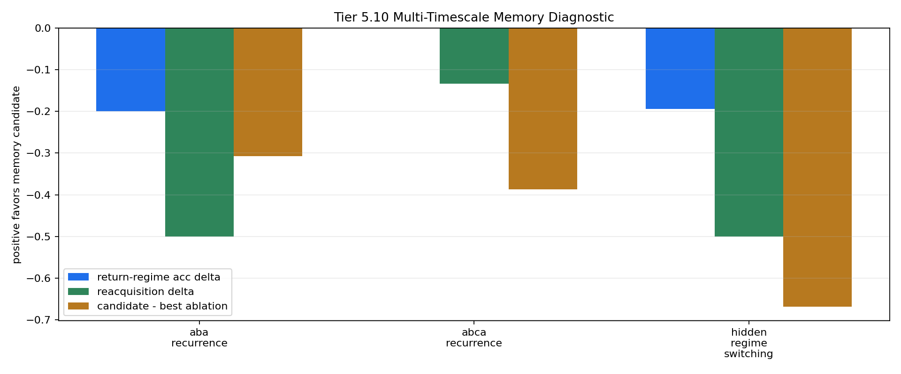

# Tier 5.10 Multi-Timescale Memory Diagnostic Findings

- Generated: `2026-04-28T22:45:43+00:00`
- Status: **FAIL**
- Backend: `nest`
- Steps: `960`
- Seeds: `42, 43, 44`
- Tasks: `aba_recurrence,abca_recurrence,hidden_regime_switching`
- Variants: `all`
- Selected baselines: `sign_persistence,online_perceptron,online_logistic_regression,echo_state_network,stdp_only_snn`
- Smoke mode: `False`
- Output directory: `/Users/james/JKS:CRA/controlled_test_output/tier5_10_20260428_181322`

Tier 5.10 tests whether existing fast/slow/structural memory knobs help CRA retain or reacquire old regimes after they disappear and return.

## Claim Boundary

- This is software diagnostic evidence, not hardware evidence.
- The candidate is a proxy memory-timescale configuration, not sleep/replay and not a full learned memory store.
- v1.4 remains the frozen architecture baseline unless the candidate passes this gate and then survives compact regression.
- A failed run is still useful: it identifies that recurrence/forgetting needs a sharper mechanism before promotion.

## Task Comparisons

| Task | v1.4 tail | Memory tail | Tail delta | v1.4 return acc | Memory return acc | Return delta | Reacq delta | Recovery delta | Best ablation | Candidate-ablation delta | External return edge |
| --- | ---: | ---: | ---: | ---: | ---: | ---: | ---: | ---: | --- | ---: | ---: |
| aba_recurrence | 0.788889 | 0.611111 | -0.177778 | 0.675 | 0.475 | -0.2 | -0.5 | -101.333 | `overrigid_memory` | -0.307956 | -0.183333 |
| abca_recurrence | 0.788889 | 0.788889 | 0 | 0.788889 | 0.788889 | 0 | -0.133333 | -40.8889 | `overrigid_memory` | -0.387549 | 0.0555556 |
| hidden_regime_switching | 0.788889 | 0.633333 | -0.155556 | 0.777778 | 0.583333 | -0.194444 | -0.5 | -42.6667 | `overrigid_memory` | -0.668742 | -0.0555556 |

## Aggregate Matrix

| Task | Model | Family | Group | Tail acc | Return acc | Reacq delta | Return corr | Recovery | Runtime s |
| --- | --- | --- | --- | ---: | ---: | ---: | ---: | ---: | ---: |
| aba_recurrence | `multi_timescale_memory` | CRA | candidate | 0.611111 | 0.475 | -0.766667 | -0.0818393 | 138.667 | 29.8781 |
| aba_recurrence | `no_bocpd_unlock` | CRA | memory_ablation | 0.611111 | 0.475 | -0.766667 | -0.0818393 | 138.667 | 30.0922 |
| aba_recurrence | `no_slow_memory` | CRA | memory_ablation | 0.655556 | 0.508333 | -0.766667 | -0.103474 | 114.667 | 29.8271 |
| aba_recurrence | `no_structural_memory` | CRA | memory_ablation | 0.611111 | 0.475 | -0.766667 | -0.0818393 | 138.667 | 29.6352 |
| aba_recurrence | `overrigid_memory` | CRA | memory_ablation | 0.666667 | 0.666667 | -0.233333 | 0.32377 | 192 | 30.8692 |
| aba_recurrence | `v1_4_pending_horizon` | CRA | frozen_baseline | 0.788889 | 0.675 | -0.266667 | 0.33622 | 37.3333 | 33.0142 |
| aba_recurrence | `echo_state_network` | reservoir |  | 0.655556 | 0.566667 | -0.166667 | 0.114153 | 86.6667 | 0.0107246 |
| aba_recurrence | `online_logistic_regression` | linear |  | 0.855556 | 0.658333 | -0.6 | 0.322496 | 90.6667 | 0.00546661 |
| aba_recurrence | `online_perceptron` | linear |  | 0.933333 | 0.85 | -0.0333333 | 0.726431 | 16 | 0.00464535 |
| aba_recurrence | `sign_persistence` | rule |  | 0.955556 | 0.95 | 0.0333333 | 0.900804 | 156 | 0.00445149 |
| aba_recurrence | `stdp_only_snn` | snn_ablation |  | 0.533333 | 0.525 | 0 | 0.000281119 | 30.6667 | 0.00822501 |
| abca_recurrence | `multi_timescale_memory` | CRA | candidate | 0.788889 | 0.788889 | -0.3 | 0.539513 | 108.444 | 31.6677 |
| abca_recurrence | `no_bocpd_unlock` | CRA | memory_ablation | 0.788889 | 0.788889 | -0.3 | 0.539513 | 108.444 | 31.4605 |
| abca_recurrence | `no_slow_memory` | CRA | memory_ablation | 0.8 | 0.8 | -0.266667 | 0.507158 | 104 | 71.8842 |
| abca_recurrence | `no_structural_memory` | CRA | memory_ablation | 0.788889 | 0.788889 | -0.3 | 0.539513 | 108.444 | 32.3548 |
| abca_recurrence | `overrigid_memory` | CRA | memory_ablation | 0.977778 | 0.977778 | 0.0666667 | 0.937249 | 103.111 | 30.2075 |
| abca_recurrence | `v1_4_pending_horizon` | CRA | frozen_baseline | 0.788889 | 0.788889 | -0.166667 | 0.585171 | 67.5556 | 32.9712 |
| abca_recurrence | `echo_state_network` | reservoir |  | 0.733333 | 0.733333 | 0.133333 | 0.158299 | 50.6667 | 0.0104176 |
| abca_recurrence | `online_logistic_regression` | linear |  | 0.733333 | 0.733333 | -0.0666667 | 0.604714 | 53.3333 | 0.00586087 |
| abca_recurrence | `online_perceptron` | linear |  | 0.911111 | 0.911111 | 0.133333 | 0.844487 | 12.4444 | 0.00495479 |
| abca_recurrence | `sign_persistence` | rule |  | 0.977778 | 0.977778 | 0.0666667 | 0.955357 | 103.111 | 0.00404221 |
| abca_recurrence | `stdp_only_snn` | snn_ablation |  | 0.488889 | 0.488889 | 0.0666667 | -0.032185 | 35.5556 | 0.00829633 |
| hidden_regime_switching | `multi_timescale_memory` | CRA | candidate | 0.633333 | 0.583333 | -0.7 | 0.156714 | 72 | 34.1601 |
| hidden_regime_switching | `no_bocpd_unlock` | CRA | memory_ablation | 0.633333 | 0.583333 | -0.7 | 0.156714 | 72 | 31.8459 |
| hidden_regime_switching | `no_slow_memory` | CRA | memory_ablation | 0.655556 | 0.611111 | -0.7 | 0.237711 | 62.6667 | 30.1443 |
| hidden_regime_switching | `no_structural_memory` | CRA | memory_ablation | 0.633333 | 0.583333 | -0.7 | 0.156714 | 72 | 30.0675 |
| hidden_regime_switching | `overrigid_memory` | CRA | memory_ablation | 0.777778 | 0.930556 | -0.0333333 | 0.8424 | 79.3333 | 31.7167 |
| hidden_regime_switching | `v1_4_pending_horizon` | CRA | frozen_baseline | 0.788889 | 0.777778 | -0.2 | 0.443846 | 29.3333 | 73.174 |
| hidden_regime_switching | `echo_state_network` | reservoir |  | 0.577778 | 0.611111 | -0.1 | 0.159042 | 58 | 0.0123805 |
| hidden_regime_switching | `online_logistic_regression` | linear |  | 0.677778 | 0.638889 | -0.4 | 0.281219 | 68 | 0.00642403 |
| hidden_regime_switching | `online_perceptron` | linear |  | 0.8 | 0.805556 | -0.133333 | 0.602322 | 30 | 0.00625881 |
| hidden_regime_switching | `sign_persistence` | rule |  | 0.777778 | 0.930556 | -0.0333333 | 0.849802 | 79.3333 | 0.00618108 |
| hidden_regime_switching | `stdp_only_snn` | snn_ablation |  | 0.477778 | 0.472222 | 0 | -0.232702 | 28 | 0.0144005 |

## Criteria

| Criterion | Value | Rule | Pass | Note |
| --- | --- | --- | --- | --- |
| full variant/baseline/task/seed matrix completed | 99 | == 99 | yes |  |
| feedback timing has no leakage violations | 0 | == 0 | yes |  |
| return-regime evaluation events exist | 0.475 | not None None | yes |  |
| multi-timescale memory does not regress tail accuracy versus v1.4 | -0.177778 | >= -0.02 | no | The candidate cannot buy recurrence by damaging ordinary tail performance. |
| multi-timescale memory improves recurrence or recovery | {'return_edges': [-0.1999999999999999, 0.0, -0.19444444444444442], 'reacquisition_edges': [-0.49999999999999994, -0.13333333333333333, -0.5000000000000001], 'recovery_edges': [-101.33333333333331, -40.888888888888886, -42.66666666666667]} | any >= {'return': 0.02, 'reacquisition': 0.02, 'recovery': 1.0} | no | At least one recurrent-regime metric must improve versus v1.4. |
| memory ablations are worse than the candidate | -0.668742 | >= 0.005 | no | No-slow/no-structural/no-BOCPD controls must not explain the benefit. |
| candidate has at least one external-baseline return-regime edge | 1 | >= 1 | yes | This is a reviewer-defense gate, not a universal superiority claim. |

Failure: Failed criteria: multi-timescale memory does not regress tail accuracy versus v1.4, multi-timescale memory improves recurrence or recovery, memory ablations are worse than the candidate

## Artifacts

- `tier5_10_results.json`: machine-readable manifest.
- `tier5_10_report.md`: human findings and claim boundary.
- `tier5_10_summary.csv`: aggregate task/model metrics.
- `tier5_10_comparisons.csv`: candidate-vs-v1.4/ablation/baseline table.
- `tier5_10_fairness_contract.json`: predeclared comparison and leakage constraints.
- `tier5_10_memory_edges.png`: recurrence edge plot.
- `*_timeseries.csv`: per-run traces with phase labels.

