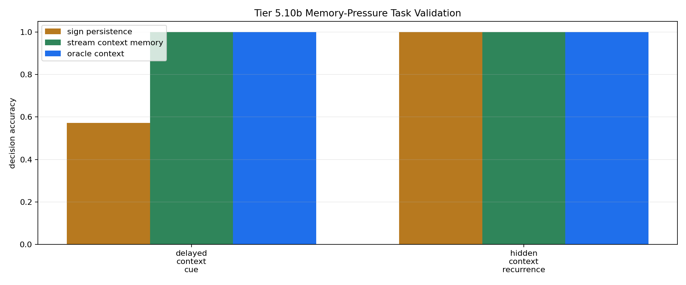

# Tier 5.10b Memory-Pressure Task Validation Findings

- Generated: `2026-04-28T23:33:32+00:00`
- Status: **FAIL**
- Steps: `180`
- Seeds: `42`
- Tasks: `delayed_context_cue,hidden_context_recurrence`
- Selected standard baselines: `sign_persistence,online_perceptron`
- Smoke mode: `True`
- Output directory: `<repo>/controlled_test_output/tier5_10b_20260428_193332`

Tier 5.10b validates whether repaired recurrence/context tasks actually require remembered context before CRA memory mechanisms are tested.

## Claim Boundary

- This is task-validation evidence, not CRA capability evidence.
- Oracle/context-memory controls are included to prove the task is solvable if the missing memory exists.
- A pass authorizes Tier 5.10c mechanism testing; it does not promote sleep/replay or any CRA memory mechanism.

## Task Pressure Comparisons

| Task | Sign persistence acc | Context memory acc | Oracle acc | Shuffled acc | Reset acc | Wrong-context acc | Best standard model | Best standard acc | Memory edge vs sign | Memory edge vs failure control | Ambiguous cues | Decisions |
| --- | ---: | ---: | ---: | ---: | ---: | ---: | --- | ---: | ---: | ---: | ---: | ---: |
| delayed_context_cue | 0.571429 | 1 | 1 | 0.428571 | 0.571429 | 0 | `online_perceptron` | 0 | 0.428571 | 0.571429 | 2 | 7 |
| hidden_context_recurrence | 1 | 1 | 1 | 1 | 1 | 0 | `online_perceptron` | 0.857143 | 0 | 0 | 0 | 14 |

## Aggregate Matrix

| Task | Model | Family | Tail acc | All acc | Corr | Runtime s |
| --- | --- | --- | ---: | ---: | ---: | ---: |
| delayed_context_cue | `memory_reset` | context_control | 0 | 0.571429 | 0.166667 | 0.000740125 |
| delayed_context_cue | `online_perceptron` | linear | 0 | 0 | -0.674088 | 0.00117525 |
| delayed_context_cue | `oracle_context` | context_control | 1 | 1 | 1 | 0.000758208 |
| delayed_context_cue | `shuffled_context` | context_control | 0 | 0.428571 | None | 0.0008075 |
| delayed_context_cue | `sign_persistence` | rule | 0 | 0.571429 | 0.166667 | 0.00158475 |
| delayed_context_cue | `stream_context_memory` | context_control | 1 | 1 | 1 | 0.000725125 |
| delayed_context_cue | `wrong_context` | context_control | 0 | 0 | -1 | 0.00072 |
| hidden_context_recurrence | `memory_reset` | context_control | 1 | 1 | 1 | 0.00217229 |
| hidden_context_recurrence | `online_perceptron` | linear | 1 | 0.857143 | 0.92292 | 0.00142083 |
| hidden_context_recurrence | `oracle_context` | context_control | 1 | 1 | 1 | 0.000777291 |
| hidden_context_recurrence | `shuffled_context` | context_control | 1 | 1 | 1 | 0.000707333 |
| hidden_context_recurrence | `sign_persistence` | rule | 1 | 1 | 1 | 0.00100196 |
| hidden_context_recurrence | `stream_context_memory` | context_control | 1 | 1 | 1 | 0.000719625 |
| hidden_context_recurrence | `wrong_context` | context_control | 0 | 0 | -1 | 0.000790458 |

## Criteria

| Criterion | Value | Rule | Pass | Note |
| --- | --- | --- | --- | --- |
| full task/model/seed matrix completed | 14 | == 14 | yes |  |
| feedback timing has no leakage violations | 0 | == 0 | yes |  |
| same current input supports opposite labels | False | == True | no |  |

Failure: Failed criteria: same current input supports opposite labels

## Artifacts

- `tier5_10b_results.json`: machine-readable manifest.
- `tier5_10b_report.md`: human findings and claim boundary.
- `tier5_10b_summary.csv`: aggregate task/model metrics.
- `tier5_10b_comparisons.csv`: task-pressure comparison table.
- `tier5_10b_fairness_contract.json`: predeclared comparison/leakage rules.
- `tier5_10b_task_pressure.png`: task-pressure plot.
- `*_timeseries.csv`: per-task/per-model/per-seed traces.

