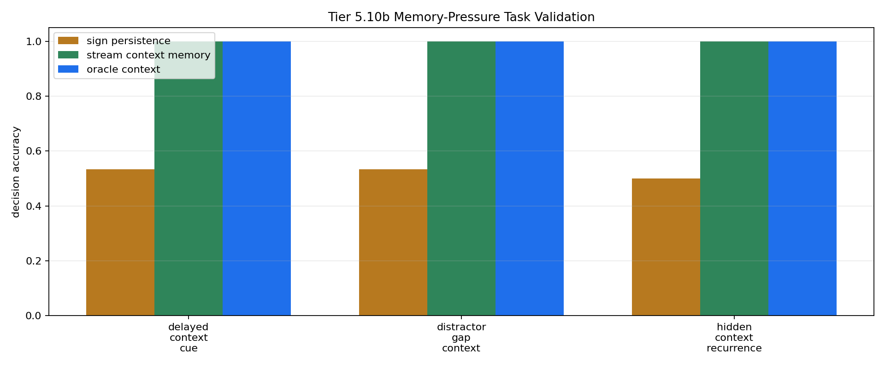

# Tier 5.10b Memory-Pressure Task Validation Findings

- Generated: `2026-04-28T23:36:41+00:00`
- Status: **PASS**
- Steps: `720`
- Seeds: `42, 43, 44`
- Tasks: `delayed_context_cue,distractor_gap_context,hidden_context_recurrence`
- Selected standard baselines: `sign_persistence,online_perceptron,online_logistic_regression,echo_state_network,small_gru,stdp_only_snn`
- Smoke mode: `False`
- Output directory: `<repo>/controlled_test_output/tier5_10b_20260428_193639`

Tier 5.10b validates whether repaired recurrence/context tasks actually require remembered context before CRA memory mechanisms are tested.

## Claim Boundary

- This is task-validation evidence, not CRA capability evidence.
- Oracle/context-memory controls are included to prove the task is solvable if the missing memory exists.
- A pass authorizes Tier 5.10c mechanism testing; it does not promote sleep/replay or any CRA memory mechanism.

## Task Pressure Comparisons

| Task | Sign persistence acc | Context memory acc | Oracle acc | Shuffled acc | Reset acc | Wrong-context acc | Best standard model | Best standard acc | Memory edge vs sign | Memory edge vs failure control | Ambiguous cues | Decisions |
| --- | ---: | ---: | ---: | ---: | ---: | ---: | --- | ---: | ---: | ---: | ---: | ---: |
| delayed_context_cue | 0.533333 | 1 | 1 | 0.533333 | 0.533333 | 0 | `sign_persistence` | 0.533333 | 0.466667 | 0.466667 | 2 | 30 |
| distractor_gap_context | 0.533333 | 1 | 1 | 0.422222 | 0.533333 | 0 | `sign_persistence` | 0.533333 | 0.466667 | 0.577778 | 2 | 15 |
| hidden_context_recurrence | 0.5 | 1 | 1 | 0.535714 | 0.5 | 0 | `online_perceptron` | 0.815476 | 0.5 | 0.464286 | 2 | 56 |

## Aggregate Matrix

| Task | Model | Family | Tail acc | All acc | Corr | Runtime s |
| --- | --- | --- | ---: | ---: | ---: | ---: |
| delayed_context_cue | `echo_state_network` | reservoir | 0.291667 | 0.266667 | -0.614377 | 0.0077041 |
| delayed_context_cue | `memory_reset` | context_control | 0.5 | 0.533333 | 0.0666667 | 0.00260862 |
| delayed_context_cue | `online_logistic_regression` | linear | 0 | 0.0222222 | -0.829291 | 0.0048706 |
| delayed_context_cue | `online_perceptron` | linear | 0.333333 | 0.2 | -0.665183 | 0.00434997 |
| delayed_context_cue | `oracle_context` | context_control | 1 | 1 | 1 | 0.00314554 |
| delayed_context_cue | `shuffled_context` | context_control | 0.625 | 0.533333 | 0.0666667 | 0.00272467 |
| delayed_context_cue | `sign_persistence` | rule | 0.5 | 0.533333 | 0.0666667 | 0.00433892 |
| delayed_context_cue | `small_gru` | recurrent | 0.25 | 0.188889 | -0.729606 | 0.015304 |
| delayed_context_cue | `stdp_only_snn` | snn_ablation | 0.5 | 0.5 | -0.00904327 | 0.00674358 |
| delayed_context_cue | `stream_context_memory` | context_control | 1 | 1 | 1 | 0.00250362 |
| delayed_context_cue | `wrong_context` | context_control | 0 | 0 | -1 | 0.00262697 |
| distractor_gap_context | `echo_state_network` | reservoir | 0.166667 | 0.2 | -0.691357 | 0.00779314 |
| distractor_gap_context | `memory_reset` | context_control | 0.5 | 0.533333 | 0.0714286 | 0.00252368 |
| distractor_gap_context | `online_logistic_regression` | linear | 0 | 0.0222222 | -0.778992 | 0.00461797 |
| distractor_gap_context | `online_perceptron` | linear | 0.0833333 | 0.177778 | -0.68205 | 0.00418033 |
| distractor_gap_context | `oracle_context` | context_control | 1 | 1 | 1 | 0.00396667 |
| distractor_gap_context | `shuffled_context` | context_control | 0.583333 | 0.422222 | -0.156153 | 0.00251957 |
| distractor_gap_context | `sign_persistence` | rule | 0.5 | 0.533333 | 0.0714286 | 0.00552293 |
| distractor_gap_context | `small_gru` | recurrent | 0.166667 | 0.133333 | -0.753945 | 0.0148364 |
| distractor_gap_context | `stdp_only_snn` | snn_ablation | 0.5 | 0.511111 | 0.0234491 | 0.00694199 |
| distractor_gap_context | `stream_context_memory` | context_control | 1 | 1 | 1 | 0.00277299 |
| distractor_gap_context | `wrong_context` | context_control | 0 | 0 | -1 | 0.0026222 |
| hidden_context_recurrence | `echo_state_network` | reservoir | 0.119048 | 0.315476 | -0.334147 | 0.00838086 |
| hidden_context_recurrence | `memory_reset` | context_control | 0 | 0.5 | 0 | 0.00262939 |
| hidden_context_recurrence | `online_logistic_regression` | linear | 0.452381 | 0.571429 | 0.138916 | 0.00481069 |
| hidden_context_recurrence | `online_perceptron` | linear | 0.809524 | 0.815476 | 0.688247 | 0.00443726 |
| hidden_context_recurrence | `oracle_context` | context_control | 1 | 1 | 1 | 0.00262246 |
| hidden_context_recurrence | `shuffled_context` | context_control | 0.571429 | 0.535714 | 0.0716115 | 0.00271847 |
| hidden_context_recurrence | `sign_persistence` | rule | 0 | 0.5 | 0 | 0.00400111 |
| hidden_context_recurrence | `small_gru` | recurrent | 0.047619 | 0.327381 | -0.411067 | 0.015204 |
| hidden_context_recurrence | `stdp_only_snn` | snn_ablation | 0.5 | 0.5 | 0.00671627 | 0.00686715 |
| hidden_context_recurrence | `stream_context_memory` | context_control | 1 | 1 | 1 | 0.00271336 |
| hidden_context_recurrence | `wrong_context` | context_control | 0 | 0 | -1 | 0.0101643 |

## Criteria

| Criterion | Value | Rule | Pass | Note |
| --- | --- | --- | --- | --- |
| full task/model/seed matrix completed | 99 | == 99 | yes |  |
| feedback timing has no leakage violations | 0 | == 0 | yes |  |
| same current input supports opposite labels | True | == True | yes |  |
| sign_persistence no longer dominates | 0.533333 | <= 0.65 | yes | A memory-pressure task cannot be solved by the reflex baseline. |
| oracle context solves the task | 1 | >= 0.95 | yes | Proves the task is solvable with the missing context state. |
| stream context memory solves the task | 1 | >= 0.9 | yes | Proves a simple memory of prior context is sufficient. |
| context memory beats sign persistence | 0.466667 | >= 0.25 | yes | The task must reward remembered context over current-signal reflexes. |
| shuffled/reset/wrong memory controls fail | 0.464286 | >= 0.25 | yes | The benefit must depend on correct memory, not generic capacity. |
| standard baselines do not solve every repaired task | 0.815476 | <= 0.85 | yes | The task may remain learnable by stronger baselines, but not trivially solved before CRA testing. |

## Artifacts

- `tier5_10b_results.json`: machine-readable manifest.
- `tier5_10b_report.md`: human findings and claim boundary.
- `tier5_10b_summary.csv`: aggregate task/model metrics.
- `tier5_10b_comparisons.csv`: task-pressure comparison table.
- `tier5_10b_fairness_contract.json`: predeclared comparison/leakage rules.
- `tier5_10b_task_pressure.png`: task-pressure plot.
- `*_timeseries.csv`: per-task/per-model/per-seed traces.

