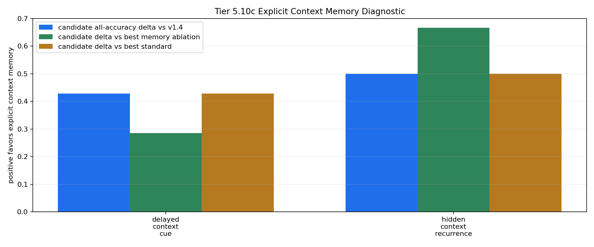

# Tier 5.10c Explicit Context Memory Mechanism Diagnostic Findings

- Generated: `2026-04-29T00:13:03+00:00`
- Status: **PASS**
- Backend: `mock`
- Steps: `180`
- Seeds: `42`
- Tasks: `delayed_context_cue,hidden_context_recurrence`
- Variants: `all`
- Selected standard baselines: `sign_persistence,online_perceptron`
- Smoke mode: `True`
- Output directory: `<repo>/controlled_test_output/tier5_10c_20260428_201258`

Tier 5.10c tests whether CRA can use an explicit host-side context-memory feature on the repaired Tier 5.10b streams.

## Claim Boundary

- This is software diagnostic evidence, not hardware evidence.
- The candidate is an explicit host-side context-binding scaffold, not native on-chip memory.
- A pass authorizes compact regression and a cleaner internal-memory design; it does not promote sleep/replay.

## Task Comparisons

| Task | v1.4 all | Candidate all | Delta vs v1.4 | Best ablation | Delta vs ablation | Sign acc | Best standard | Delta vs standard | Feature-active steps |
| --- | ---: | ---: | ---: | --- | ---: | ---: | --- | ---: | ---: |
| delayed_context_cue | 0.571429 | 1 | 0.428571 | `shuffled_memory_ablation` | 0.285714 | 0.571429 | `sign_persistence` | 0.428571 | 7 |
| hidden_context_recurrence | 0.5 | 1 | 0.5 | `shuffled_memory_ablation` | 0.666667 | 0.5 | `sign_persistence` | 0.5 | 12 |

## Aggregate Matrix

| Task | Model | Family | Group | All acc | Tail acc | Corr | Runtime s | Feature active | Context updates |
| --- | --- | --- | --- | ---: | ---: | ---: | ---: | ---: | ---: |
| delayed_context_cue | `explicit_context_memory` | CRA | candidate | 1 | 1 | 0.948472 | 0.415453 | 7 | 7 |
| delayed_context_cue | `memory_reset_ablation` | CRA | memory_ablation | 0.571429 | 0 | 0.0537743 | 0.417269 | 7 | 7 |
| delayed_context_cue | `shuffled_memory_ablation` | CRA | memory_ablation | 0.714286 | 0 | 0.450008 | 0.415727 | 7 | 7 |
| delayed_context_cue | `v1_4_raw` | CRA | frozen_baseline | 0.571429 | 0 | 0.0537743 | 0.427804 | 0 | 7 |
| delayed_context_cue | `wrong_memory_ablation` | CRA | memory_ablation | 0 | 0 | -0.529582 | 0.413028 | 7 | 7 |
| delayed_context_cue | `memory_reset` | context_control |  | 0.571429 | 0 | 0.166667 | 0.000729792 | None | None |
| delayed_context_cue | `online_perceptron` | linear |  | 0 | 0 | -0.674088 | 0.00116754 | None | None |
| delayed_context_cue | `oracle_context` | context_control |  | 1 | 1 | 1 | 0.000697875 | None | None |
| delayed_context_cue | `shuffled_context` | context_control |  | 0.428571 | 0 | None | 0.000630834 | None | None |
| delayed_context_cue | `sign_persistence` | rule |  | 0.571429 | 0 | 0.166667 | 0.001081 | None | None |
| delayed_context_cue | `stream_context_memory` | context_control |  | 1 | 1 | 1 | 0.000672834 | None | None |
| delayed_context_cue | `wrong_context` | context_control |  | 0 | 0 | -1 | 0.000673209 | None | None |
| hidden_context_recurrence | `explicit_context_memory` | CRA | candidate | 1 | 1 | 0.909862 | 0.42624 | 12 | 4 |
| hidden_context_recurrence | `memory_reset_ablation` | CRA | memory_ablation | 0.5 | 0 | 0.0980663 | 0.425268 | 12 | 4 |
| hidden_context_recurrence | `shuffled_memory_ablation` | CRA | memory_ablation | 0.333333 | 0.666667 | -0.252896 | 0.415831 | 12 | 4 |
| hidden_context_recurrence | `v1_4_raw` | CRA | frozen_baseline | 0.5 | 0 | 0.0980663 | 0.416139 | 0 | 4 |
| hidden_context_recurrence | `wrong_memory_ablation` | CRA | memory_ablation | 0 | 0 | -0.306467 | 0.475664 | 12 | 4 |
| hidden_context_recurrence | `memory_reset` | context_control |  | 0.5 | 0 | 0 | 0.000817667 | None | None |
| hidden_context_recurrence | `online_perceptron` | linear |  | 0.25 | 0.333333 | -0.359172 | 0.00120492 | None | None |
| hidden_context_recurrence | `oracle_context` | context_control |  | 1 | 1 | 1 | 0.0008185 | None | None |
| hidden_context_recurrence | `shuffled_context` | context_control |  | 0.5 | 0.333333 | 0.125 | 0.000849833 | None | None |
| hidden_context_recurrence | `sign_persistence` | rule |  | 0.5 | 0 | 0 | 0.00114871 | None | None |
| hidden_context_recurrence | `stream_context_memory` | context_control |  | 1 | 1 | 1 | 0.000747084 | None | None |
| hidden_context_recurrence | `wrong_context` | context_control |  | 0 | 0 | -1 | 0.000791333 | None | None |

## Criteria

| Criterion | Value | Rule | Pass | Note |
| --- | --- | --- | --- | --- |
| full variant/baseline/control/task/seed matrix completed | 24 | == 24 | yes |  |
| feedback timing has no leakage violations | 0 | == 0 | yes |  |
| candidate context feature is active | 19 | > 0 | yes |  |
| candidate memory receives context updates | 11 | > 0 | yes |  |

## Artifacts

- `tier5_10c_results.json`: machine-readable manifest.
- `tier5_10c_report.md`: human findings and claim boundary.
- `tier5_10c_summary.csv`: aggregate task/model metrics.
- `tier5_10c_comparisons.csv`: candidate-vs-v1.4/ablation/baseline table.
- `tier5_10c_fairness_contract.json`: predeclared comparison/leakage rules.
- `tier5_10c_memory_edges.png`: explicit-memory edge plot.
- `*_timeseries.csv`: per-task/per-model/per-seed traces.

