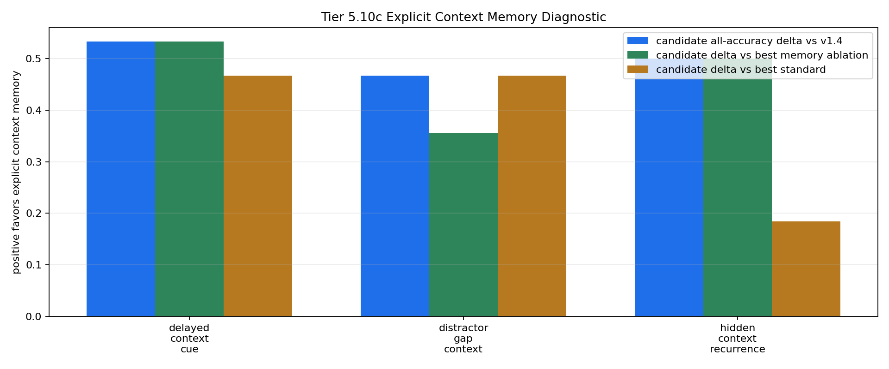

# Tier 5.10c Explicit Context Memory Mechanism Diagnostic Findings

- Generated: `2026-04-29T00:29:08+00:00`
- Status: **PASS**
- Backend: `nest`
- Steps: `720`
- Seeds: `42, 43, 44`
- Tasks: `delayed_context_cue,distractor_gap_context,hidden_context_recurrence`
- Variants: `all`
- Selected standard baselines: `sign_persistence,online_perceptron,online_logistic_regression,echo_state_network,small_gru,stdp_only_snn`
- Smoke mode: `False`
- Output directory: `/Users/james/JKS:CRA/controlled_test_output/tier5_10c_20260428_201314`

Tier 5.10c tests whether CRA can use an explicit host-side context-memory feature on the repaired Tier 5.10b streams.

## Claim Boundary

- This is software diagnostic evidence, not hardware evidence.
- The candidate is an explicit host-side context-binding scaffold, not native on-chip memory.
- A pass authorizes compact regression and a cleaner internal-memory design; it does not promote sleep/replay.

## Task Comparisons

| Task | v1.4 all | Candidate all | Delta vs v1.4 | Best ablation | Delta vs ablation | Sign acc | Best standard | Delta vs standard | Feature-active steps |
| --- | ---: | ---: | ---: | --- | ---: | ---: | --- | ---: | ---: |
| delayed_context_cue | 0.466667 | 1 | 0.533333 | `memory_reset_ablation` | 0.533333 | 0.533333 | `sign_persistence` | 0.466667 | 90 |
| distractor_gap_context | 0.533333 | 1 | 0.466667 | `shuffled_memory_ablation` | 0.355556 | 0.533333 | `sign_persistence` | 0.466667 | 45 |
| hidden_context_recurrence | 0.5 | 1 | 0.5 | `memory_reset_ablation` | 0.5 | 0.5 | `online_perceptron` | 0.184524 | 168 |

## Aggregate Matrix

| Task | Model | Family | Group | All acc | Tail acc | Corr | Runtime s | Feature active | Context updates |
| --- | --- | --- | --- | ---: | ---: | ---: | ---: | ---: | ---: |
| delayed_context_cue | `explicit_context_memory` | CRA | candidate | 1 | 1 | 0.904009 | 20.7154 | 90 | 90 |
| delayed_context_cue | `memory_reset_ablation` | CRA | memory_ablation | 0.466667 | 0.25 | 0.0148276 | 20.8657 | 90 | 90 |
| delayed_context_cue | `shuffled_memory_ablation` | CRA | memory_ablation | 0.266667 | 0.0416667 | -0.122814 | 21.9783 | 90 | 90 |
| delayed_context_cue | `v1_4_raw` | CRA | frozen_baseline | 0.466667 | 0.25 | 0.0148276 | 20.5223 | 0 | 90 |
| delayed_context_cue | `wrong_memory_ablation` | CRA | memory_ablation | 0 | 0 | -0.226902 | 22.0726 | 90 | 90 |
| delayed_context_cue | `echo_state_network` | reservoir |  | 0.266667 | 0.291667 | -0.614377 | 0.00854492 | None | None |
| delayed_context_cue | `memory_reset` | context_control |  | 0.533333 | 0.5 | 0.0666667 | 0.00292685 | None | None |
| delayed_context_cue | `online_logistic_regression` | linear |  | 0.0222222 | 0 | -0.829291 | 0.0053966 | None | None |
| delayed_context_cue | `online_perceptron` | linear |  | 0.2 | 0.333333 | -0.665183 | 0.00486493 | None | None |
| delayed_context_cue | `oracle_context` | context_control |  | 1 | 1 | 1 | 0.00304442 | None | None |
| delayed_context_cue | `shuffled_context` | context_control |  | 0.533333 | 0.625 | 0.0666667 | 0.00278171 | None | None |
| delayed_context_cue | `sign_persistence` | rule |  | 0.533333 | 0.5 | 0.0666667 | 0.00431981 | None | None |
| delayed_context_cue | `small_gru` | recurrent |  | 0.188889 | 0.25 | -0.729606 | 0.0157999 | None | None |
| delayed_context_cue | `stdp_only_snn` | snn_ablation |  | 0.5 | 0.5 | -0.00904327 | 0.00824035 | None | None |
| delayed_context_cue | `stream_context_memory` | context_control |  | 1 | 1 | 1 | 0.00322214 | None | None |
| delayed_context_cue | `wrong_context` | context_control |  | 0 | 0 | -1 | 0.00292138 | None | None |
| distractor_gap_context | `explicit_context_memory` | CRA | candidate | 1 | 1 | 0.910836 | 20.8801 | 45 | 45 |
| distractor_gap_context | `memory_reset_ablation` | CRA | memory_ablation | 0.533333 | 0.5 | 0.027325 | 20.743 | 45 | 45 |
| distractor_gap_context | `shuffled_memory_ablation` | CRA | memory_ablation | 0.644444 | 0.583333 | 0.17494 | 20.8681 | 45 | 45 |
| distractor_gap_context | `v1_4_raw` | CRA | frozen_baseline | 0.533333 | 0.5 | 0.027325 | 22.0346 | 0 | 45 |
| distractor_gap_context | `wrong_memory_ablation` | CRA | memory_ablation | 0 | 0 | -0.337067 | 21.176 | 45 | 45 |
| distractor_gap_context | `echo_state_network` | reservoir |  | 0.2 | 0.166667 | -0.691357 | 0.0102815 | None | None |
| distractor_gap_context | `memory_reset` | context_control |  | 0.533333 | 0.5 | 0.0714286 | 0.00272871 | None | None |
| distractor_gap_context | `online_logistic_regression` | linear |  | 0.0222222 | 0 | -0.778992 | 0.00507728 | None | None |
| distractor_gap_context | `online_perceptron` | linear |  | 0.177778 | 0.0833333 | -0.68205 | 0.00500238 | None | None |
| distractor_gap_context | `oracle_context` | context_control |  | 1 | 1 | 1 | 0.003354 | None | None |
| distractor_gap_context | `shuffled_context` | context_control |  | 0.422222 | 0.583333 | -0.156153 | 0.00354493 | None | None |
| distractor_gap_context | `sign_persistence` | rule |  | 0.533333 | 0.5 | 0.0714286 | 0.00406631 | None | None |
| distractor_gap_context | `small_gru` | recurrent |  | 0.133333 | 0.166667 | -0.753945 | 0.0168567 | None | None |
| distractor_gap_context | `stdp_only_snn` | snn_ablation |  | 0.511111 | 0.5 | 0.0234491 | 0.00952675 | None | None |
| distractor_gap_context | `stream_context_memory` | context_control |  | 1 | 1 | 1 | 0.00278096 | None | None |
| distractor_gap_context | `wrong_context` | context_control |  | 0 | 0 | -1 | 0.00705536 | None | None |
| hidden_context_recurrence | `explicit_context_memory` | CRA | candidate | 1 | 1 | 0.921393 | 20.7886 | 168 | 12 |
| hidden_context_recurrence | `memory_reset_ablation` | CRA | memory_ablation | 0.5 | 0 | 0.219196 | 20.7369 | 168 | 12 |
| hidden_context_recurrence | `shuffled_memory_ablation` | CRA | memory_ablation | 0.244048 | 0 | -0.0807364 | 20.6107 | 168 | 12 |
| hidden_context_recurrence | `v1_4_raw` | CRA | frozen_baseline | 0.5 | 0 | 0.219196 | 21.5528 | 0 | 12 |
| hidden_context_recurrence | `wrong_memory_ablation` | CRA | memory_ablation | 0 | 0 | -0.165505 | 20.8433 | 168 | 12 |
| hidden_context_recurrence | `echo_state_network` | reservoir |  | 0.315476 | 0.119048 | -0.334147 | 0.00833808 | None | None |
| hidden_context_recurrence | `memory_reset` | context_control |  | 0.5 | 0 | 0 | 0.00259171 | None | None |
| hidden_context_recurrence | `online_logistic_regression` | linear |  | 0.571429 | 0.452381 | 0.138916 | 0.00466419 | None | None |
| hidden_context_recurrence | `online_perceptron` | linear |  | 0.815476 | 0.809524 | 0.688247 | 0.00430731 | None | None |
| hidden_context_recurrence | `oracle_context` | context_control |  | 1 | 1 | 1 | 0.00258667 | None | None |
| hidden_context_recurrence | `shuffled_context` | context_control |  | 0.535714 | 0.571429 | 0.0716115 | 0.00260754 | None | None |
| hidden_context_recurrence | `sign_persistence` | rule |  | 0.5 | 0 | 0 | 0.00406256 | None | None |
| hidden_context_recurrence | `small_gru` | recurrent |  | 0.327381 | 0.047619 | -0.411067 | 0.0158694 | None | None |
| hidden_context_recurrence | `stdp_only_snn` | snn_ablation |  | 0.5 | 0.5 | 0.00671627 | 0.00834493 | None | None |
| hidden_context_recurrence | `stream_context_memory` | context_control |  | 1 | 1 | 1 | 0.00285978 | None | None |
| hidden_context_recurrence | `wrong_context` | context_control |  | 0 | 0 | -1 | 0.00254376 | None | None |

## Criteria

| Criterion | Value | Rule | Pass | Note |
| --- | --- | --- | --- | --- |
| full variant/baseline/control/task/seed matrix completed | 144 | == 144 | yes |  |
| feedback timing has no leakage violations | 0 | == 0 | yes |  |
| candidate context feature is active | 303 | > 0 | yes |  |
| candidate memory receives context updates | 147 | > 0 | yes |  |
| candidate reaches minimum accuracy on repaired tasks | 1 | >= 0.7 | yes |  |
| candidate improves over v1.4 raw CRA | 0.466667 | >= 0.1 | yes |  |
| memory ablations are worse than candidate | 0.355556 | >= 0.1 | yes |  |
| candidate beats sign persistence | 0.466667 | >= 0.2 | yes |  |
| candidate is competitive with best standard baseline | 0.184524 | >= -0.05 | yes | Strong baselines may still win some tasks, but candidate cannot be far behind before promotion. |

## Artifacts

- `tier5_10c_results.json`: machine-readable manifest.
- `tier5_10c_report.md`: human findings and claim boundary.
- `tier5_10c_summary.csv`: aggregate task/model metrics.
- `tier5_10c_comparisons.csv`: candidate-vs-v1.4/ablation/baseline table.
- `tier5_10c_fairness_contract.json`: predeclared comparison/leakage rules.
- `tier5_10c_memory_edges.png`: explicit-memory edge plot.
- `*_timeseries.csv`: per-task/per-model/per-seed traces.

