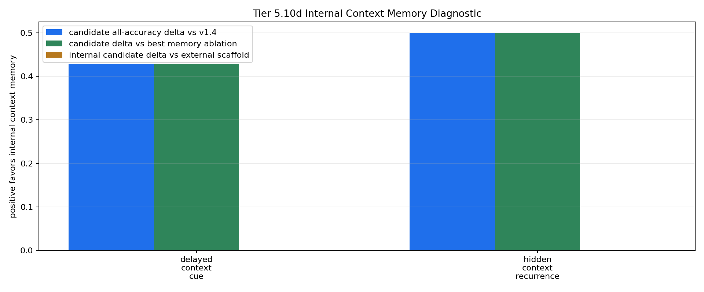

# Tier 5.10d Internal Context Memory Implementation Diagnostic Findings

- Generated: `2026-04-29T01:22:21+00:00`
- Status: **PASS**
- Backend: `mock`
- Steps: `180`
- Seeds: `42`
- Tasks: `delayed_context_cue,hidden_context_recurrence`
- Variants: `all`
- Selected standard baselines: `sign_persistence,online_perceptron`
- Smoke mode: `True`
- Output directory: `/Users/james/JKS:CRA/controlled_test_output/tier5_10d_20260428_212215`

Tier 5.10d tests whether CRA can use its internal host-side context-memory pathway on the repaired Tier 5.10b streams when fed raw observations.

## Claim Boundary

- This is software diagnostic evidence, not hardware evidence.
- The candidate is internal to `Organism`, but still host-side software, not native on-chip memory.
- The external Tier 5.10c scaffold is included as a capability reference, not the promoted mechanism.
- A pass authorizes compact regression and a candidate memory promotion review; it does not promote sleep/replay.

## Task Comparisons

| Task | v1.4 all | Scaffold all | Internal all | Delta vs v1.4 | Delta vs scaffold | Best ablation | Delta vs ablation | Sign acc | Best standard | Delta vs standard | Feature-active steps |
| --- | ---: | ---: | ---: | ---: | ---: | --- | ---: | ---: | --- | ---: | ---: |
| delayed_context_cue | 0.571429 | 1 | 1 | 0.428571 | 0 | `memory_reset_ablation` | 0.428571 | 0.571429 | `sign_persistence` | 0.428571 | 7 |
| hidden_context_recurrence | 0.5 | 1 | 1 | 0.5 | 0 | `memory_reset_ablation` | 0.5 | 0.5 | `sign_persistence` | 0.5 | 12 |

## Aggregate Matrix

| Task | Model | Family | Group | All acc | Tail acc | Corr | Runtime s | Feature active | Context updates |
| --- | --- | --- | --- | ---: | ---: | ---: | ---: | ---: | ---: |
| delayed_context_cue | `external_context_memory_scaffold` | CRA | external_scaffold | 1 | 1 | 0.948472 | 0.430813 | 7 | 7 |
| delayed_context_cue | `internal_context_memory` | CRA | candidate | 1 | 1 | 0.948472 | 0.43631 | 7 | 7 |
| delayed_context_cue | `memory_reset_ablation` | CRA | memory_ablation | 0.571429 | 0 | 0.0537743 | 0.429665 | 7 | 7 |
| delayed_context_cue | `shuffled_memory_ablation` | CRA | memory_ablation | 0.428571 | 0 | -0.457847 | 0.448398 | 7 | 7 |
| delayed_context_cue | `v1_4_raw` | CRA | frozen_baseline | 0.571429 | 0 | 0.0537743 | 0.436903 | 0 | 0 |
| delayed_context_cue | `wrong_memory_ablation` | CRA | memory_ablation | 0 | 0 | -0.529582 | 0.434828 | 7 | 7 |
| delayed_context_cue | `memory_reset` | context_control |  | 0.571429 | 0 | 0.166667 | 0.00103042 | None | None |
| delayed_context_cue | `online_perceptron` | linear |  | 0 | 0 | -0.674088 | 0.00125029 | None | None |
| delayed_context_cue | `oracle_context` | context_control |  | 1 | 1 | 1 | 0.000681667 | None | None |
| delayed_context_cue | `shuffled_context` | context_control |  | 0.428571 | 0 | None | 0.000661042 | None | None |
| delayed_context_cue | `sign_persistence` | rule |  | 0.571429 | 0 | 0.166667 | 0.000965708 | None | None |
| delayed_context_cue | `stream_context_memory` | context_control |  | 1 | 1 | 1 | 0.000659667 | None | None |
| delayed_context_cue | `wrong_context` | context_control |  | 0 | 0 | -1 | 0.000763542 | None | None |
| hidden_context_recurrence | `external_context_memory_scaffold` | CRA | external_scaffold | 1 | 1 | 0.909862 | 0.433788 | 12 | 4 |
| hidden_context_recurrence | `internal_context_memory` | CRA | candidate | 1 | 1 | 0.909862 | 0.428527 | 12 | 4 |
| hidden_context_recurrence | `memory_reset_ablation` | CRA | memory_ablation | 0.5 | 0 | 0.0980663 | 0.432327 | 12 | 4 |
| hidden_context_recurrence | `shuffled_memory_ablation` | CRA | memory_ablation | 0 | 0 | -0.306467 | 0.425431 | 12 | 4 |
| hidden_context_recurrence | `v1_4_raw` | CRA | frozen_baseline | 0.5 | 0 | 0.0980663 | 0.426482 | 0 | 0 |
| hidden_context_recurrence | `wrong_memory_ablation` | CRA | memory_ablation | 0 | 0 | -0.306467 | 0.435348 | 12 | 4 |
| hidden_context_recurrence | `memory_reset` | context_control |  | 0.5 | 0 | 0 | 0.000712708 | None | None |
| hidden_context_recurrence | `online_perceptron` | linear |  | 0.25 | 0.333333 | -0.359172 | 0.00114179 | None | None |
| hidden_context_recurrence | `oracle_context` | context_control |  | 1 | 1 | 1 | 0.000835125 | None | None |
| hidden_context_recurrence | `shuffled_context` | context_control |  | 0.5 | 0.333333 | 0.125 | 0.000728167 | None | None |
| hidden_context_recurrence | `sign_persistence` | rule |  | 0.5 | 0 | 0 | 0.00109083 | None | None |
| hidden_context_recurrence | `stream_context_memory` | context_control |  | 1 | 1 | 1 | 0.000715791 | None | None |
| hidden_context_recurrence | `wrong_context` | context_control |  | 0 | 0 | -1 | 0.00113992 | None | None |

## Criteria

| Criterion | Value | Rule | Pass | Note |
| --- | --- | --- | --- | --- |
| full variant/baseline/control/task/seed matrix completed | 26 | == 26 | yes |  |
| feedback timing has no leakage violations | 0 | == 0 | yes |  |
| candidate context feature is active | 19 | > 0 | yes |  |
| candidate memory receives context updates | 11 | > 0 | yes |  |

## Artifacts

- `tier5_10d_results.json`: machine-readable manifest.
- `tier5_10d_report.md`: human findings and claim boundary.
- `tier5_10d_summary.csv`: aggregate task/model metrics.
- `tier5_10d_comparisons.csv`: internal candidate vs v1.4/scaffold/ablation/baseline table.
- `tier5_10d_fairness_contract.json`: predeclared comparison/leakage rules.
- `tier5_10d_memory_edges.png`: internal-memory edge plot.
- `*_timeseries.csv`: per-task/per-model/per-seed traces.

