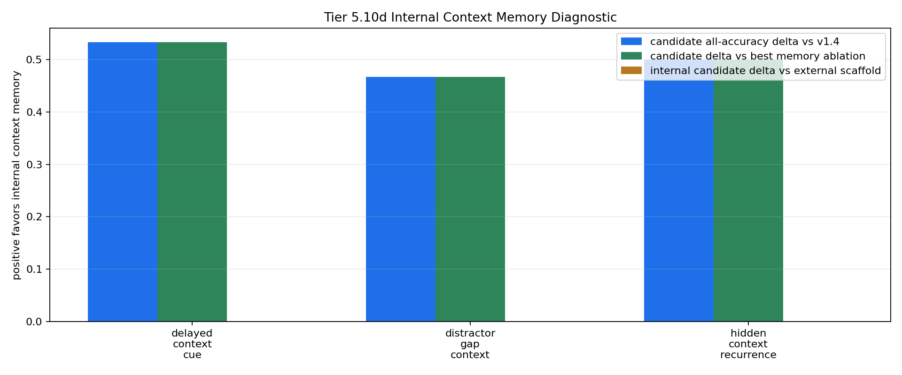

# Tier 5.10d Internal Context Memory Implementation Diagnostic Findings

- Generated: `2026-04-29T01:42:10+00:00`
- Status: **PASS**
- Backend: `nest`
- Steps: `720`
- Seeds: `42, 43, 44`
- Tasks: `delayed_context_cue,distractor_gap_context,hidden_context_recurrence`
- Variants: `all`
- Selected standard baselines: `sign_persistence,online_perceptron,online_logistic_regression,echo_state_network,small_gru,stdp_only_snn`
- Smoke mode: `False`
- Output directory: `/Users/james/JKS:CRA/controlled_test_output/tier5_10d_20260428_212229`

Tier 5.10d tests whether CRA can use its internal host-side context-memory pathway on the repaired Tier 5.10b streams when fed raw observations.

## Claim Boundary

- This is software diagnostic evidence, not hardware evidence.
- The candidate is internal to `Organism`, but still host-side software, not native on-chip memory.
- The external Tier 5.10c scaffold is included as a capability reference, not the promoted mechanism.
- A pass authorizes compact regression and a candidate memory promotion review; it does not promote sleep/replay.

## Task Comparisons

| Task | v1.4 all | Scaffold all | Internal all | Delta vs v1.4 | Delta vs scaffold | Best ablation | Delta vs ablation | Sign acc | Best standard | Delta vs standard | Feature-active steps |
| --- | ---: | ---: | ---: | ---: | ---: | --- | ---: | ---: | --- | ---: | ---: |
| delayed_context_cue | 0.466667 | 1 | 1 | 0.533333 | 0 | `memory_reset_ablation` | 0.533333 | 0.533333 | `sign_persistence` | 0.466667 | 90 |
| distractor_gap_context | 0.533333 | 1 | 1 | 0.466667 | 0 | `memory_reset_ablation` | 0.466667 | 0.533333 | `sign_persistence` | 0.466667 | 45 |
| hidden_context_recurrence | 0.5 | 1 | 1 | 0.5 | 0 | `memory_reset_ablation` | 0.5 | 0.5 | `online_perceptron` | 0.184524 | 168 |

## Aggregate Matrix

| Task | Model | Family | Group | All acc | Tail acc | Corr | Runtime s | Feature active | Context updates |
| --- | --- | --- | --- | ---: | ---: | ---: | ---: | ---: | ---: |
| delayed_context_cue | `external_context_memory_scaffold` | CRA | external_scaffold | 1 | 1 | 0.904009 | 21.4014 | 90 | 90 |
| delayed_context_cue | `internal_context_memory` | CRA | candidate | 1 | 1 | 0.904009 | 21.6035 | 90 | 90 |
| delayed_context_cue | `memory_reset_ablation` | CRA | memory_ablation | 0.466667 | 0.25 | 0.0148276 | 21.3012 | 90 | 90 |
| delayed_context_cue | `shuffled_memory_ablation` | CRA | memory_ablation | 0.4 | 0.125 | -0.186264 | 21.3263 | 90 | 90 |
| delayed_context_cue | `v1_4_raw` | CRA | frozen_baseline | 0.466667 | 0.25 | 0.0148276 | 21.2004 | 0 | 0 |
| delayed_context_cue | `wrong_memory_ablation` | CRA | memory_ablation | 0 | 0 | -0.226902 | 21.3877 | 90 | 90 |
| delayed_context_cue | `echo_state_network` | reservoir |  | 0.266667 | 0.291667 | -0.614377 | 0.00826712 | None | None |
| delayed_context_cue | `memory_reset` | context_control |  | 0.533333 | 0.5 | 0.0666667 | 0.00284667 | None | None |
| delayed_context_cue | `online_logistic_regression` | linear |  | 0.0222222 | 0 | -0.829291 | 0.00484226 | None | None |
| delayed_context_cue | `online_perceptron` | linear |  | 0.2 | 0.333333 | -0.665183 | 0.00444215 | None | None |
| delayed_context_cue | `oracle_context` | context_control |  | 1 | 1 | 1 | 0.00259393 | None | None |
| delayed_context_cue | `shuffled_context` | context_control |  | 0.533333 | 0.625 | 0.0666667 | 0.00506194 | None | None |
| delayed_context_cue | `sign_persistence` | rule |  | 0.533333 | 0.5 | 0.0666667 | 0.00404576 | None | None |
| delayed_context_cue | `small_gru` | recurrent |  | 0.188889 | 0.25 | -0.729606 | 0.015339 | None | None |
| delayed_context_cue | `stdp_only_snn` | snn_ablation |  | 0.5 | 0.5 | -0.00904327 | 0.0267509 | None | None |
| delayed_context_cue | `stream_context_memory` | context_control |  | 1 | 1 | 1 | 0.00274862 | None | None |
| delayed_context_cue | `wrong_context` | context_control |  | 0 | 0 | -1 | 0.00268992 | None | None |
| distractor_gap_context | `external_context_memory_scaffold` | CRA | external_scaffold | 1 | 1 | 0.910836 | 21.4151 | 45 | 45 |
| distractor_gap_context | `internal_context_memory` | CRA | candidate | 1 | 1 | 0.910836 | 21.3961 | 45 | 45 |
| distractor_gap_context | `memory_reset_ablation` | CRA | memory_ablation | 0.533333 | 0.5 | 0.027325 | 21.3545 | 45 | 45 |
| distractor_gap_context | `shuffled_memory_ablation` | CRA | memory_ablation | 0.466667 | 0.5 | -0.282985 | 21.4125 | 45 | 45 |
| distractor_gap_context | `v1_4_raw` | CRA | frozen_baseline | 0.533333 | 0.5 | 0.027325 | 21.4907 | 0 | 0 |
| distractor_gap_context | `wrong_memory_ablation` | CRA | memory_ablation | 0 | 0 | -0.337067 | 21.4358 | 45 | 45 |
| distractor_gap_context | `echo_state_network` | reservoir |  | 0.2 | 0.166667 | -0.691357 | 0.00772786 | None | None |
| distractor_gap_context | `memory_reset` | context_control |  | 0.533333 | 0.5 | 0.0714286 | 0.002967 | None | None |
| distractor_gap_context | `online_logistic_regression` | linear |  | 0.0222222 | 0 | -0.778992 | 0.00469293 | None | None |
| distractor_gap_context | `online_perceptron` | linear |  | 0.177778 | 0.0833333 | -0.68205 | 0.00442353 | None | None |
| distractor_gap_context | `oracle_context` | context_control |  | 1 | 1 | 1 | 0.0032474 | None | None |
| distractor_gap_context | `shuffled_context` | context_control |  | 0.422222 | 0.583333 | -0.156153 | 0.00276824 | None | None |
| distractor_gap_context | `sign_persistence` | rule |  | 0.533333 | 0.5 | 0.0714286 | 0.00401772 | None | None |
| distractor_gap_context | `small_gru` | recurrent |  | 0.133333 | 0.166667 | -0.753945 | 0.0348437 | None | None |
| distractor_gap_context | `stdp_only_snn` | snn_ablation |  | 0.511111 | 0.5 | 0.0234491 | 0.0236565 | None | None |
| distractor_gap_context | `stream_context_memory` | context_control |  | 1 | 1 | 1 | 0.00280528 | None | None |
| distractor_gap_context | `wrong_context` | context_control |  | 0 | 0 | -1 | 0.00276426 | None | None |
| hidden_context_recurrence | `external_context_memory_scaffold` | CRA | external_scaffold | 1 | 1 | 0.921393 | 21.9706 | 168 | 12 |
| hidden_context_recurrence | `internal_context_memory` | CRA | candidate | 1 | 1 | 0.921393 | 23.1173 | 168 | 12 |
| hidden_context_recurrence | `memory_reset_ablation` | CRA | memory_ablation | 0.5 | 0 | 0.219196 | 24.9493 | 168 | 12 |
| hidden_context_recurrence | `shuffled_memory_ablation` | CRA | memory_ablation | 0 | 0 | -0.165505 | 21.5264 | 168 | 12 |
| hidden_context_recurrence | `v1_4_raw` | CRA | frozen_baseline | 0.5 | 0 | 0.219196 | 21.5074 | 0 | 0 |
| hidden_context_recurrence | `wrong_memory_ablation` | CRA | memory_ablation | 0 | 0 | -0.165505 | 22.0183 | 168 | 12 |
| hidden_context_recurrence | `echo_state_network` | reservoir |  | 0.315476 | 0.119048 | -0.334147 | 0.00864946 | None | None |
| hidden_context_recurrence | `memory_reset` | context_control |  | 0.5 | 0 | 0 | 0.00288682 | None | None |
| hidden_context_recurrence | `online_logistic_regression` | linear |  | 0.571429 | 0.452381 | 0.138916 | 0.00520872 | None | None |
| hidden_context_recurrence | `online_perceptron` | linear |  | 0.815476 | 0.809524 | 0.688247 | 0.00470022 | None | None |
| hidden_context_recurrence | `oracle_context` | context_control |  | 1 | 1 | 1 | 0.00334272 | None | None |
| hidden_context_recurrence | `shuffled_context` | context_control |  | 0.535714 | 0.571429 | 0.0716115 | 0.00405092 | None | None |
| hidden_context_recurrence | `sign_persistence` | rule |  | 0.5 | 0 | 0 | 0.00454586 | None | None |
| hidden_context_recurrence | `small_gru` | recurrent |  | 0.327381 | 0.047619 | -0.411067 | 0.0164807 | None | None |
| hidden_context_recurrence | `stdp_only_snn` | snn_ablation |  | 0.5 | 0.5 | 0.00671627 | 0.00815999 | None | None |
| hidden_context_recurrence | `stream_context_memory` | context_control |  | 1 | 1 | 1 | 0.00309522 | None | None |
| hidden_context_recurrence | `wrong_context` | context_control |  | 0 | 0 | -1 | 0.0249667 | None | None |

## Criteria

| Criterion | Value | Rule | Pass | Note |
| --- | --- | --- | --- | --- |
| full variant/baseline/control/task/seed matrix completed | 153 | == 153 | yes |  |
| feedback timing has no leakage violations | 0 | == 0 | yes |  |
| candidate context feature is active | 303 | > 0 | yes |  |
| candidate memory receives context updates | 147 | > 0 | yes |  |
| candidate reaches minimum accuracy on repaired tasks | 1 | >= 0.7 | yes |  |
| candidate improves over v1.4 raw CRA | 0.466667 | >= 0.1 | yes |  |
| internal candidate approaches external scaffold | 0 | >= -0.05 | yes | Internal memory can trail the 5.10c scaffold slightly but cannot collapse relative to it. |
| memory ablations are worse than candidate | 0.466667 | >= 0.1 | yes |  |
| candidate beats sign persistence | 0.466667 | >= 0.2 | yes |  |
| candidate is competitive with best standard baseline | 0.184524 | >= -0.05 | yes | Strong baselines may still win some tasks, but candidate cannot be far behind before promotion. |

## Artifacts

- `tier5_10d_results.json`: machine-readable manifest.
- `tier5_10d_report.md`: human findings and claim boundary.
- `tier5_10d_summary.csv`: aggregate task/model metrics.
- `tier5_10d_comparisons.csv`: internal candidate vs v1.4/scaffold/ablation/baseline table.
- `tier5_10d_fairness_contract.json`: predeclared comparison/leakage rules.
- `tier5_10d_memory_edges.png`: internal-memory edge plot.
- `*_timeseries.csv`: per-task/per-model/per-seed traces.

