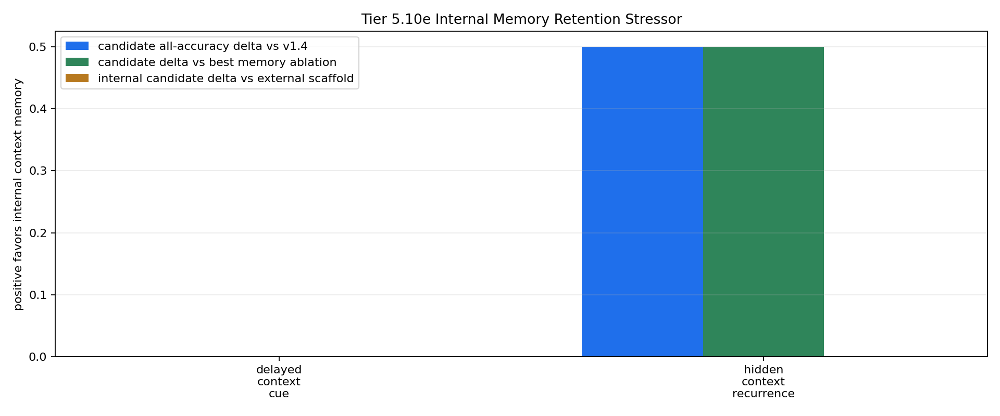

# Tier 5.10e Internal Memory Retention Stressor Findings

- Generated: `2026-04-29T02:03:06+00:00`
- Status: **PASS**
- Backend: `mock`
- Steps: `240`
- Seeds: `42`
- Tasks: `delayed_context_cue,hidden_context_recurrence`
- Variants: `all`
- Selected standard baselines: `sign_persistence,online_perceptron`
- Smoke mode: `True`
- Output directory: `<repo>/controlled_test_output/tier5_10e_20260428_220258`

Tier 5.10e tests whether CRA's internal host-side context-memory pathway survives longer context gaps, denser distractors, and stronger recurrence pressure while still receiving raw observations.

## Claim Boundary

- This is software diagnostic evidence, not hardware evidence.
- The candidate is internal to `Organism`, but still host-side software, not native on-chip memory.
- The external Tier 5.10c scaffold is included as a capability reference, not the promoted mechanism.
- A pass means the current Tier 5.10d memory mechanism survives this stress profile; it does not promote sleep/replay.
- A failure would not falsify memory as a concept; it would identify where sleep/replay, decay, capacity, or multi-timescale memory must be tested next.

## Stressor Profile

- `context_gap`: `48`
- `context_period`: `96`
- `long_context_gap`: `96`
- `long_context_period`: `160`
- `distractor_density`: `0.85`
- `distractor_scale`: `0.45`
- `recurrence_phase_len`: `240`
- `recurrence_trial_gap`: `24`
- `recurrence_decision_gap`: `64`

## Task Comparisons

| Task | v1.4 all | Scaffold all | Internal all | Delta vs v1.4 | Delta vs scaffold | Best ablation | Delta vs ablation | Sign acc | Best standard | Delta vs standard | Feature-active steps |
| --- | ---: | ---: | ---: | ---: | ---: | --- | ---: | ---: | --- | ---: | ---: |
| delayed_context_cue | 1 | 1 | 1 | 0 | 0 | `memory_reset_ablation` | 0 | 1 | `sign_persistence` | 0 | 2 |
| hidden_context_recurrence | 0.5 | 1 | 1 | 0.5 | 0 | `memory_reset_ablation` | 0.5 | 0.5 | `sign_persistence` | 0.5 | 4 |

## Aggregate Matrix

| Task | Model | Family | Group | All acc | Tail acc | Corr | Runtime s | Feature active | Context updates |
| --- | --- | --- | --- | ---: | ---: | ---: | ---: | ---: | ---: |
| delayed_context_cue | `external_context_memory_scaffold` | CRA | external_scaffold | 1 | None | None | 0.648629 | 2 | 2 |
| delayed_context_cue | `internal_context_memory` | CRA | candidate | 1 | None | None | 0.643625 | 2 | 2 |
| delayed_context_cue | `memory_reset_ablation` | CRA | memory_ablation | 1 | None | None | 0.628744 | 2 | 2 |
| delayed_context_cue | `shuffled_memory_ablation` | CRA | memory_ablation | 0.5 | None | None | 0.646843 | 2 | 2 |
| delayed_context_cue | `v1_4_raw` | CRA | frozen_baseline | 1 | None | None | 0.648181 | 0 | 0 |
| delayed_context_cue | `wrong_memory_ablation` | CRA | memory_ablation | 0 | None | None | 0.64652 | 2 | 2 |
| delayed_context_cue | `memory_reset` | context_control |  | 1 | None | None | 0.000826625 | None | None |
| delayed_context_cue | `online_perceptron` | linear |  | 0 | None | None | 0.00147588 | None | None |
| delayed_context_cue | `oracle_context` | context_control |  | 1 | None | None | 0.000805792 | None | None |
| delayed_context_cue | `shuffled_context` | context_control |  | 1 | None | None | 0.00101513 | None | None |
| delayed_context_cue | `sign_persistence` | rule |  | 1 | None | None | 0.00125567 | None | None |
| delayed_context_cue | `stream_context_memory` | context_control |  | 1 | None | None | 0.000804917 | None | None |
| delayed_context_cue | `wrong_context` | context_control |  | 0 | None | None | 0.000777834 | None | None |
| hidden_context_recurrence | `external_context_memory_scaffold` | CRA | external_scaffold | 1 | 1 | 0.975086 | 0.642737 | 4 | 2 |
| hidden_context_recurrence | `internal_context_memory` | CRA | candidate | 1 | 1 | 0.975086 | 0.637493 | 4 | 2 |
| hidden_context_recurrence | `memory_reset_ablation` | CRA | memory_ablation | 0.5 | 0 | 0.0329128 | 0.689334 | 4 | 2 |
| hidden_context_recurrence | `shuffled_memory_ablation` | CRA | memory_ablation | 0 | 0 | -0.659899 | 0.659439 | 4 | 2 |
| hidden_context_recurrence | `v1_4_raw` | CRA | frozen_baseline | 0.5 | 0 | 0.0329128 | 0.698713 | 0 | 0 |
| hidden_context_recurrence | `wrong_memory_ablation` | CRA | memory_ablation | 0 | 0 | -0.659899 | 0.640757 | 4 | 2 |
| hidden_context_recurrence | `memory_reset` | context_control |  | 0.5 | 0 | 0 | 0.000942291 | None | None |
| hidden_context_recurrence | `online_perceptron` | linear |  | 0.25 | 0 | -0.655001 | 0.00199392 | None | None |
| hidden_context_recurrence | `oracle_context` | context_control |  | 1 | 1 | 1 | 0.000902709 | None | None |
| hidden_context_recurrence | `shuffled_context` | context_control |  | 0 | 0 | -1 | 0.000880667 | None | None |
| hidden_context_recurrence | `sign_persistence` | rule |  | 0.5 | 0 | 0 | 0.00137283 | None | None |
| hidden_context_recurrence | `stream_context_memory` | context_control |  | 1 | 1 | 1 | 0.000849167 | None | None |
| hidden_context_recurrence | `wrong_context` | context_control |  | 0 | 0 | -1 | 0.00084775 | None | None |

## Criteria

| Criterion | Value | Rule | Pass | Note |
| --- | --- | --- | --- | --- |
| full variant/baseline/control/task/seed matrix completed | 26 | == 26 | yes |  |
| feedback timing has no leakage violations | 0 | == 0 | yes |  |
| candidate context feature is active | 6 | > 0 | yes |  |
| candidate memory receives context updates | 4 | > 0 | yes |  |

## Artifacts

- `tier5_10e_results.json`: machine-readable manifest.
- `tier5_10e_report.md`: human findings and claim boundary.
- `tier5_10e_summary.csv`: aggregate task/model metrics.
- `tier5_10e_comparisons.csv`: internal candidate vs v1.4/scaffold/ablation/baseline table.
- `tier5_10e_fairness_contract.json`: predeclared comparison/leakage rules.
- `tier5_10e_memory_edges.png`: internal-memory edge plot.
- `*_timeseries.csv`: per-task/per-model/per-seed traces.

