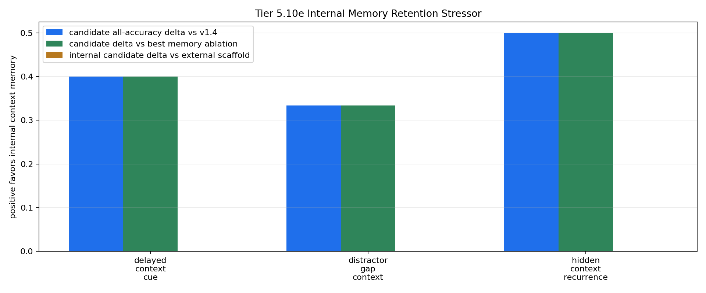

# Tier 5.10e Internal Memory Retention Stressor Findings

- Generated: `2026-04-29T02:30:50+00:00`
- Status: **PASS**
- Backend: `nest`
- Steps: `960`
- Seeds: `42, 43, 44`
- Tasks: `delayed_context_cue,distractor_gap_context,hidden_context_recurrence`
- Variants: `all`
- Selected standard baselines: `sign_persistence,online_perceptron,online_logistic_regression,echo_state_network,small_gru,stdp_only_snn`
- Smoke mode: `False`
- Output directory: `/Users/james/JKS:CRA/controlled_test_output/tier5_10e_20260428_220316`

Tier 5.10e tests whether CRA's internal host-side context-memory pathway survives longer context gaps, denser distractors, and stronger recurrence pressure while still receiving raw observations.

## Claim Boundary

- This is software diagnostic evidence, not hardware evidence.
- The candidate is internal to `Organism`, but still host-side software, not native on-chip memory.
- The external Tier 5.10c scaffold is included as a capability reference, not the promoted mechanism.
- A pass means the current Tier 5.10d memory mechanism survives this stress profile; it does not promote sleep/replay.
- A failure would not falsify memory as a concept; it would identify where sleep/replay, decay, capacity, or multi-timescale memory must be tested next.

## Stressor Profile

- `context_gap`: `48`
- `context_period`: `96`
- `long_context_gap`: `96`
- `long_context_period`: `160`
- `distractor_density`: `0.85`
- `distractor_scale`: `0.45`
- `recurrence_phase_len`: `240`
- `recurrence_trial_gap`: `24`
- `recurrence_decision_gap`: `64`

## Task Comparisons

| Task | v1.4 all | Scaffold all | Internal all | Delta vs v1.4 | Delta vs scaffold | Best ablation | Delta vs ablation | Sign acc | Best standard | Delta vs standard | Feature-active steps |
| --- | ---: | ---: | ---: | ---: | ---: | --- | ---: | ---: | --- | ---: | ---: |
| delayed_context_cue | 0.6 | 1 | 1 | 0.4 | 0 | `memory_reset_ablation` | 0.4 | 0.6 | `sign_persistence` | 0.4 | 30 |
| distractor_gap_context | 0.666667 | 1 | 1 | 0.333333 | 0 | `memory_reset_ablation` | 0.333333 | 0.666667 | `sign_persistence` | 0.333333 | 18 |
| hidden_context_recurrence | 0.5 | 1 | 1 | 0.5 | 0 | `memory_reset_ablation` | 0.5 | 0.5 | `online_perceptron` | 0.395833 | 96 |

## Aggregate Matrix

| Task | Model | Family | Group | All acc | Tail acc | Corr | Runtime s | Feature active | Context updates |
| --- | --- | --- | --- | ---: | ---: | ---: | ---: | ---: | ---: |
| delayed_context_cue | `external_context_memory_scaffold` | CRA | external_scaffold | 1 | 1 | 0.927225 | 29.7233 | 30 | 30 |
| delayed_context_cue | `internal_context_memory` | CRA | candidate | 1 | 1 | 0.927225 | 30.1931 | 30 | 30 |
| delayed_context_cue | `memory_reset_ablation` | CRA | memory_ablation | 0.6 | 0.666667 | 0.0261599 | 29.8213 | 30 | 30 |
| delayed_context_cue | `shuffled_memory_ablation` | CRA | memory_ablation | 0.5 | 0.666667 | -0.331353 | 29.8112 | 30 | 30 |
| delayed_context_cue | `v1_4_raw` | CRA | frozen_baseline | 0.6 | 0.666667 | 0.0261599 | 29.6585 | 0 | 0 |
| delayed_context_cue | `wrong_memory_ablation` | CRA | memory_ablation | 0 | 0 | -0.40007 | 29.7687 | 30 | 30 |
| delayed_context_cue | `echo_state_network` | reservoir |  | 0.266667 | 0.333333 | -0.386997 | 0.0103407 | None | None |
| delayed_context_cue | `memory_reset` | context_control |  | 0.6 | 0.666667 | 0.2 | 0.00324531 | None | None |
| delayed_context_cue | `online_logistic_regression` | linear |  | 0.333333 | 0.444444 | -0.574099 | 0.00595501 | None | None |
| delayed_context_cue | `online_perceptron` | linear |  | 0.4 | 0.555556 | -0.416756 | 0.00531796 | None | None |
| delayed_context_cue | `oracle_context` | context_control |  | 1 | 1 | 1 | 0.00327538 | None | None |
| delayed_context_cue | `shuffled_context` | context_control |  | 0.6 | 0.555556 | 0.224291 | 0.00335331 | None | None |
| delayed_context_cue | `sign_persistence` | rule |  | 0.6 | 0.666667 | 0.2 | 0.00463003 | None | None |
| delayed_context_cue | `small_gru` | recurrent |  | 0.233333 | 0.333333 | -0.646866 | 0.0218568 | None | None |
| delayed_context_cue | `stdp_only_snn` | snn_ablation |  | 0.5 | 0.555556 | -0.00810059 | 0.00991756 | None | None |
| delayed_context_cue | `stream_context_memory` | context_control |  | 1 | 1 | 1 | 0.00317581 | None | None |
| delayed_context_cue | `wrong_context` | context_control |  | 0 | 0 | -1 | 0.00420218 | None | None |
| distractor_gap_context | `external_context_memory_scaffold` | CRA | external_scaffold | 1 | 1 | 0.955544 | 31.3745 | 18 | 18 |
| distractor_gap_context | `internal_context_memory` | CRA | candidate | 1 | 1 | 0.955544 | 31.0732 | 18 | 18 |
| distractor_gap_context | `memory_reset_ablation` | CRA | memory_ablation | 0.666667 | 1 | 0.0611634 | 30.0565 | 18 | 18 |
| distractor_gap_context | `shuffled_memory_ablation` | CRA | memory_ablation | 0.5 | 0.5 | -0.438004 | 29.9567 | 18 | 18 |
| distractor_gap_context | `v1_4_raw` | CRA | frozen_baseline | 0.666667 | 1 | 0.0611634 | 30.4423 | 0 | 0 |
| distractor_gap_context | `wrong_memory_ablation` | CRA | memory_ablation | 0 | 0 | -0.526118 | 31.5536 | 18 | 18 |
| distractor_gap_context | `echo_state_network` | reservoir |  | 0.111111 | 0.166667 | -0.723119 | 0.0110528 | None | None |
| distractor_gap_context | `memory_reset` | context_control |  | 0.666667 | 1 | 0.333333 | 0.00343911 | None | None |
| distractor_gap_context | `online_logistic_regression` | linear |  | 0.0555556 | 0.166667 | -0.663175 | 0.0245837 | None | None |
| distractor_gap_context | `online_perceptron` | linear |  | 0.0555556 | 0.166667 | -0.611906 | 0.00634036 | None | None |
| distractor_gap_context | `oracle_context` | context_control |  | 1 | 1 | 1 | 0.0278959 | None | None |
| distractor_gap_context | `shuffled_context` | context_control |  | 0.666667 | 0.666667 | 0.333333 | 0.0180689 | None | None |
| distractor_gap_context | `sign_persistence` | rule |  | 0.666667 | 1 | 0.333333 | 0.00523357 | None | None |
| distractor_gap_context | `small_gru` | recurrent |  | 0.111111 | 0.166667 | -0.736317 | 0.0243916 | None | None |
| distractor_gap_context | `stdp_only_snn` | snn_ablation |  | 0.5 | 0.5 | -0.0474365 | 0.00991965 | None | None |
| distractor_gap_context | `stream_context_memory` | context_control |  | 1 | 1 | 1 | 0.0039106 | None | None |
| distractor_gap_context | `wrong_context` | context_control |  | 0 | 0 | -1 | 0.0032375 | None | None |
| hidden_context_recurrence | `external_context_memory_scaffold` | CRA | external_scaffold | 1 | 1 | 0.90487 | 30.9021 | 96 | 12 |
| hidden_context_recurrence | `internal_context_memory` | CRA | candidate | 1 | 1 | 0.90487 | 30.3306 | 96 | 12 |
| hidden_context_recurrence | `memory_reset_ablation` | CRA | memory_ablation | 0.5 | 0 | 0.19231 | 31.3746 | 96 | 12 |
| hidden_context_recurrence | `shuffled_memory_ablation` | CRA | memory_ablation | 0 | 0 | -0.219811 | 29.6852 | 96 | 12 |
| hidden_context_recurrence | `v1_4_raw` | CRA | frozen_baseline | 0.5 | 0 | 0.19231 | 33.3219 | 0 | 0 |
| hidden_context_recurrence | `wrong_memory_ablation` | CRA | memory_ablation | 0 | 0 | -0.219811 | 30.1382 | 96 | 12 |
| hidden_context_recurrence | `echo_state_network` | reservoir |  | 0.3125 | 0.208333 | -0.460406 | 0.0113095 | None | None |
| hidden_context_recurrence | `memory_reset` | context_control |  | 0.5 | 0 | -2.1684e-17 | 0.00354879 | None | None |
| hidden_context_recurrence | `online_logistic_regression` | linear |  | 0.489583 | 0.291667 | -0.0888755 | 0.00631997 | None | None |
| hidden_context_recurrence | `online_perceptron` | linear |  | 0.604167 | 0.583333 | 0.385828 | 0.00543654 | None | None |
| hidden_context_recurrence | `oracle_context` | context_control |  | 1 | 1 | 1 | 0.00325147 | None | None |
| hidden_context_recurrence | `shuffled_context` | context_control |  | 0.4375 | 0.375 | -0.127025 | 0.00326693 | None | None |
| hidden_context_recurrence | `sign_persistence` | rule |  | 0.5 | 0 | -2.1684e-17 | 0.00512294 | None | None |
| hidden_context_recurrence | `small_gru` | recurrent |  | 0.28125 | 0.166667 | -0.524107 | 0.0219363 | None | None |
| hidden_context_recurrence | `stdp_only_snn` | snn_ablation |  | 0.5 | 0.5 | 0.00532288 | 0.0102827 | None | None |
| hidden_context_recurrence | `stream_context_memory` | context_control |  | 1 | 1 | 1 | 0.00326844 | None | None |
| hidden_context_recurrence | `wrong_context` | context_control |  | 0 | 0 | -1 | 0.00374281 | None | None |

## Criteria

| Criterion | Value | Rule | Pass | Note |
| --- | --- | --- | --- | --- |
| full variant/baseline/control/task/seed matrix completed | 153 | == 153 | yes |  |
| feedback timing has no leakage violations | 0 | == 0 | yes |  |
| candidate context feature is active | 144 | > 0 | yes |  |
| candidate memory receives context updates | 60 | > 0 | yes |  |
| candidate reaches minimum accuracy on retention-stress tasks | 1 | >= 0.7 | yes |  |
| candidate improves over v1.4 raw CRA | 0.333333 | >= 0.1 | yes |  |
| internal candidate approaches external scaffold | 0 | >= -0.05 | yes | Internal memory can trail the 5.10c scaffold slightly but cannot collapse relative to it. |
| memory ablations are worse than candidate | 0.333333 | >= 0.1 | yes |  |
| candidate beats sign persistence | 0.333333 | >= 0.2 | yes |  |
| candidate is competitive with best standard baseline | 0.333333 | >= -0.05 | yes | Strong baselines may still win some tasks, but candidate cannot be far behind before promotion. |

## Artifacts

- `tier5_10e_results.json`: machine-readable manifest.
- `tier5_10e_report.md`: human findings and claim boundary.
- `tier5_10e_summary.csv`: aggregate task/model metrics.
- `tier5_10e_comparisons.csv`: internal candidate vs v1.4/scaffold/ablation/baseline table.
- `tier5_10e_fairness_contract.json`: predeclared comparison/leakage rules.
- `tier5_10e_memory_edges.png`: internal-memory edge plot.
- `*_timeseries.csv`: per-task/per-model/per-seed traces.

