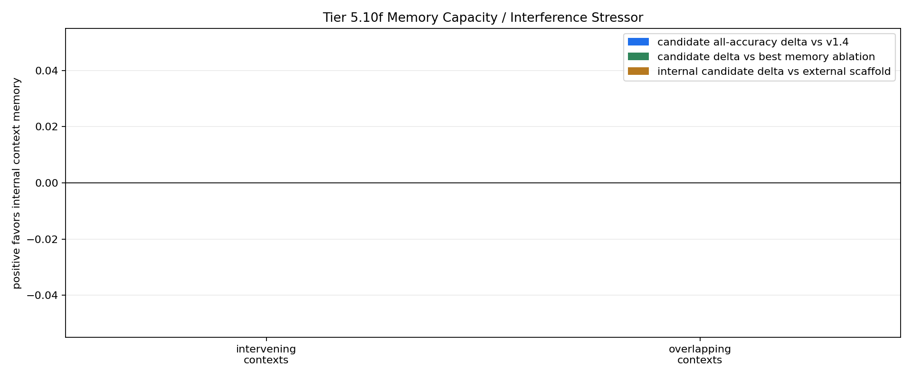

# Tier 5.10f Memory Capacity / Interference Stressor Findings

- Generated: `2026-04-29T02:47:55+00:00`
- Status: **PASS**
- Backend: `mock`
- Steps: `240`
- Seeds: `42`
- Tasks: `intervening_contexts,overlapping_contexts`
- Variants: `all`
- Selected standard baselines: `sign_persistence,online_perceptron`
- Smoke mode: `True`
- Output directory: `/Users/james/JKS:CRA/controlled_test_output/tier5_10f_20260428_224743`

Tier 5.10f tests whether CRA's internal host-side context-memory pathway survives intervening contexts, overlapping pending decisions, and reentry interference while still receiving raw observations.

## Claim Boundary

- This is software diagnostic evidence, not hardware evidence.
- The candidate is internal to `Organism`, but still host-side software, not native on-chip memory.
- The external Tier 5.10c scaffold is included as a capability reference, not the promoted mechanism.
- A pass means the current v1.5 memory mechanism survives this capacity/interference profile; it does not promote sleep/replay.
- A failure would not falsify memory as a concept; it would identify where multi-slot memory, consolidation, sleep/replay, or decay/capacity controls must be tested next.

## Capacity / Interference Profile

- `capacity_period`: `120`
- `capacity_decision_gap`: `72`
- `interfering_contexts`: `2`
- `interference_spacing`: `24`
- `interfering_context_scale`: `0.5`
- `overlap_period`: `120`
- `overlap_context_gap`: `36`
- `overlap_first_decision_gap`: `72`
- `overlap_second_decision_gap`: `96`
- `reentry_phase_len`: `180`
- `reentry_decision_stride`: `24`
- `reentry_interference_probability`: `0.7`
- `distractor_density`: `0.55`
- `distractor_scale`: `0.35`

## Task Comparisons

| Task | v1.4 all | Scaffold all | Internal all | Delta vs v1.4 | Delta vs scaffold | Best ablation | Delta vs ablation | Sign acc | Best standard | Delta vs standard | Feature-active steps |
| --- | ---: | ---: | ---: | ---: | ---: | --- | ---: | ---: | --- | ---: | ---: |
| intervening_contexts | 0.5 | 0.5 | 0.5 | 0 | 0 | `wrong_memory_ablation` | 0 | 0.5 | `sign_persistence` | 0 | 2 |
| overlapping_contexts | 0.5 | 0.5 | 0.5 | 0 | 0 | `memory_reset_ablation` | 0 | 0.5 | `sign_persistence` | 0 | 4 |

## Aggregate Matrix

| Task | Model | Family | Group | All acc | Tail acc | Corr | Runtime s | Feature active | Context updates |
| --- | --- | --- | --- | ---: | ---: | ---: | ---: | ---: | ---: |
| intervening_contexts | `external_context_memory_scaffold` | CRA | external_scaffold | 0.5 | 0 | None | 1.5571 | 2 | 6 |
| intervening_contexts | `internal_context_memory` | CRA | candidate | 0.5 | 0 | None | 0.992267 | 2 | 6 |
| intervening_contexts | `memory_reset_ablation` | CRA | memory_ablation | 0.5 | 0 | None | 0.900997 | 2 | 6 |
| intervening_contexts | `shuffled_memory_ablation` | CRA | memory_ablation | 0 | 0 | None | 0.838895 | 2 | 6 |
| intervening_contexts | `v1_4_raw` | CRA | frozen_baseline | 0.5 | 0 | None | 1.53195 | 0 | 0 |
| intervening_contexts | `wrong_memory_ablation` | CRA | memory_ablation | 0.5 | 1 | None | 0.758268 | 2 | 6 |
| intervening_contexts | `memory_reset` | context_control |  | 0.5 | 0 | None | 0.00085425 | None | None |
| intervening_contexts | `online_perceptron` | linear |  | 0 | 0 | None | 0.00133975 | None | None |
| intervening_contexts | `oracle_context` | context_control |  | 1 | 1 | None | 0.000885625 | None | None |
| intervening_contexts | `shuffled_context` | context_control |  | 0 | 0 | None | 0.000851541 | None | None |
| intervening_contexts | `sign_persistence` | rule |  | 0.5 | 0 | None | 0.00406592 | None | None |
| intervening_contexts | `stream_context_memory` | context_control |  | 0.5 | 0 | None | 0.00129571 | None | None |
| intervening_contexts | `wrong_context` | context_control |  | 0 | 0 | None | 0.00120333 | None | None |
| overlapping_contexts | `external_context_memory_scaffold` | CRA | external_scaffold | 0.5 | 0.5 | -0.494845 | 0.720704 | 4 | 4 |
| overlapping_contexts | `internal_context_memory` | CRA | candidate | 0.5 | 0.5 | -0.494845 | 0.826881 | 4 | 4 |
| overlapping_contexts | `memory_reset_ablation` | CRA | memory_ablation | 0.5 | 0.5 | -0.175643 | 0.722566 | 4 | 4 |
| overlapping_contexts | `shuffled_memory_ablation` | CRA | memory_ablation | 0.5 | 0.5 | -0.105055 | 0.755861 | 4 | 4 |
| overlapping_contexts | `v1_4_raw` | CRA | frozen_baseline | 0.5 | 0.5 | -0.175643 | 0.709297 | 0 | 0 |
| overlapping_contexts | `wrong_memory_ablation` | CRA | memory_ablation | 0.5 | 0.5 | -0.105055 | 0.773352 | 4 | 4 |
| overlapping_contexts | `memory_reset` | context_control |  | 0.5 | 0.5 | 0 | 0.00110604 | None | None |
| overlapping_contexts | `online_perceptron` | linear |  | 0 | 0 | -1 | 0.00152983 | None | None |
| overlapping_contexts | `oracle_context` | context_control |  | 1 | 1 | 1 | 0.00102567 | None | None |
| overlapping_contexts | `shuffled_context` | context_control |  | 0.5 | 1 | None | 0.0008535 | None | None |
| overlapping_contexts | `sign_persistence` | rule |  | 0.5 | 0.5 | 0 | 0.0013845 | None | None |
| overlapping_contexts | `stream_context_memory` | context_control |  | 0.5 | 0.5 | 0 | 0.000958 | None | None |
| overlapping_contexts | `wrong_context` | context_control |  | 0 | 0 | -1 | 0.00110033 | None | None |

## Criteria

| Criterion | Value | Rule | Pass | Note |
| --- | --- | --- | --- | --- |
| full variant/baseline/control/task/seed matrix completed | 26 | == 26 | yes |  |
| feedback timing has no leakage violations | 0 | == 0 | yes |  |
| candidate context feature is active | 6 | > 0 | yes |  |
| candidate memory receives context updates | 10 | > 0 | yes |  |

## Artifacts

- `tier5_10f_results.json`: machine-readable manifest.
- `tier5_10f_report.md`: human findings and claim boundary.
- `tier5_10f_summary.csv`: aggregate task/model metrics.
- `tier5_10f_comparisons.csv`: internal candidate vs v1.4/scaffold/ablation/baseline table.
- `tier5_10f_fairness_contract.json`: predeclared comparison/leakage rules.
- `tier5_10f_memory_edges.png`: internal-memory edge plot.
- `*_timeseries.csv`: per-task/per-model/per-seed traces.

