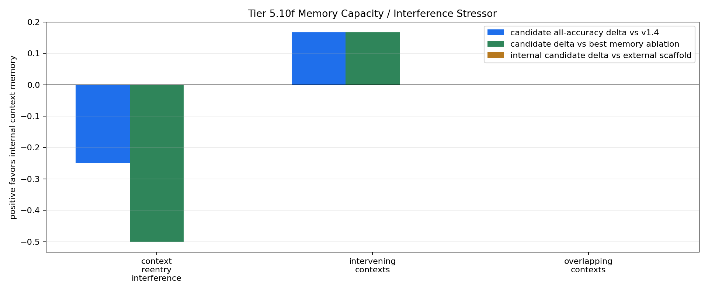

# Tier 5.10f Memory Capacity / Interference Stressor Findings

- Generated: `2026-04-29T03:09:02+00:00`
- Status: **FAIL**
- Backend: `nest`
- Steps: `720`
- Seeds: `42, 43, 44`
- Tasks: `intervening_contexts,overlapping_contexts,context_reentry_interference`
- Variants: `all`
- Selected standard baselines: `sign_persistence,online_perceptron,online_logistic_regression,echo_state_network,small_gru,stdp_only_snn`
- Smoke mode: `False`
- Output directory: `<repo>/controlled_test_output/tier5_10f_20260428_224805`

Tier 5.10f tests whether CRA's internal host-side context-memory pathway survives intervening contexts, overlapping pending decisions, and reentry interference while still receiving raw observations.

## Claim Boundary

- This is software diagnostic evidence, not hardware evidence.
- The candidate is internal to `Organism`, but still host-side software, not native on-chip memory.
- The external Tier 5.10c scaffold is included as a capability reference, not the promoted mechanism.
- A pass means the current v1.5 memory mechanism survives this capacity/interference profile; it does not promote sleep/replay.
- A failure would not falsify memory as a concept; it would identify where multi-slot memory, consolidation, sleep/replay, or decay/capacity controls must be tested next.

## Capacity / Interference Profile

- `capacity_period`: `120`
- `capacity_decision_gap`: `72`
- `interfering_contexts`: `2`
- `interference_spacing`: `24`
- `interfering_context_scale`: `0.5`
- `overlap_period`: `120`
- `overlap_context_gap`: `36`
- `overlap_first_decision_gap`: `72`
- `overlap_second_decision_gap`: `96`
- `reentry_phase_len`: `180`
- `reentry_decision_stride`: `24`
- `reentry_interference_probability`: `0.7`
- `distractor_density`: `0.55`
- `distractor_scale`: `0.35`

## Task Comparisons

| Task | v1.4 all | Scaffold all | Internal all | Delta vs v1.4 | Delta vs scaffold | Best ablation | Delta vs ablation | Sign acc | Best standard | Delta vs standard | Feature-active steps |
| --- | ---: | ---: | ---: | ---: | ---: | --- | ---: | ---: | --- | ---: | ---: |
| context_reentry_interference | 0.5 | 0.25 | 0.25 | -0.25 | 0 | `wrong_memory_ablation` | -0.5 | 0.5 | `online_perceptron` | -0.25 | 60 |
| intervening_contexts | 0.5 | 0.666667 | 0.666667 | 0.166667 | 0 | `memory_reset_ablation` | 0.166667 | 0.5 | `sign_persistence` | 0.166667 | 18 |
| overlapping_contexts | 0.5 | 0.5 | 0.5 | 0 | 0 | `memory_reset_ablation` | 0 | 0.5 | `sign_persistence` | 0 | 36 |

## Aggregate Matrix

| Task | Model | Family | Group | All acc | Tail acc | Corr | Runtime s | Feature active | Context updates |
| --- | --- | --- | --- | ---: | ---: | ---: | ---: | ---: | ---: |
| context_reentry_interference | `external_context_memory_scaffold` | CRA | external_scaffold | 0.25 | 0 | -0.279539 | 22.1657 | 60 | 31 |
| context_reentry_interference | `internal_context_memory` | CRA | candidate | 0.25 | 0 | -0.279539 | 24.1068 | 60 | 31 |
| context_reentry_interference | `memory_reset_ablation` | CRA | memory_ablation | 0.5 | 1 | 0.156499 | 24.3561 | 60 | 31 |
| context_reentry_interference | `shuffled_memory_ablation` | CRA | memory_ablation | 0.583333 | 0.333333 | 0.0913005 | 23.4929 | 60 | 31 |
| context_reentry_interference | `v1_4_raw` | CRA | frozen_baseline | 0.5 | 1 | 0.156499 | 22.1744 | 0 | 0 |
| context_reentry_interference | `wrong_memory_ablation` | CRA | memory_ablation | 0.75 | 1 | 0.407062 | 28.7003 | 60 | 31 |
| context_reentry_interference | `echo_state_network` | reservoir |  | 0.2 | 0.0666667 | -0.612029 | 0.00927182 | None | None |
| context_reentry_interference | `memory_reset` | context_control |  | 0.5 | 1 | 0 | 0.00368197 | None | None |
| context_reentry_interference | `online_logistic_regression` | linear |  | 0.4 | 0 | -0.181642 | 0.00497889 | None | None |
| context_reentry_interference | `online_perceptron` | linear |  | 0.5 | 0.2 | 0.358569 | 0.00541526 | None | None |
| context_reentry_interference | `oracle_context` | context_control |  | 1 | 1 | 1 | 0.00277554 | None | None |
| context_reentry_interference | `shuffled_context` | context_control |  | 0.566667 | 0.4 | 0.136083 | 0.00371149 | None | None |
| context_reentry_interference | `sign_persistence` | rule |  | 0.5 | 1 | 0 | 0.00425671 | None | None |
| context_reentry_interference | `small_gru` | recurrent |  | 0.35 | 0 | -0.599864 | 0.0191332 | None | None |
| context_reentry_interference | `stdp_only_snn` | snn_ablation |  | 0.5 | 0.533333 | 0.0587267 | 0.00819614 | None | None |
| context_reentry_interference | `stream_context_memory` | context_control |  | 0.25 | 0 | -0.50084 | 0.00410194 | None | None |
| context_reentry_interference | `wrong_context` | context_control |  | 0 | 0 | -1 | 0.036306 | None | None |
| intervening_contexts | `external_context_memory_scaffold` | CRA | external_scaffold | 0.666667 | 0.666667 | -0.00922819 | 22.1263 | 18 | 54 |
| intervening_contexts | `internal_context_memory` | CRA | candidate | 0.666667 | 0.666667 | -0.00922819 | 22.8649 | 18 | 54 |
| intervening_contexts | `memory_reset_ablation` | CRA | memory_ablation | 0.5 | 0.5 | -0.0970165 | 22.8016 | 18 | 54 |
| intervening_contexts | `shuffled_memory_ablation` | CRA | memory_ablation | 0 | 0 | -0.526118 | 24.1875 | 18 | 54 |
| intervening_contexts | `v1_4_raw` | CRA | frozen_baseline | 0.5 | 0.5 | -0.0970165 | 22.4755 | 0 | 0 |
| intervening_contexts | `wrong_memory_ablation` | CRA | memory_ablation | 0.333333 | 0.333333 | -0.294378 | 27.0076 | 18 | 54 |
| intervening_contexts | `echo_state_network` | reservoir |  | 0.222222 | 0.333333 | -0.660176 | 0.0083869 | None | None |
| intervening_contexts | `memory_reset` | context_control |  | 0.5 | 0.5 | 0 | 0.00351556 | None | None |
| intervening_contexts | `online_logistic_regression` | linear |  | 0.0555556 | 0 | -0.743145 | 0.00458364 | None | None |
| intervening_contexts | `online_perceptron` | linear |  | 0.111111 | 0.166667 | -0.725757 | 0.00448826 | None | None |
| intervening_contexts | `oracle_context` | context_control |  | 1 | 1 | 1 | 0.00264907 | None | None |
| intervening_contexts | `shuffled_context` | context_control |  | 0.333333 | 0.166667 | -0.295373 | 0.00284192 | None | None |
| intervening_contexts | `sign_persistence` | rule |  | 0.5 | 0.5 | 0 | 0.00376428 | None | None |
| intervening_contexts | `small_gru` | recurrent |  | 0.277778 | 0.333333 | -0.714888 | 0.0198049 | None | None |
| intervening_contexts | `stdp_only_snn` | snn_ablation |  | 0.5 | 0.5 | -0.0231211 | 0.0101014 | None | None |
| intervening_contexts | `stream_context_memory` | context_control |  | 0.666667 | 0.666667 | 0.346813 | 0.0033584 | None | None |
| intervening_contexts | `wrong_context` | context_control |  | 0 | 0 | -1 | 0.00274293 | None | None |
| overlapping_contexts | `external_context_memory_scaffold` | CRA | external_scaffold | 0.5 | 0.5 | -0.293672 | 21.536 | 36 | 36 |
| overlapping_contexts | `internal_context_memory` | CRA | candidate | 0.5 | 0.5 | -0.293672 | 21.8188 | 36 | 36 |
| overlapping_contexts | `memory_reset_ablation` | CRA | memory_ablation | 0.5 | 0.5 | -0.105566 | 21.3117 | 36 | 36 |
| overlapping_contexts | `shuffled_memory_ablation` | CRA | memory_ablation | 0.5 | 0.5 | -0.0642777 | 21.7365 | 36 | 36 |
| overlapping_contexts | `v1_4_raw` | CRA | frozen_baseline | 0.5 | 0.5 | -0.105566 | 21.8093 | 0 | 0 |
| overlapping_contexts | `wrong_memory_ablation` | CRA | memory_ablation | 0.5 | 0.5 | -0.0642777 | 22.1053 | 36 | 36 |
| overlapping_contexts | `echo_state_network` | reservoir |  | 0.222222 | 0.166667 | -0.623846 | 0.00813936 | None | None |
| overlapping_contexts | `memory_reset` | context_control |  | 0.5 | 0.5 | 0 | 0.00303944 | None | None |
| overlapping_contexts | `online_logistic_regression` | linear |  | 0.111111 | 0 | -0.977363 | 0.00478754 | None | None |
| overlapping_contexts | `online_perceptron` | linear |  | 0.25 | 0.25 | -0.881754 | 0.00455143 | None | None |
| overlapping_contexts | `oracle_context` | context_control |  | 1 | 1 | 1 | 0.00312893 | None | None |
| overlapping_contexts | `shuffled_context` | context_control |  | 0.555556 | 0.583333 | 0.111111 | 0.00475881 | None | None |
| overlapping_contexts | `sign_persistence` | rule |  | 0.5 | 0.5 | 0 | 0.00371169 | None | None |
| overlapping_contexts | `small_gru` | recurrent |  | 0.25 | 0.25 | -0.719514 | 0.0352474 | None | None |
| overlapping_contexts | `stdp_only_snn` | snn_ablation |  | 0.5 | 0.5 | -0.0818638 | 0.0085616 | None | None |
| overlapping_contexts | `stream_context_memory` | context_control |  | 0.5 | 0.5 | 0 | 0.00316789 | None | None |
| overlapping_contexts | `wrong_context` | context_control |  | 0 | 0 | -1 | 0.00299413 | None | None |

## Criteria

| Criterion | Value | Rule | Pass | Note |
| --- | --- | --- | --- | --- |
| full variant/baseline/control/task/seed matrix completed | 153 | == 153 | yes |  |
| feedback timing has no leakage violations | 0 | == 0 | yes |  |
| candidate context feature is active | 114 | > 0 | yes |  |
| candidate memory receives context updates | 121 | > 0 | yes |  |
| candidate reaches minimum accuracy on capacity-interference tasks | 0.25 | >= 0.7 | no |  |
| candidate improves over v1.4 raw CRA | -0.25 | >= 0.1 | no |  |
| internal candidate approaches external scaffold | 0 | >= -0.05 | yes | Internal memory can trail the 5.10c scaffold slightly but cannot collapse relative to it. |
| memory ablations are worse than candidate | -0.5 | >= 0.1 | no |  |
| candidate beats sign persistence | -0.25 | >= 0.2 | no |  |
| candidate is competitive with best standard baseline | -0.25 | >= -0.05 | no | Strong baselines may still win some tasks, but candidate cannot be far behind before promotion. |

Failure: Failed criteria: candidate reaches minimum accuracy on capacity-interference tasks, candidate improves over v1.4 raw CRA, memory ablations are worse than candidate, candidate beats sign persistence, candidate is competitive with best standard baseline

## Artifacts

- `tier5_10f_results.json`: machine-readable manifest.
- `tier5_10f_report.md`: human findings and claim boundary.
- `tier5_10f_summary.csv`: aggregate task/model metrics.
- `tier5_10f_comparisons.csv`: internal candidate vs v1.4/scaffold/ablation/baseline table.
- `tier5_10f_fairness_contract.json`: predeclared comparison/leakage rules.
- `tier5_10f_memory_edges.png`: internal-memory edge plot.
- `*_timeseries.csv`: per-task/per-model/per-seed traces.

