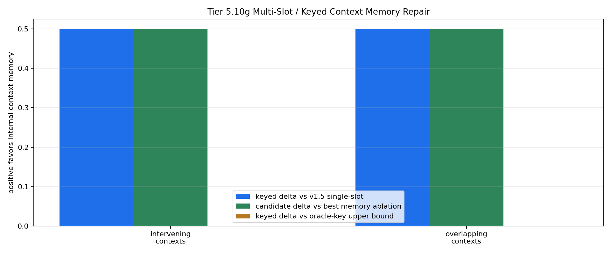

# Tier 5.10g Multi-Slot / Keyed Context Memory Repair Findings

- Generated: `2026-04-29T03:28:34+00:00`
- Status: **PASS**
- Backend: `mock`
- Steps: `240`
- Seeds: `42`
- Tasks: `intervening_contexts,overlapping_contexts`
- Variants: `all`
- Selected standard baselines: `sign_persistence,online_perceptron`
- Smoke mode: `True`
- Output directory: `/Users/james/JKS:CRA/controlled_test_output/tier5_10g_20260428_232824`

Tier 5.10g tests whether CRA's internal host-side keyed context-memory pathway repairs the Tier 5.10f capacity/interference failure while still receiving raw observations.

## Claim Boundary

- This is software diagnostic evidence, not hardware evidence.
- The candidate is internal to `Organism`, but still host-side software, not native on-chip memory.
- The oracle-key scaffold is included as an upper-bound reference, not the promoted mechanism.
- A pass means keyed multi-slot binding repairs the measured Tier 5.10f capacity/interference limit; it does not promote sleep/replay.
- A failure would not falsify memory as a concept; it would identify where routing, slot policy, consolidation, or decay/capacity controls must be tested next.

## Capacity / Interference Profile

- `capacity_period`: `120`
- `capacity_decision_gap`: `72`
- `interfering_contexts`: `2`
- `interference_spacing`: `24`
- `interfering_context_scale`: `0.5`
- `overlap_period`: `120`
- `overlap_context_gap`: `36`
- `overlap_first_decision_gap`: `72`
- `overlap_second_decision_gap`: `96`
- `reentry_phase_len`: `180`
- `reentry_decision_stride`: `24`
- `reentry_interference_probability`: `0.7`
- `distractor_density`: `0.55`
- `distractor_scale`: `0.35`

## Task Comparisons

| Task | v1.4 all | v1.5 single-slot | Oracle-key all | Keyed all | Delta vs single-slot | Delta vs oracle | Best ablation | Delta vs ablation | Overcapacity all | Delta vs overcapacity | Best standard | Delta vs standard |
| --- | ---: | ---: | ---: | ---: | ---: | ---: | --- | ---: | ---: | ---: | --- | ---: |
| intervening_contexts | 0.5 | 0.5 | 1 | 1 | 0.5 | 0 | `slot_reset_ablation` | 0.5 | 0.5 | 0.5 | `sign_persistence` | 0.5 | 
| overlapping_contexts | 0.5 | 0.5 | 1 | 1 | 0.5 | 0 | `slot_reset_ablation` | 0.5 | 1 | 0 | `sign_persistence` | 0.5 | 

## Aggregate Matrix

| Task | Model | Family | Group | All acc | Tail acc | Corr | Runtime s | Feature active | Context updates |
| --- | --- | --- | --- | ---: | ---: | ---: | ---: | ---: | ---: |
| intervening_contexts | `keyed_context_memory` | CRA | candidate | 1 | 1 | None | 0.609511 | 2 | 6 |
| intervening_contexts | `oracle_keyed_scaffold` | CRA | external_scaffold | 1 | 1 | None | 0.606837 | 2 | 6 |
| intervening_contexts | `overcapacity_keyed_memory` | CRA | overcapacity_control | 0.5 | 0 | None | 0.604786 | 2 | 6 |
| intervening_contexts | `slot_reset_ablation` | CRA | memory_ablation | 0.5 | 0 | None | 0.607565 | 2 | 6 |
| intervening_contexts | `slot_shuffle_ablation` | CRA | memory_ablation | 0.5 | 0 | None | 0.6263 | 2 | 6 |
| intervening_contexts | `v1_4_raw` | CRA | frozen_baseline | 0.5 | 0 | None | 0.62061 | 0 | 0 |
| intervening_contexts | `v1_5_single_slot` | CRA | single_slot_baseline | 0.5 | 0 | None | 0.601495 | 2 | 6 |
| intervening_contexts | `wrong_key_ablation` | CRA | memory_ablation | 0.5 | 0 | None | 0.664657 | 2 | 6 |
| intervening_contexts | `memory_reset` | context_control |  | 0.5 | 0 | None | 0.000810917 | None | None |
| intervening_contexts | `online_perceptron` | linear |  | 0 | 0 | None | 0.00135571 | None | None |
| intervening_contexts | `oracle_context` | context_control |  | 1 | 1 | None | 0.000801542 | None | None |
| intervening_contexts | `shuffled_context` | context_control |  | 0 | 0 | None | 0.000788292 | None | None |
| intervening_contexts | `sign_persistence` | rule |  | 0.5 | 0 | None | 0.0012155 | None | None |
| intervening_contexts | `stream_context_memory` | context_control |  | 0.5 | 0 | None | 0.000788375 | None | None |
| intervening_contexts | `wrong_context` | context_control |  | 0 | 0 | None | 0.000783625 | None | None |
| overlapping_contexts | `keyed_context_memory` | CRA | candidate | 1 | 1 | 0.994835 | 0.613501 | 4 | 4 |
| overlapping_contexts | `oracle_keyed_scaffold` | CRA | external_scaffold | 1 | 1 | 0.994835 | 0.6606 | 4 | 4 |
| overlapping_contexts | `overcapacity_keyed_memory` | CRA | overcapacity_control | 1 | 1 | 0.994835 | 0.607718 | 4 | 4 |
| overlapping_contexts | `slot_reset_ablation` | CRA | memory_ablation | 0.5 | 0.5 | -0.175643 | 0.625447 | 4 | 4 |
| overlapping_contexts | `slot_shuffle_ablation` | CRA | memory_ablation | 0 | 0 | -0.761607 | 0.607255 | 4 | 4 |
| overlapping_contexts | `v1_4_raw` | CRA | frozen_baseline | 0.5 | 0.5 | -0.175643 | 0.608434 | 0 | 0 |
| overlapping_contexts | `v1_5_single_slot` | CRA | single_slot_baseline | 0.5 | 0.5 | -0.494845 | 0.601488 | 4 | 4 |
| overlapping_contexts | `wrong_key_ablation` | CRA | memory_ablation | 0 | 0 | -0.761607 | 0.611103 | 4 | 4 |
| overlapping_contexts | `memory_reset` | context_control |  | 0.5 | 0.5 | 0 | 0.000884958 | None | None |
| overlapping_contexts | `online_perceptron` | linear |  | 0 | 0 | -1 | 0.00136671 | None | None |
| overlapping_contexts | `oracle_context` | context_control |  | 1 | 1 | 1 | 0.000859541 | None | None |
| overlapping_contexts | `shuffled_context` | context_control |  | 0.5 | 1 | None | 0.000796916 | None | None |
| overlapping_contexts | `sign_persistence` | rule |  | 0.5 | 0.5 | 0 | 0.00135087 | None | None |
| overlapping_contexts | `stream_context_memory` | context_control |  | 0.5 | 0.5 | 0 | 0.000936042 | None | None |
| overlapping_contexts | `wrong_context` | context_control |  | 0 | 0 | -1 | 0.000914333 | None | None |

## Criteria

| Criterion | Value | Rule | Pass | Note |
| --- | --- | --- | --- | --- |
| full variant/baseline/control/task/seed matrix completed | 30 | == 30 | yes |  |
| feedback timing has no leakage violations | 0 | == 0 | yes |  |
| candidate context feature is active | 6 | > 0 | yes |  |
| candidate memory receives context updates | 10 | > 0 | yes |  |

## Artifacts

- `tier5_10g_results.json`: machine-readable manifest.
- `tier5_10g_report.md`: human findings and claim boundary.
- `tier5_10g_summary.csv`: aggregate task/model metrics.
- `tier5_10g_comparisons.csv`: keyed candidate vs v1.4/single-slot/oracle/ablation/baseline table.
- `tier5_10g_fairness_contract.json`: predeclared comparison/leakage rules.
- `tier5_10g_memory_edges.png`: internal-memory edge plot.
- `*_timeseries.csv`: per-task/per-model/per-seed traces.

