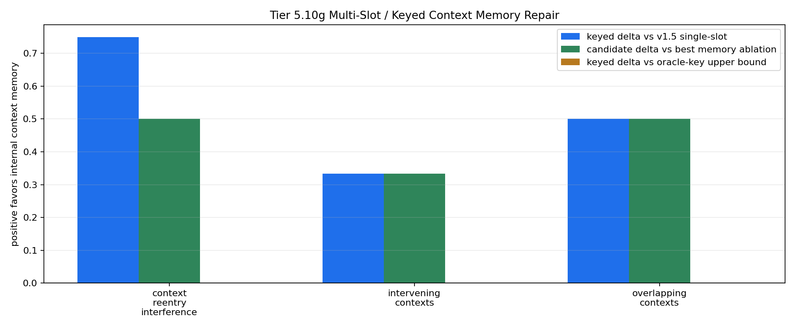

# Tier 5.10g Multi-Slot / Keyed Context Memory Repair Findings

- Generated: `2026-04-29T03:54:38+00:00`
- Status: **PASS**
- Backend: `nest`
- Steps: `720`
- Seeds: `42, 43, 44`
- Tasks: `intervening_contexts,overlapping_contexts,context_reentry_interference`
- Variants: `all`
- Selected standard baselines: `sign_persistence,online_perceptron,online_logistic_regression,echo_state_network,small_gru,stdp_only_snn`
- Smoke mode: `False`
- Output directory: `<repo>/controlled_test_output/tier5_10g_20260428_232844`

Tier 5.10g tests whether CRA's internal host-side keyed context-memory pathway repairs the Tier 5.10f capacity/interference failure while still receiving raw observations.

## Claim Boundary

- This is software diagnostic evidence, not hardware evidence.
- The candidate is internal to `Organism`, but still host-side software, not native on-chip memory.
- The oracle-key scaffold is included as an upper-bound reference, not the promoted mechanism.
- A pass means keyed multi-slot binding repairs the measured Tier 5.10f capacity/interference limit; it does not promote sleep/replay.
- A failure would not falsify memory as a concept; it would identify where routing, slot policy, consolidation, or decay/capacity controls must be tested next.

## Capacity / Interference Profile

- `capacity_period`: `120`
- `capacity_decision_gap`: `72`
- `interfering_contexts`: `2`
- `interference_spacing`: `24`
- `interfering_context_scale`: `0.5`
- `overlap_period`: `120`
- `overlap_context_gap`: `36`
- `overlap_first_decision_gap`: `72`
- `overlap_second_decision_gap`: `96`
- `reentry_phase_len`: `180`
- `reentry_decision_stride`: `24`
- `reentry_interference_probability`: `0.7`
- `distractor_density`: `0.55`
- `distractor_scale`: `0.35`

## Task Comparisons

| Task | v1.4 all | v1.5 single-slot | Oracle-key all | Keyed all | Delta vs single-slot | Delta vs oracle | Best ablation | Delta vs ablation | Overcapacity all | Delta vs overcapacity | Best standard | Delta vs standard |
| --- | ---: | ---: | ---: | ---: | ---: | ---: | --- | ---: | ---: | ---: | --- | ---: |
| context_reentry_interference | 0.5 | 0.25 | 1 | 1 | 0.75 | 0 | `slot_reset_ablation` | 0.5 | 0.583333 | 0.416667 | `online_perceptron` | 0.5 | 
| intervening_contexts | 0.5 | 0.666667 | 1 | 1 | 0.333333 | 0 | `slot_shuffle_ablation` | 0.333333 | 0.666667 | 0.333333 | `sign_persistence` | 0.5 | 
| overlapping_contexts | 0.5 | 0.5 | 1 | 1 | 0.5 | 0 | `slot_reset_ablation` | 0.5 | 1 | 0 | `sign_persistence` | 0.5 | 

## Aggregate Matrix

| Task | Model | Family | Group | All acc | Tail acc | Corr | Runtime s | Feature active | Context updates |
| --- | --- | --- | --- | ---: | ---: | ---: | ---: | ---: | ---: |
| context_reentry_interference | `keyed_context_memory` | CRA | candidate | 1 | 1 | 0.906815 | 20.9611 | 60 | 31 |
| context_reentry_interference | `oracle_keyed_scaffold` | CRA | external_scaffold | 1 | 1 | 0.906815 | 21.0135 | 60 | 31 |
| context_reentry_interference | `overcapacity_keyed_memory` | CRA | overcapacity_control | 0.583333 | 0.333333 | 0.136474 | 21.1484 | 60 | 31 |
| context_reentry_interference | `slot_reset_ablation` | CRA | memory_ablation | 0.5 | 1 | 0.156499 | 21.1196 | 60 | 31 |
| context_reentry_interference | `slot_shuffle_ablation` | CRA | memory_ablation | 0.25 | 0 | -0.279539 | 21.1833 | 60 | 31 |
| context_reentry_interference | `v1_4_raw` | CRA | frozen_baseline | 0.5 | 1 | 0.156499 | 21.123 | 0 | 0 |
| context_reentry_interference | `v1_5_single_slot` | CRA | single_slot_baseline | 0.25 | 0 | -0.279539 | 21.0144 | 60 | 31 |
| context_reentry_interference | `wrong_key_ablation` | CRA | memory_ablation | 0.25 | 0 | -0.279539 | 21.1194 | 60 | 31 |
| context_reentry_interference | `echo_state_network` | reservoir |  | 0.2 | 0.0666667 | -0.612029 | 0.00862319 | None | None |
| context_reentry_interference | `memory_reset` | context_control |  | 0.5 | 1 | 0 | 0.00262799 | None | None |
| context_reentry_interference | `online_logistic_regression` | linear |  | 0.4 | 0 | -0.181642 | 0.0047859 | None | None |
| context_reentry_interference | `online_perceptron` | linear |  | 0.5 | 0.2 | 0.358569 | 0.00428336 | None | None |
| context_reentry_interference | `oracle_context` | context_control |  | 1 | 1 | 1 | 0.00261668 | None | None |
| context_reentry_interference | `shuffled_context` | context_control |  | 0.566667 | 0.4 | 0.136083 | 0.0064579 | None | None |
| context_reentry_interference | `sign_persistence` | rule |  | 0.5 | 1 | 0 | 0.00381721 | None | None |
| context_reentry_interference | `small_gru` | recurrent |  | 0.35 | 0 | -0.599864 | 0.0152528 | None | None |
| context_reentry_interference | `stdp_only_snn` | snn_ablation |  | 0.5 | 0.533333 | 0.0587267 | 0.00709653 | None | None |
| context_reentry_interference | `stream_context_memory` | context_control |  | 0.25 | 0 | -0.50084 | 0.00280244 | None | None |
| context_reentry_interference | `wrong_context` | context_control |  | 0 | 0 | -1 | 0.0033261 | None | None |
| intervening_contexts | `keyed_context_memory` | CRA | candidate | 1 | 1 | 0.955544 | 21.1109 | 18 | 54 |
| intervening_contexts | `oracle_keyed_scaffold` | CRA | external_scaffold | 1 | 1 | 0.955544 | 20.7012 | 18 | 54 |
| intervening_contexts | `overcapacity_keyed_memory` | CRA | overcapacity_control | 0.666667 | 0.666667 | -0.00922819 | 23.747 | 18 | 54 |
| intervening_contexts | `slot_reset_ablation` | CRA | memory_ablation | 0.5 | 0.5 | -0.0970165 | 21.5084 | 18 | 54 |
| intervening_contexts | `slot_shuffle_ablation` | CRA | memory_ablation | 0.666667 | 0.666667 | -0.00922819 | 23.5391 | 18 | 54 |
| intervening_contexts | `v1_4_raw` | CRA | frozen_baseline | 0.5 | 0.5 | -0.0970165 | 20.614 | 0 | 0 |
| intervening_contexts | `v1_5_single_slot` | CRA | single_slot_baseline | 0.666667 | 0.666667 | -0.00922819 | 21.0745 | 18 | 54 |
| intervening_contexts | `wrong_key_ablation` | CRA | memory_ablation | 0.666667 | 0.666667 | -0.00922819 | 23.7298 | 18 | 54 |
| intervening_contexts | `echo_state_network` | reservoir |  | 0.222222 | 0.333333 | -0.660176 | 0.00780718 | None | None |
| intervening_contexts | `memory_reset` | context_control |  | 0.5 | 0.5 | 0 | 0.00281265 | None | None |
| intervening_contexts | `online_logistic_regression` | linear |  | 0.0555556 | 0 | -0.743145 | 0.00425156 | None | None |
| intervening_contexts | `online_perceptron` | linear |  | 0.111111 | 0.166667 | -0.725757 | 0.00417517 | None | None |
| intervening_contexts | `oracle_context` | context_control |  | 1 | 1 | 1 | 0.00251018 | None | None |
| intervening_contexts | `shuffled_context` | context_control |  | 0.333333 | 0.166667 | -0.295373 | 0.00262556 | None | None |
| intervening_contexts | `sign_persistence` | rule |  | 0.5 | 0.5 | 0 | 0.00365235 | None | None |
| intervening_contexts | `small_gru` | recurrent |  | 0.277778 | 0.333333 | -0.714888 | 0.0163583 | None | None |
| intervening_contexts | `stdp_only_snn` | snn_ablation |  | 0.5 | 0.5 | -0.0231211 | 0.00755793 | None | None |
| intervening_contexts | `stream_context_memory` | context_control |  | 0.666667 | 0.666667 | 0.346813 | 0.00267115 | None | None |
| intervening_contexts | `wrong_context` | context_control |  | 0 | 0 | -1 | 0.00242913 | None | None |
| overlapping_contexts | `keyed_context_memory` | CRA | candidate | 1 | 1 | 0.924416 | 22.2093 | 36 | 36 |
| overlapping_contexts | `oracle_keyed_scaffold` | CRA | external_scaffold | 1 | 1 | 0.924416 | 21.557 | 36 | 36 |
| overlapping_contexts | `overcapacity_keyed_memory` | CRA | overcapacity_control | 1 | 1 | 0.924416 | 20.7222 | 36 | 36 |
| overlapping_contexts | `slot_reset_ablation` | CRA | memory_ablation | 0.5 | 0.5 | -0.105566 | 22.9334 | 36 | 36 |
| overlapping_contexts | `slot_shuffle_ablation` | CRA | memory_ablation | 0 | 0 | -0.378153 | 20.9569 | 36 | 36 |
| overlapping_contexts | `v1_4_raw` | CRA | frozen_baseline | 0.5 | 0.5 | -0.105566 | 20.8803 | 0 | 0 |
| overlapping_contexts | `v1_5_single_slot` | CRA | single_slot_baseline | 0.5 | 0.5 | -0.293672 | 21.0543 | 36 | 36 |
| overlapping_contexts | `wrong_key_ablation` | CRA | memory_ablation | 0 | 0 | -0.378153 | 20.7289 | 36 | 36 |
| overlapping_contexts | `echo_state_network` | reservoir |  | 0.222222 | 0.166667 | -0.623846 | 0.00809424 | None | None |
| overlapping_contexts | `memory_reset` | context_control |  | 0.5 | 0.5 | 0 | 0.00252036 | None | None |
| overlapping_contexts | `online_logistic_regression` | linear |  | 0.111111 | 0 | -0.977363 | 0.00429417 | None | None |
| overlapping_contexts | `online_perceptron` | linear |  | 0.25 | 0.25 | -0.881754 | 0.00419239 | None | None |
| overlapping_contexts | `oracle_context` | context_control |  | 1 | 1 | 1 | 0.00263015 | None | None |
| overlapping_contexts | `shuffled_context` | context_control |  | 0.555556 | 0.583333 | 0.111111 | 0.00265139 | None | None |
| overlapping_contexts | `sign_persistence` | rule |  | 0.5 | 0.5 | 0 | 0.0037031 | None | None |
| overlapping_contexts | `small_gru` | recurrent |  | 0.25 | 0.25 | -0.719514 | 0.0150464 | None | None |
| overlapping_contexts | `stdp_only_snn` | snn_ablation |  | 0.5 | 0.5 | -0.0818638 | 0.00706958 | None | None |
| overlapping_contexts | `stream_context_memory` | context_control |  | 0.5 | 0.5 | 0 | 0.0027004 | None | None |
| overlapping_contexts | `wrong_context` | context_control |  | 0 | 0 | -1 | 0.00254646 | None | None |

## Criteria

| Criterion | Value | Rule | Pass | Note |
| --- | --- | --- | --- | --- |
| full variant/baseline/control/task/seed matrix completed | 171 | == 171 | yes |  |
| feedback timing has no leakage violations | 0 | == 0 | yes |  |
| candidate context feature is active | 114 | > 0 | yes |  |
| candidate memory receives context updates | 121 | > 0 | yes |  |
| candidate reaches minimum accuracy on capacity-interference tasks | 1 | >= 0.7 | yes |  |
| keyed candidate improves over v1.4 raw CRA | 0.5 | >= 0.1 | yes |  |
| keyed candidate improves over v1.5 single-slot memory | 0.333333 | >= 0.1 | yes |  |
| keyed candidate approaches oracle-key scaffold | 0 | >= -0.05 | yes | Internal keyed memory can trail the oracle-key upper bound slightly but cannot collapse relative to it. |
| full keyed memory is not worse than overcapacity keyed control | 0 | >= 0 | yes | Overcapacity control documents graceful degradation when slots are too few. |
| memory ablations are worse than candidate | 0.333333 | >= 0.1 | yes |  |
| candidate beats sign persistence | 0.5 | >= 0.2 | yes |  |
| candidate is competitive with best standard baseline | 0.5 | >= -0.05 | yes | Strong baselines may still win some tasks, but candidate cannot be far behind before promotion. |

## Artifacts

- `tier5_10g_results.json`: machine-readable manifest.
- `tier5_10g_report.md`: human findings and claim boundary.
- `tier5_10g_summary.csv`: aggregate task/model metrics.
- `tier5_10g_comparisons.csv`: keyed candidate vs v1.4/single-slot/oracle/ablation/baseline table.
- `tier5_10g_fairness_contract.json`: predeclared comparison/leakage rules.
- `tier5_10g_memory_edges.png`: internal-memory edge plot.
- `*_timeseries.csv`: per-task/per-model/per-seed traces.

