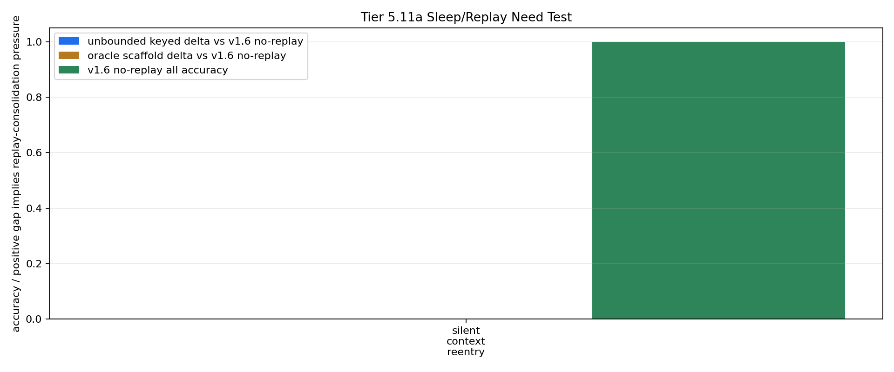

# Tier 5.11a Sleep/Replay Need Test Findings

- Generated: `2026-04-29T04:43:33+00:00`
- Status: **PASS**
- Diagnostic decision: **replay_not_needed_yet**
- Backend: `mock`
- Steps: `240`
- Seeds: `42`
- Tasks: `silent_context_reentry`
- Variants: `all`
- Selected standard baselines: `sign_persistence,online_perceptron`
- Smoke mode: `True`
- Output directory: `<repo>/controlled_test_output/tier5_11a_20260429_004328`

Tier 5.11a does not implement replay. It first asks whether the frozen v1.6 keyed-memory baseline degrades under a stressor replay/consolidation is supposed to solve.

## Claim Boundary

- This is software diagnostic evidence, not hardware evidence.
- The candidate is v1.6 no-replay keyed memory inside `Organism`.
- Unbounded keyed memory and oracle scaffold are upper bounds, not replay mechanisms.
- A `replay_or_consolidation_needed` decision authorizes Tier 5.11b replay intervention testing; it does not prove replay works.
- A `replay_not_needed_yet` decision means replay should be deferred in favor of routing/composition or harder stressors.

## Replay-Need Decision Metrics

- v1.6 no-replay min accuracy: `1.0`
- unbounded keyed min accuracy: `1.0`
- oracle scaffold min accuracy: `1.0`
- max unbounded gap vs no-replay: `0.0`
- max oracle gap vs no-replay: `0.0`
- max tail unbounded gap vs no-replay: `0.0`

## Stress Profile

- `replay_intruder_contexts`: `6`
- `replay_intruder_period`: `96`
- `replay_long_gap_spacing`: `112`
- `replay_return_start`: `720`
- `replay_return_window`: `216`
- `replay_decision_stride`: `24`
- `replay_distractor_density`: `0.45`
- `replay_distractor_scale`: `0.35`

## Task Comparisons

| Task | v1.4 all | v1.6 no replay | Unbounded keyed | Oracle | Gap unbounded-v1.6 | Gap oracle-v1.6 | Best ablation | Sign persistence | Best standard |
| --- | ---: | ---: | ---: | ---: | ---: | ---: | --- | ---: | --- |
| silent_context_reentry | 0.75 | 1 | 1 | 1 | 0 | 0 | `slot_reset_ablation` 0.75 | 0.75 | `sign_persistence` 0.75 |

## Aggregate Matrix

| Task | Model | Family | Group | All acc | Tail acc | Corr | Runtime s | Feature active | Context updates |
| --- | --- | --- | --- | ---: | ---: | ---: | ---: | ---: | ---: |
| silent_context_reentry | `oracle_context_scaffold` | CRA | external_scaffold | 1 | 1 | 0.939567 | 0.610429 | 8 | 2 |
| silent_context_reentry | `overcapacity_keyed_memory` | CRA | overcapacity_control | 1 | 1 | 0.939567 | 0.604414 | 8 | 2 |
| silent_context_reentry | `slot_reset_ablation` | CRA | memory_ablation | 0.75 | 0.666667 | 0.277448 | 0.607778 | 8 | 2 |
| silent_context_reentry | `slot_shuffle_ablation` | CRA | memory_ablation | 0 | 0 | -0.452379 | 0.618705 | 8 | 2 |
| silent_context_reentry | `unbounded_keyed_control` | CRA | capacity_upper_bound | 1 | 1 | 0.939567 | 0.614559 | 8 | 2 |
| silent_context_reentry | `v1_4_raw` | CRA | frozen_baseline | 0.75 | 0.666667 | 0.277448 | 0.625105 | 0 | 0 |
| silent_context_reentry | `v1_6_no_replay` | CRA | candidate_no_replay | 1 | 1 | 0.939567 | 0.617884 | 8 | 2 |
| silent_context_reentry | `wrong_key_ablation` | CRA | memory_ablation | 0 | 0 | -0.452379 | 0.680335 | 8 | 2 |
| silent_context_reentry | `memory_reset` | context_control |  | 0.75 | 0.666667 | 0.5 | 0.00093575 | None | None |
| silent_context_reentry | `online_perceptron` | linear |  | 0.375 | 0.333333 | 1.4114e-17 | 0.00145196 | None | None |
| silent_context_reentry | `oracle_context` | context_control |  | 1 | 1 | 1 | 0.00104329 | None | None |
| silent_context_reentry | `shuffled_context` | context_control |  | 0.5 | 0.333333 | 0 | 0.000889458 | None | None |
| silent_context_reentry | `sign_persistence` | rule |  | 0.75 | 0.666667 | 0.5 | 0.00138921 | None | None |
| silent_context_reentry | `stream_context_memory` | context_control |  | 0.75 | 0.333333 | 0.5 | 0.000931958 | None | None |
| silent_context_reentry | `wrong_context` | context_control |  | 0 | 0 | -1 | 0.000967667 | None | None |

## Criteria

| Criterion | Value | Rule | Pass | Note |
| --- | --- | --- | --- | --- |
| full variant/baseline/control/task/seed matrix completed | 15 | == 15 | yes |  |
| feedback timing has no leakage violations | 0 | == 0 | yes |  |
| v1.6 no-replay context feature is active | 8 | > 0 | yes |  |
| v1.6 no-replay memory receives context updates | 2 | > 0 | yes |  |

## Artifacts

- `tier5_11a_results.json`: machine-readable manifest.
- `tier5_11a_report.md`: human findings and claim boundary.
- `tier5_11a_summary.csv`: aggregate task/model metrics.
- `tier5_11a_comparisons.csv`: no-replay versus upper-bound/control/baseline table.
- `tier5_11a_fairness_contract.json`: predeclared comparison/leakage rules.
- `tier5_11a_memory_edges.png`: replay-need edge plot.
- `*_timeseries.csv`: per-task/per-model/per-seed traces.

