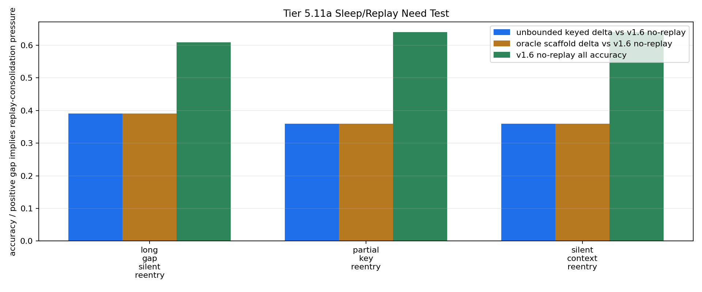

# Tier 5.11a Sleep/Replay Need Test Findings

- Generated: `2026-04-29T05:20:32+00:00`
- Status: **PASS**
- Diagnostic decision: **replay_or_consolidation_needed**
- Backend: `nest`
- Steps: `960`
- Seeds: `42, 43, 44`
- Tasks: `silent_context_reentry,long_gap_silent_reentry,partial_key_reentry`
- Variants: `all`
- Selected standard baselines: `sign_persistence,online_perceptron,online_logistic_regression,echo_state_network,small_gru,stdp_only_snn`
- Smoke mode: `False`
- Output directory: `/Users/james/JKS:CRA/controlled_test_output/tier5_11a_20260429_004340`

Tier 5.11a does not implement replay. It first asks whether the frozen v1.6 keyed-memory baseline degrades under a stressor replay/consolidation is supposed to solve.

## Claim Boundary

- This is software diagnostic evidence, not hardware evidence.
- The candidate is v1.6 no-replay keyed memory inside `Organism`.
- Unbounded keyed memory and oracle scaffold are upper bounds, not replay mechanisms.
- A `replay_or_consolidation_needed` decision authorizes Tier 5.11b replay intervention testing; it does not prove replay works.
- A `replay_not_needed_yet` decision means replay should be deferred in favor of routing/composition or harder stressors.

## Replay-Need Decision Metrics

- v1.6 no-replay min accuracy: `0.6086956521739131`
- unbounded keyed min accuracy: `1.0`
- oracle scaffold min accuracy: `1.0`
- max unbounded gap vs no-replay: `0.3913043478260869`
- max oracle gap vs no-replay: `0.3913043478260869`
- max tail unbounded gap vs no-replay: `1.0`

## Stress Profile

- `replay_intruder_contexts`: `6`
- `replay_intruder_period`: `96`
- `replay_long_gap_spacing`: `112`
- `replay_return_start`: `720`
- `replay_return_window`: `216`
- `replay_decision_stride`: `24`
- `replay_distractor_density`: `0.45`
- `replay_distractor_scale`: `0.35`

## Task Comparisons

| Task | v1.4 all | v1.6 no replay | Unbounded keyed | Oracle | Gap unbounded-v1.6 | Gap oracle-v1.6 | Best ablation | Sign persistence | Best standard |
| --- | ---: | ---: | ---: | ---: | ---: | ---: | --- | ---: | --- |
| long_gap_silent_reentry | 0.565217 | 0.608696 | 1 | 1 | 0.391304 | 0.391304 | `slot_reset_ablation` 0.565217 | 0.565217 | `online_perceptron` 0.623188 |
| partial_key_reentry | 0.52 | 0.64 | 1 | 1 | 0.36 | 0.36 | `slot_reset_ablation` 0.52 | 0.52 | `online_perceptron` 0.626667 |
| silent_context_reentry | 0.52 | 0.64 | 1 | 1 | 0.36 | 0.36 | `slot_reset_ablation` 0.52 | 0.52 | `online_perceptron` 0.613333 |

## Aggregate Matrix

| Task | Model | Family | Group | All acc | Tail acc | Corr | Runtime s | Feature active | Context updates |
| --- | --- | --- | --- | ---: | ---: | ---: | ---: | ---: | ---: |
| long_gap_silent_reentry | `oracle_context_scaffold` | CRA | external_scaffold | 1 | 1 | 0.903096 | 29.1835 | 69 | 18 |
| long_gap_silent_reentry | `overcapacity_keyed_memory` | CRA | overcapacity_control | 0.608696 | 0 | 0.343589 | 30.184 | 69 | 18 |
| long_gap_silent_reentry | `slot_reset_ablation` | CRA | memory_ablation | 0.565217 | 1 | 0.108427 | 29.8729 | 69 | 18 |
| long_gap_silent_reentry | `slot_shuffle_ablation` | CRA | memory_ablation | 0.347826 | 0 | -0.253441 | 29.5344 | 69 | 18 |
| long_gap_silent_reentry | `unbounded_keyed_control` | CRA | capacity_upper_bound | 1 | 1 | 0.903096 | 32.7331 | 69 | 18 |
| long_gap_silent_reentry | `v1_4_raw` | CRA | frozen_baseline | 0.565217 | 1 | 0.108427 | 29.7365 | 0 | 0 |
| long_gap_silent_reentry | `v1_6_no_replay` | CRA | candidate_no_replay | 0.608696 | 0 | 0.343589 | 31.865 | 69 | 18 |
| long_gap_silent_reentry | `wrong_key_ablation` | CRA | memory_ablation | 0.347826 | 0 | -0.253441 | 29.3873 | 69 | 18 |
| long_gap_silent_reentry | `echo_state_network` | reservoir |  | 0.144928 | 0.148148 | -0.581918 | 0.0106616 | None | None |
| long_gap_silent_reentry | `memory_reset` | context_control |  | 0.565217 | 1 | 0.128788 | 0.0033421 | None | None |
| long_gap_silent_reentry | `online_logistic_regression` | linear |  | 0.478261 | 0.333333 | -0.0837228 | 0.00573093 | None | None |
| long_gap_silent_reentry | `online_perceptron` | linear |  | 0.623188 | 0.555556 | 0.457488 | 0.00578982 | None | None |
| long_gap_silent_reentry | `oracle_context` | context_control |  | 1 | 1 | 1 | 0.003338 | None | None |
| long_gap_silent_reentry | `shuffled_context` | context_control |  | 0.565217 | 0.703704 | 0.123752 | 0.00354557 | None | None |
| long_gap_silent_reentry | `sign_persistence` | rule |  | 0.565217 | 1 | 0.128788 | 0.00491839 | None | None |
| long_gap_silent_reentry | `small_gru` | recurrent |  | 0.231884 | 0.259259 | -0.622622 | 0.0212081 | None | None |
| long_gap_silent_reentry | `stdp_only_snn` | snn_ablation |  | 0.492754 | 0.481481 | -0.016508 | 0.009929 | None | None |
| long_gap_silent_reentry | `stream_context_memory` | context_control |  | 0.608696 | 0 | 0.219697 | 0.00386982 | None | None |
| long_gap_silent_reentry | `wrong_context` | context_control |  | 0 | 0 | -1 | 0.00333658 | None | None |
| partial_key_reentry | `oracle_context_scaffold` | CRA | external_scaffold | 1 | 1 | 0.902965 | 31.1015 | 75 | 24 |
| partial_key_reentry | `overcapacity_keyed_memory` | CRA | overcapacity_control | 0.64 | 0 | 0.360031 | 31.4862 | 75 | 24 |
| partial_key_reentry | `slot_reset_ablation` | CRA | memory_ablation | 0.52 | 1 | 0.104121 | 29.8215 | 75 | 24 |
| partial_key_reentry | `slot_shuffle_ablation` | CRA | memory_ablation | 0.56 | 0 | 0.265511 | 29.6213 | 75 | 24 |
| partial_key_reentry | `unbounded_keyed_control` | CRA | capacity_upper_bound | 1 | 1 | 0.902965 | 32.0364 | 75 | 24 |
| partial_key_reentry | `v1_4_raw` | CRA | frozen_baseline | 0.52 | 1 | 0.104121 | 31.8366 | 0 | 0 |
| partial_key_reentry | `v1_6_no_replay` | CRA | candidate_no_replay | 0.64 | 0 | 0.360031 | 30.6017 | 75 | 24 |
| partial_key_reentry | `wrong_key_ablation` | CRA | memory_ablation | 0.56 | 0 | 0.265511 | 29.672 | 75 | 24 |
| partial_key_reentry | `echo_state_network` | reservoir |  | 0.213333 | 0.037037 | -0.591516 | 0.0104858 | None | None |
| partial_key_reentry | `memory_reset` | context_control |  | 0.52 | 1 | 0.0384615 | 0.0036786 | None | None |
| partial_key_reentry | `online_logistic_regression` | linear |  | 0.506667 | 0.296296 | -0.0520959 | 0.00575976 | None | None |
| partial_key_reentry | `online_perceptron` | linear |  | 0.626667 | 0.555556 | 0.500197 | 0.00550099 | None | None |
| partial_key_reentry | `oracle_context` | context_control |  | 1 | 1 | 1 | 0.00360607 | None | None |
| partial_key_reentry | `shuffled_context` | context_control |  | 0.493333 | 0.592593 | -0.015361 | 0.00349903 | None | None |
| partial_key_reentry | `sign_persistence` | rule |  | 0.52 | 1 | 0.0384615 | 0.00497349 | None | None |
| partial_key_reentry | `small_gru` | recurrent |  | 0.253333 | 0.111111 | -0.601379 | 0.0230771 | None | None |
| partial_key_reentry | `stdp_only_snn` | snn_ablation |  | 0.493333 | 0.481481 | 0.000117931 | 0.00935335 | None | None |
| partial_key_reentry | `stream_context_memory` | context_control |  | 0.64 | 0 | 0.282051 | 0.00339842 | None | None |
| partial_key_reentry | `wrong_context` | context_control |  | 0 | 0 | -1 | 0.00341625 | None | None |
| silent_context_reentry | `oracle_context_scaffold` | CRA | external_scaffold | 1 | 1 | 0.902965 | 30.5065 | 75 | 21 |
| silent_context_reentry | `overcapacity_keyed_memory` | CRA | overcapacity_control | 0.64 | 0 | 0.360031 | 29.671 | 75 | 21 |
| silent_context_reentry | `slot_reset_ablation` | CRA | memory_ablation | 0.52 | 1 | 0.104121 | 31.7261 | 75 | 21 |
| silent_context_reentry | `slot_shuffle_ablation` | CRA | memory_ablation | 0.4 | 0 | -0.243336 | 31.4353 | 75 | 21 |
| silent_context_reentry | `unbounded_keyed_control` | CRA | capacity_upper_bound | 1 | 1 | 0.902965 | 31.0015 | 75 | 21 |
| silent_context_reentry | `v1_4_raw` | CRA | frozen_baseline | 0.52 | 1 | 0.104121 | 30.5731 | 0 | 0 |
| silent_context_reentry | `v1_6_no_replay` | CRA | candidate_no_replay | 0.64 | 0 | 0.360031 | 29.6262 | 75 | 21 |
| silent_context_reentry | `wrong_key_ablation` | CRA | memory_ablation | 0.4 | 0 | -0.243336 | 31.3054 | 75 | 21 |
| silent_context_reentry | `echo_state_network` | reservoir |  | 0.186667 | 0 | -0.538083 | 0.0103731 | None | None |
| silent_context_reentry | `memory_reset` | context_control |  | 0.52 | 1 | 0.0384615 | 0.00357076 | None | None |
| silent_context_reentry | `online_logistic_regression` | linear |  | 0.493333 | 0.259259 | -0.0464275 | 0.00572824 | None | None |
| silent_context_reentry | `online_perceptron` | linear |  | 0.613333 | 0.555556 | 0.507926 | 0.00534986 | None | None |
| silent_context_reentry | `oracle_context` | context_control |  | 1 | 1 | 1 | 0.00398714 | None | None |
| silent_context_reentry | `shuffled_context` | context_control |  | 0.493333 | 0.592593 | -0.015361 | 0.00333829 | None | None |
| silent_context_reentry | `sign_persistence` | rule |  | 0.52 | 1 | 0.0384615 | 0.00510711 | None | None |
| silent_context_reentry | `small_gru` | recurrent |  | 0.24 | 0.037037 | -0.567794 | 0.0210289 | None | None |
| silent_context_reentry | `stdp_only_snn` | snn_ablation |  | 0.493333 | 0.481481 | -0.0177501 | 0.00897074 | None | None |
| silent_context_reentry | `stream_context_memory` | context_control |  | 0.64 | 0 | 0.282051 | 0.00327546 | None | None |
| silent_context_reentry | `wrong_context` | context_control |  | 0 | 0 | -1 | 0.00337683 | None | None |

## Criteria

| Criterion | Value | Rule | Pass | Note |
| --- | --- | --- | --- | --- |
| full variant/baseline/control/task/seed matrix completed | 171 | == 171 | yes |  |
| feedback timing has no leakage violations | 0 | == 0 | yes |  |
| v1.6 no-replay context feature is active | 219 | > 0 | yes |  |
| v1.6 no-replay memory receives context updates | 63 | > 0 | yes |  |
| upper-bound condition is solvable | 1 | >= 0.85 | yes | If unbounded keyed memory cannot solve the stressor, replay is not the next justified repair. |
| oracle scaffold condition is solvable | 1 | >= 0.85 | yes |  |
| diagnostic decision produced | replay_or_consolidation_needed | in replay_or_consolidation_needed,replay_not_needed_yet,inconclusive | yes |  |

## Artifacts

- `tier5_11a_results.json`: machine-readable manifest.
- `tier5_11a_report.md`: human findings and claim boundary.
- `tier5_11a_summary.csv`: aggregate task/model metrics.
- `tier5_11a_comparisons.csv`: no-replay versus upper-bound/control/baseline table.
- `tier5_11a_fairness_contract.json`: predeclared comparison/leakage rules.
- `tier5_11a_memory_edges.png`: replay-need edge plot.
- `*_timeseries.csv`: per-task/per-model/per-seed traces.

