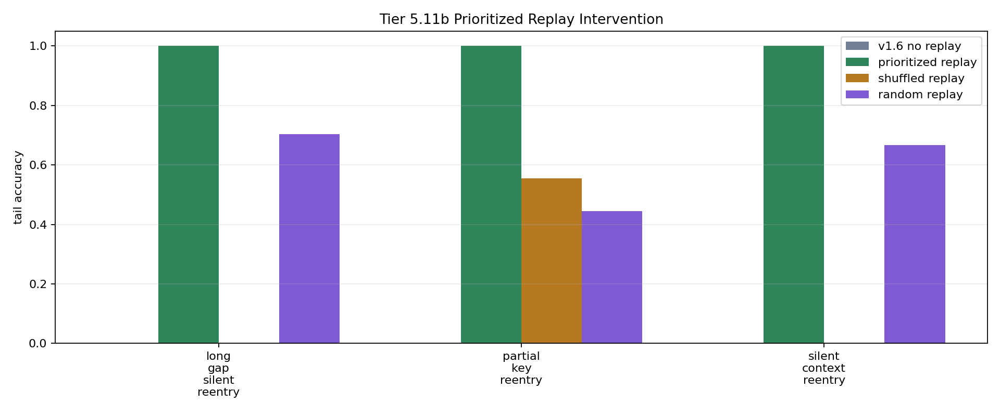

# Tier 5.11b Prioritized Replay / Consolidation Intervention Findings

- Generated: `2026-04-29T06:19:27.128002+00:00`
- Status: **PASS**
- Backend: `nest`
- Steps: `960`
- Seeds: `42, 43, 44`
- Tasks: `silent_context_reentry,long_gap_silent_reentry,partial_key_reentry`
- Variants: `all`
- Selected standard baselines: `sign_persistence,online_perceptron,online_logistic_regression,echo_state_network,small_gru,stdp_only_snn`
- Output directory: `/Users/james/JKS:CRA/controlled_test_output/tier5_11b_20260429_014637`

Tier 5.11b tests whether prioritized offline replay repairs the Tier 5.11a silent-reentry failure. It is not hardware replay and not native on-chip replay.

## Claim Boundary

- A pass promotes prioritized replay only as a software memory/consolidation mechanism candidate.
- A pass does not prove hardware replay, on-chip replay, general working memory, or compositional reuse.
- Replay events must use only previously observed context episodes and must remain outside online scoring steps.
- Shuffled, random, and no-consolidation controls must not match prioritized replay.

## Summary Metrics

- prioritized replay events: `1185.0`
- prioritized replay consolidations: `1185.0`
- no-consolidation writes: `0.0`
- prioritized min all accuracy: `1.0`
- prioritized min tail accuracy: `1.0`
- prioritized min tail delta vs no replay: `1.0`
- prioritized min all gap closure: `1.0`
- prioritized min tail gap closure: `1.0`
- prioritized min tail edge vs shuffled: `0.4444444444444444`
- prioritized min tail edge vs random: `0.2962962962962963`
- prioritized min tail edge vs no-consolidation: `1.0`

## Task Comparisons

| Task | No replay tail | Prioritized tail | Shuffled tail | Random tail | No-consolidation tail | Unbounded tail | Tail gain vs no replay | Tail edge vs shuffled | Tail edge vs random | Gap closure |
| --- | ---: | ---: | ---: | ---: | ---: | ---: | ---: | ---: | ---: | ---: |
| long_gap_silent_reentry | 0 | 1 | 0 | 0.703704 | 0 | 1 | 1 | 1 | 0.296296 | 1 |
| partial_key_reentry | 0 | 1 | 0.555556 | 0.444444 | 0 | 1 | 1 | 0.444444 | 0.555556 | 1 |
| silent_context_reentry | 0 | 1 | 0 | 0.666667 | 0 | 1 | 1 | 1 | 0.333333 | 1 |

## Aggregate Matrix

| Task | Model | Group | All acc | Tail acc | Replay events | Writes | Replay leakage | Runtime s |
| --- | --- | --- | ---: | ---: | ---: | ---: | ---: | ---: |
| long_gap_silent_reentry | `no_consolidation_replay` | replay_ablation | 0.608696 | 0 | 381 | 0 | 0 | 29.4822 |
| long_gap_silent_reentry | `oracle_context_scaffold` | external_scaffold | 1 | 1 | 0 | 0 | 0 | 30.5642 |
| long_gap_silent_reentry | `prioritized_replay` | replay_candidate | 1 | 1 | 381 | 381 | 0 | 29.5902 |
| long_gap_silent_reentry | `random_replay` | replay_ablation | 0.884058 | 0.703704 | 381 | 381 | 0 | 29.5805 |
| long_gap_silent_reentry | `shuffled_replay` | replay_ablation | 0.26087 | 0 | 381 | 381 | 0 | 29.5826 |
| long_gap_silent_reentry | `unbounded_keyed_control` | capacity_upper_bound | 1 | 1 | 0 | 0 | 0 | 29.8606 |
| long_gap_silent_reentry | `v1_6_no_replay` | candidate_no_replay | 0.608696 | 0 | 0 | 0 | 0 | 29.3248 |
| long_gap_silent_reentry | `echo_state_network` |  | 0.188406 | 0.0740741 | None | None | None | 0.0109511 |
| long_gap_silent_reentry | `memory_reset` |  | 0.565217 | 1 | None | None | None | 0.00381085 |
| long_gap_silent_reentry | `online_logistic_regression` |  | 0.478261 | 0.333333 | None | None | None | 0.00655774 |
| long_gap_silent_reentry | `online_perceptron` |  | 0.608696 | 0.555556 | None | None | None | 0.00640996 |
| long_gap_silent_reentry | `oracle_context` |  | 1 | 1 | None | None | None | 0.00358338 |
| long_gap_silent_reentry | `shuffled_context` |  | 0.565217 | 0.703704 | None | None | None | 0.00357765 |
| long_gap_silent_reentry | `sign_persistence` |  | 0.565217 | 1 | None | None | None | 0.00519383 |
| long_gap_silent_reentry | `small_gru` |  | 0.188406 | 0.0740741 | None | None | None | 0.0221054 |
| long_gap_silent_reentry | `stdp_only_snn` |  | 0.492754 | 0.481481 | None | None | None | 0.0106506 |
| long_gap_silent_reentry | `stream_context_memory` |  | 0.608696 | 0 | None | None | None | 0.00421928 |
| long_gap_silent_reentry | `wrong_context` |  | 0 | 0 | None | None | None | 0.00355894 |
| partial_key_reentry | `no_consolidation_replay` | replay_ablation | 0.64 | 0 | 420 | 0 | 0 | 41.1524 |
| partial_key_reentry | `oracle_context_scaffold` | external_scaffold | 1 | 1 | 0 | 0 | 0 | 30.0701 |
| partial_key_reentry | `prioritized_replay` | replay_candidate | 1 | 1 | 420 | 420 | 0 | 31.8515 |
| partial_key_reentry | `random_replay` | replay_ablation | 0.8 | 0.444444 | 420 | 420 | 0 | 31.2452 |
| partial_key_reentry | `shuffled_replay` | replay_ablation | 0.6 | 0.555556 | 420 | 420 | 0 | 31.2545 |
| partial_key_reentry | `unbounded_keyed_control` | capacity_upper_bound | 1 | 1 | 0 | 0 | 0 | 33.9239 |
| partial_key_reentry | `v1_6_no_replay` | candidate_no_replay | 0.64 | 0 | 0 | 0 | 0 | 31.1154 |
| partial_key_reentry | `echo_state_network` |  | 0.226667 | 0.037037 | None | None | None | 0.011126 |
| partial_key_reentry | `memory_reset` |  | 0.52 | 1 | None | None | None | 0.00418781 |
| partial_key_reentry | `online_logistic_regression` |  | 0.52 | 0.333333 | None | None | None | 0.00599404 |
| partial_key_reentry | `online_perceptron` |  | 0.6 | 0.555556 | None | None | None | 0.00547503 |
| partial_key_reentry | `oracle_context` |  | 1 | 1 | None | None | None | 0.00437085 |
| partial_key_reentry | `shuffled_context` |  | 0.493333 | 0.592593 | None | None | None | 0.00345126 |
| partial_key_reentry | `sign_persistence` |  | 0.52 | 1 | None | None | None | 0.00588832 |
| partial_key_reentry | `small_gru` |  | 0.253333 | 0.037037 | None | None | None | 0.0209665 |
| partial_key_reentry | `stdp_only_snn` |  | 0.493333 | 0.481481 | None | None | None | 0.00957994 |
| partial_key_reentry | `stream_context_memory` |  | 0.64 | 0 | None | None | None | 0.00346079 |
| partial_key_reentry | `wrong_context` |  | 0 | 0 | None | None | None | 0.00387382 |
| silent_context_reentry | `no_consolidation_replay` | replay_ablation | 0.64 | 0 | 384 | 0 | 0 | 29.4488 |
| silent_context_reentry | `oracle_context_scaffold` | external_scaffold | 1 | 1 | 0 | 0 | 0 | 29.5537 |
| silent_context_reentry | `prioritized_replay` | replay_candidate | 1 | 1 | 384 | 384 | 0 | 30.1105 |
| silent_context_reentry | `random_replay` | replay_ablation | 0.88 | 0.666667 | 384 | 384 | 0 | 32.8793 |
| silent_context_reentry | `shuffled_replay` | replay_ablation | 0.32 | 0 | 384 | 384 | 0 | 31.7708 |
| silent_context_reentry | `unbounded_keyed_control` | capacity_upper_bound | 1 | 1 | 0 | 0 | 0 | 29.7125 |
| silent_context_reentry | `v1_6_no_replay` | candidate_no_replay | 0.64 | 0 | 0 | 0 | 0 | 31.7476 |
| silent_context_reentry | `echo_state_network` |  | 0.173333 | 0.037037 | None | None | None | 0.0103803 |
| silent_context_reentry | `memory_reset` |  | 0.52 | 1 | None | None | None | 0.00329536 |
| silent_context_reentry | `online_logistic_regression` |  | 0.506667 | 0.296296 | None | None | None | 0.00622626 |
| silent_context_reentry | `online_perceptron` |  | 0.64 | 0.555556 | None | None | None | 0.00534794 |
| silent_context_reentry | `oracle_context` |  | 1 | 1 | None | None | None | 0.00380771 |
| silent_context_reentry | `shuffled_context` |  | 0.493333 | 0.592593 | None | None | None | 0.00327571 |
| silent_context_reentry | `sign_persistence` |  | 0.52 | 1 | None | None | None | 0.00506033 |
| silent_context_reentry | `small_gru` |  | 0.253333 | 0.111111 | None | None | None | 0.0367181 |
| silent_context_reentry | `stdp_only_snn` |  | 0.493333 | 0.481481 | None | None | None | 0.0124015 |
| silent_context_reentry | `stream_context_memory` |  | 0.64 | 0 | None | None | None | 0.00332365 |
| silent_context_reentry | `wrong_context` |  | 0 | 0 | None | None | None | 0.00341521 |

## Criteria

| Criterion | Value | Rule | Pass | Note |
| --- | --- | --- | --- | --- |
| full replay/control/baseline/task/seed matrix completed | 162 | == 162 | yes |  |
| feedback timing has no leakage violations | 0 | == 0 | yes |  |
| replay uses no future context episodes | 0 | == 0 | yes |  |
| prioritized replay selected episodes | 1185 | > 0 | yes |  |
| prioritized replay consolidated episodes | 1185 | > 0 | yes |  |
| prioritized replay minimum all accuracy | 1 | >= 0.85 | yes |  |
| prioritized replay minimum tail accuracy | 1 | >= 0.75 | yes |  |
| prioritized replay improves tail over no replay | 1 | >= 0.5 | yes |  |
| prioritized replay closes all-accuracy gap toward unbounded | 1 | >= 0.75 | yes |  |
| prioritized replay closes tail gap toward unbounded | 1 | >= 0.75 | yes |  |
| shuffled replay does not match prioritized tail | 0.444444 | >= 0.5 | no |  |
| random replay does not match prioritized tail | 0.296296 | >= 0.2 | yes |  |
| no-consolidation replay is worse than full replay | 1 | >= 0.5 | yes |  |
| no-consolidation replay performs zero writes | 0 | == 0 | yes |  |

## Artifacts

- `tier5_11b_results.json`: machine-readable manifest.
- `tier5_11b_report.md`: human findings and claim boundary.
- `tier5_11b_summary.csv`: aggregate task/model metrics.
- `tier5_11b_comparisons.csv`: no-replay/replay/control comparison table.
- `tier5_11b_replay_events.csv`: auditable replay selections and writes.
- `tier5_11b_fairness_contract.json`: predeclared replay/fairness/leakage rules.
- `tier5_11b_replay_edges.png`: replay edge plot.
- `*_timeseries.csv`: per-task/per-model/per-seed traces.

