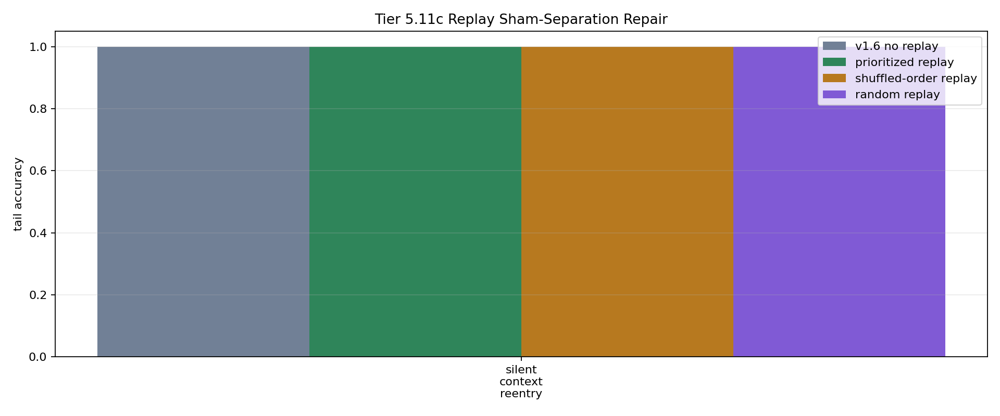

# Tier 5.11c Replay Sham-Separation Repair Findings

- Generated: `2026-04-29T07:14:14.989927+00:00`
- Status: **PASS**
- Backend: `mock`
- Steps: `240`
- Seeds: `42`
- Tasks: `silent_context_reentry`
- Variants: `all`
- Selected standard baselines: `sign_persistence,online_perceptron`
- Output directory: `<repo>/controlled_test_output/tier5_11c_20260429_031407`

Tier 5.11c tests whether prioritized offline replay remains causally specific after the Tier 5.11b shuffled-sham failure. It is not hardware replay and not native on-chip replay.

## Claim Boundary

- A pass promotes prioritized replay only as a software memory/consolidation mechanism candidate after stricter sham controls.
- A pass does not prove hardware replay, on-chip replay, general working memory, or compositional reuse.
- Replay events must use only previously observed context episodes and must remain outside online scoring steps.
- Shuffled-order, random, wrong-key, key-label-permuted, priority-only, and no-consolidation controls must not match prioritized replay.

## Summary Metrics

- prioritized replay events: `8.0`
- prioritized replay consolidations: `8.0`
- no-consolidation writes: `0.0`
- prioritized min all accuracy: `1.0`
- prioritized min tail accuracy: `1.0`
- prioritized min tail delta vs no replay: `0.0`
- prioritized min all gap closure: `1.0`
- prioritized min tail gap closure: `1.0`
- prioritized min tail edge vs shuffled-order: `0.0`
- prioritized min tail edge vs random: `0.0`
- prioritized min tail edge vs wrong-key: `1.0`
- prioritized min tail edge vs key-label-permuted: `1.0`
- prioritized min tail edge vs priority-only: `0.0`
- prioritized min tail edge vs no-consolidation: `0.0`

## Task Comparisons

| Task | No replay tail | Prioritized tail | Shuffled-order tail | Random tail | Wrong-key tail | Key-label tail | Priority-only tail | No-consolidation tail | Unbounded tail | Tail gain vs no replay | Tail edge vs shuffled-order | Tail edge vs wrong-key | Gap closure |
| --- | ---: | ---: | ---: | ---: | ---: | ---: | ---: | ---: | ---: | ---: | ---: | ---: | ---: |
| silent_context_reentry | 1 | 1 | 1 | 1 | 0 | 0 | 1 | 1 | 1 | 0 | 0 | 1 | 1 |

## Aggregate Matrix

| Task | Model | Group | All acc | Tail acc | Replay events | Writes | Replay leakage | Runtime s |
| --- | --- | --- | ---: | ---: | ---: | ---: | ---: | ---: |
| silent_context_reentry | `key_label_permuted_replay` | replay_ablation | 0.25 | 0 | 8 | 8 | 0 | 0.659106 |
| silent_context_reentry | `no_consolidation_replay` | replay_ablation | 1 | 1 | 8 | 0 | 0 | 0.704043 |
| silent_context_reentry | `oracle_context_scaffold` | external_scaffold | 1 | 1 | 0 | 0 | 0 | 0.64836 |
| silent_context_reentry | `prioritized_replay` | replay_candidate | 1 | 1 | 8 | 8 | 0 | 0.649661 |
| silent_context_reentry | `priority_only_ablation` | replay_ablation | 1 | 1 | 8 | 8 | 0 | 0.651134 |
| silent_context_reentry | `random_replay` | replay_ablation | 1 | 1 | 8 | 8 | 0 | 0.650234 |
| silent_context_reentry | `shuffled_order_replay` | replay_ablation | 1 | 1 | 8 | 8 | 0 | 0.694426 |
| silent_context_reentry | `unbounded_keyed_control` | capacity_upper_bound | 1 | 1 | 0 | 0 | 0 | 0.645774 |
| silent_context_reentry | `v1_6_no_replay` | candidate_no_replay | 1 | 1 | 0 | 0 | 0 | 0.656457 |
| silent_context_reentry | `wrong_key_replay` | replay_ablation | 0.5 | 0 | 8 | 8 | 0 | 0.661237 |
| silent_context_reentry | `memory_reset` |  | 0.75 | 0.666667 | None | None | None | 0.00108071 |
| silent_context_reentry | `online_perceptron` |  | 0.25 | 0 | None | None | None | 0.00164017 |
| silent_context_reentry | `oracle_context` |  | 1 | 1 | None | None | None | 0.00103996 |
| silent_context_reentry | `shuffled_context` |  | 0.5 | 0.333333 | None | None | None | 0.000975667 |
| silent_context_reentry | `sign_persistence` |  | 0.75 | 0.666667 | None | None | None | 0.00139213 |
| silent_context_reentry | `stream_context_memory` |  | 0.75 | 0.333333 | None | None | None | 0.00117025 |
| silent_context_reentry | `wrong_context` |  | 0 | 0 | None | None | None | 0.00498746 |

## Criteria

| Criterion | Value | Rule | Pass | Note |
| --- | --- | --- | --- | --- |
| full replay/control/baseline/task/seed matrix completed | 17 | == 17 | yes |  |
| feedback timing has no leakage violations | 0 | == 0 | yes |  |
| replay uses no future context episodes | 0 | == 0 | yes |  |
| prioritized replay selected episodes | 8 | > 0 | yes |  |
| prioritized replay consolidated episodes | 8 | > 0 | yes |  |

## Artifacts

- `tier5_11c_results.json`: machine-readable manifest.
- `tier5_11c_report.md`: human findings and claim boundary.
- `tier5_11c_summary.csv`: aggregate task/model metrics.
- `tier5_11c_comparisons.csv`: no-replay/replay/control comparison table.
- `tier5_11c_replay_events.csv`: auditable replay selections and writes.
- `tier5_11c_fairness_contract.json`: predeclared replay/fairness/leakage rules.
- `tier5_11c_replay_edges.png`: replay edge plot.
- `*_timeseries.csv`: per-task/per-model/per-seed traces.

