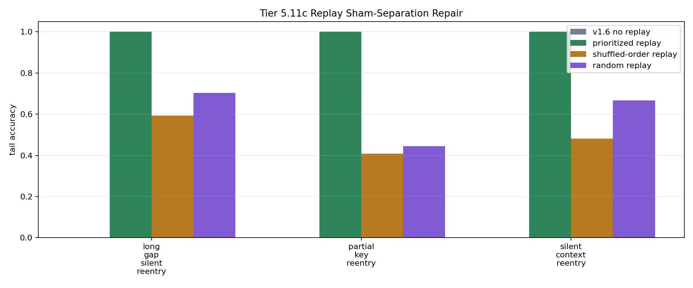

# Tier 5.11c Replay Sham-Separation Repair Findings

- Generated: `2026-04-29T08:02:20.356964+00:00`
- Status: **FAIL**
- Backend: `nest`
- Steps: `960`
- Seeds: `42, 43, 44`
- Tasks: `silent_context_reentry,long_gap_silent_reentry,partial_key_reentry`
- Variants: `all`
- Selected standard baselines: `sign_persistence,online_perceptron,online_logistic_regression,echo_state_network,small_gru,stdp_only_snn`
- Output directory: `<repo>/controlled_test_output/tier5_11c_20260429_031427`

Tier 5.11c tests whether prioritized offline replay remains causally specific after the Tier 5.11b shuffled-sham failure. It is not hardware replay and not native on-chip replay.

## Claim Boundary

- A pass promotes prioritized replay only as a software memory/consolidation mechanism candidate after stricter sham controls.
- A pass does not prove hardware replay, on-chip replay, general working memory, or compositional reuse.
- Replay events must use only previously observed context episodes and must remain outside online scoring steps.
- Shuffled-order, random, wrong-key, key-label-permuted, priority-only, and no-consolidation controls must not match prioritized replay.

## Summary Metrics

- prioritized replay events: `1185.0`
- prioritized replay consolidations: `1185.0`
- no-consolidation writes: `0.0`
- prioritized min all accuracy: `1.0`
- prioritized min tail accuracy: `1.0`
- prioritized min tail delta vs no replay: `1.0`
- prioritized min all gap closure: `1.0`
- prioritized min tail gap closure: `1.0`
- prioritized min tail edge vs shuffled-order: `0.40740740740740733`
- prioritized min tail edge vs random: `0.2962962962962963`
- prioritized min tail edge vs wrong-key: `0.5555555555555556`
- prioritized min tail edge vs key-label-permuted: `1.0`
- prioritized min tail edge vs priority-only: `1.0`
- prioritized min tail edge vs no-consolidation: `1.0`

## Task Comparisons

| Task | No replay tail | Prioritized tail | Shuffled-order tail | Random tail | Wrong-key tail | Key-label tail | Priority-only tail | No-consolidation tail | Unbounded tail | Tail gain vs no replay | Tail edge vs shuffled-order | Tail edge vs wrong-key | Gap closure |
| --- | ---: | ---: | ---: | ---: | ---: | ---: | ---: | ---: | ---: | ---: | ---: | ---: | ---: |
| long_gap_silent_reentry | 0 | 1 | 0.592593 | 0.703704 | 0 | 0 | 0 | 0 | 1 | 1 | 0.407407 | 1 | 1 |
| partial_key_reentry | 0 | 1 | 0.407407 | 0.444444 | 0.444444 | 0 | 0 | 0 | 1 | 1 | 0.592593 | 0.555556 | 1 |
| silent_context_reentry | 0 | 1 | 0.481481 | 0.666667 | 0 | 0 | 0 | 0 | 1 | 1 | 0.518519 | 1 | 1 |

## Aggregate Matrix

| Task | Model | Group | All acc | Tail acc | Replay events | Writes | Replay leakage | Runtime s |
| --- | --- | --- | ---: | ---: | ---: | ---: | ---: | ---: |
| long_gap_silent_reentry | `key_label_permuted_replay` | replay_ablation | 0.26087 | 0 | 381 | 381 | 0 | 33.0771 |
| long_gap_silent_reentry | `no_consolidation_replay` | replay_ablation | 0.608696 | 0 | 381 | 0 | 0 | 31.2533 |
| long_gap_silent_reentry | `oracle_context_scaffold` | external_scaffold | 1 | 1 | 0 | 0 | 0 | 30.0851 |
| long_gap_silent_reentry | `prioritized_replay` | replay_candidate | 1 | 1 | 381 | 381 | 0 | 32.103 |
| long_gap_silent_reentry | `priority_only_ablation` | replay_ablation | 0.608696 | 0 | 381 | 381 | 0 | 29.9397 |
| long_gap_silent_reentry | `random_replay` | replay_ablation | 0.884058 | 0.703704 | 381 | 381 | 0 | 33.7272 |
| long_gap_silent_reentry | `shuffled_order_replay` | replay_ablation | 0.84058 | 0.592593 | 381 | 381 | 0 | 31.7038 |
| long_gap_silent_reentry | `unbounded_keyed_control` | capacity_upper_bound | 1 | 1 | 0 | 0 | 0 | 29.909 |
| long_gap_silent_reentry | `v1_6_no_replay` | candidate_no_replay | 0.608696 | 0 | 0 | 0 | 0 | 31.3578 |
| long_gap_silent_reentry | `wrong_key_replay` | replay_ablation | 0.521739 | 0 | 381 | 381 | 0 | 37.4463 |
| long_gap_silent_reentry | `echo_state_network` |  | 0.188406 | 0.0740741 | None | None | None | 0.0111533 |
| long_gap_silent_reentry | `memory_reset` |  | 0.565217 | 1 | None | None | None | 0.00324612 |
| long_gap_silent_reentry | `online_logistic_regression` |  | 0.478261 | 0.333333 | None | None | None | 0.00583882 |
| long_gap_silent_reentry | `online_perceptron` |  | 0.608696 | 0.555556 | None | None | None | 0.00556293 |
| long_gap_silent_reentry | `oracle_context` |  | 1 | 1 | None | None | None | 0.00368032 |
| long_gap_silent_reentry | `shuffled_context` |  | 0.565217 | 0.703704 | None | None | None | 0.00344038 |
| long_gap_silent_reentry | `sign_persistence` |  | 0.565217 | 1 | None | None | None | 0.00507979 |
| long_gap_silent_reentry | `small_gru` |  | 0.188406 | 0.0740741 | None | None | None | 0.0214724 |
| long_gap_silent_reentry | `stdp_only_snn` |  | 0.492754 | 0.481481 | None | None | None | 0.0102646 |
| long_gap_silent_reentry | `stream_context_memory` |  | 0.608696 | 0 | None | None | None | 0.00374944 |
| long_gap_silent_reentry | `wrong_context` |  | 0 | 0 | None | None | None | 0.00367251 |
| partial_key_reentry | `key_label_permuted_replay` | replay_ablation | 0.4 | 0 | 420 | 420 | 0 | 30.4953 |
| partial_key_reentry | `no_consolidation_replay` | replay_ablation | 0.64 | 0 | 420 | 0 | 0 | 33.2908 |
| partial_key_reentry | `oracle_context_scaffold` | external_scaffold | 1 | 1 | 0 | 0 | 0 | 30.917 |
| partial_key_reentry | `prioritized_replay` | replay_candidate | 1 | 1 | 420 | 420 | 0 | 30.3364 |
| partial_key_reentry | `priority_only_ablation` | replay_ablation | 0.64 | 0 | 420 | 420 | 0 | 31.4798 |
| partial_key_reentry | `random_replay` | replay_ablation | 0.8 | 0.444444 | 420 | 420 | 0 | 30.5207 |
| partial_key_reentry | `shuffled_order_replay` | replay_ablation | 0.786667 | 0.407407 | 420 | 420 | 0 | 30.6171 |
| partial_key_reentry | `unbounded_keyed_control` | capacity_upper_bound | 1 | 1 | 0 | 0 | 0 | 32.1398 |
| partial_key_reentry | `v1_6_no_replay` | candidate_no_replay | 0.64 | 0 | 0 | 0 | 0 | 30.2796 |
| partial_key_reentry | `wrong_key_replay` | replay_ablation | 0.72 | 0.444444 | 420 | 420 | 0 | 30.3028 |
| partial_key_reentry | `echo_state_network` |  | 0.226667 | 0.037037 | None | None | None | 0.0110406 |
| partial_key_reentry | `memory_reset` |  | 0.52 | 1 | None | None | None | 0.00343206 |
| partial_key_reentry | `online_logistic_regression` |  | 0.52 | 0.333333 | None | None | None | 0.00613319 |
| partial_key_reentry | `online_perceptron` |  | 0.6 | 0.555556 | None | None | None | 0.00598988 |
| partial_key_reentry | `oracle_context` |  | 1 | 1 | None | None | None | 0.00351474 |
| partial_key_reentry | `shuffled_context` |  | 0.493333 | 0.592593 | None | None | None | 0.0034319 |
| partial_key_reentry | `sign_persistence` |  | 0.52 | 1 | None | None | None | 0.0054329 |
| partial_key_reentry | `small_gru` |  | 0.253333 | 0.037037 | None | None | None | 0.0210414 |
| partial_key_reentry | `stdp_only_snn` |  | 0.493333 | 0.481481 | None | None | None | 0.00945867 |
| partial_key_reentry | `stream_context_memory` |  | 0.64 | 0 | None | None | None | 0.00337304 |
| partial_key_reentry | `wrong_context` |  | 0 | 0 | None | None | None | 0.0033336 |
| silent_context_reentry | `key_label_permuted_replay` | replay_ablation | 0.32 | 0 | 384 | 384 | 0 | 30.4222 |
| silent_context_reentry | `no_consolidation_replay` | replay_ablation | 0.64 | 0 | 384 | 0 | 0 | 36.4657 |
| silent_context_reentry | `oracle_context_scaffold` | external_scaffold | 1 | 1 | 0 | 0 | 0 | 32.272 |
| silent_context_reentry | `prioritized_replay` | replay_candidate | 1 | 1 | 384 | 384 | 0 | 31.1522 |
| silent_context_reentry | `priority_only_ablation` | replay_ablation | 0.64 | 0 | 384 | 384 | 0 | 34.3555 |
| silent_context_reentry | `random_replay` | replay_ablation | 0.88 | 0.666667 | 384 | 384 | 0 | 32.2483 |
| silent_context_reentry | `shuffled_order_replay` | replay_ablation | 0.813333 | 0.481481 | 384 | 384 | 0 | 32.4849 |
| silent_context_reentry | `unbounded_keyed_control` | capacity_upper_bound | 1 | 1 | 0 | 0 | 0 | 32.8999 |
| silent_context_reentry | `v1_6_no_replay` | candidate_no_replay | 0.64 | 0 | 0 | 0 | 0 | 30.2728 |
| silent_context_reentry | `wrong_key_replay` | replay_ablation | 0.56 | 0 | 384 | 384 | 0 | 30.3253 |
| silent_context_reentry | `echo_state_network` |  | 0.173333 | 0.037037 | None | None | None | 0.0119239 |
| silent_context_reentry | `memory_reset` |  | 0.52 | 1 | None | None | None | 0.00363626 |
| silent_context_reentry | `online_logistic_regression` |  | 0.506667 | 0.296296 | None | None | None | 0.00757783 |
| silent_context_reentry | `online_perceptron` |  | 0.64 | 0.555556 | None | None | None | 0.00582528 |
| silent_context_reentry | `oracle_context` |  | 1 | 1 | None | None | None | 0.003775 |
| silent_context_reentry | `shuffled_context` |  | 0.493333 | 0.592593 | None | None | None | 0.00377119 |
| silent_context_reentry | `sign_persistence` |  | 0.52 | 1 | None | None | None | 0.00585894 |
| silent_context_reentry | `small_gru` |  | 0.253333 | 0.111111 | None | None | None | 0.0261895 |
| silent_context_reentry | `stdp_only_snn` |  | 0.493333 | 0.481481 | None | None | None | 0.00951372 |
| silent_context_reentry | `stream_context_memory` |  | 0.64 | 0 | None | None | None | 0.00359771 |
| silent_context_reentry | `wrong_context` |  | 0 | 0 | None | None | None | 0.00348113 |

## Criteria

| Criterion | Value | Rule | Pass | Note |
| --- | --- | --- | --- | --- |
| full replay/control/baseline/task/seed matrix completed | 189 | == 189 | yes |  |
| feedback timing has no leakage violations | 0 | == 0 | yes |  |
| replay uses no future context episodes | 0 | == 0 | yes |  |
| prioritized replay selected episodes | 1185 | > 0 | yes |  |
| prioritized replay consolidated episodes | 1185 | > 0 | yes |  |
| prioritized replay minimum all accuracy | 1 | >= 0.85 | yes |  |
| prioritized replay minimum tail accuracy | 1 | >= 0.75 | yes |  |
| prioritized replay improves tail over no replay | 1 | >= 0.5 | yes |  |
| prioritized replay closes all-accuracy gap toward unbounded | 1 | >= 0.75 | yes |  |
| prioritized replay closes tail gap toward unbounded | 1 | >= 0.75 | yes |  |
| shuffled-order replay does not match prioritized tail | 0.407407 | >= 0.5 | no |  |
| random replay does not match prioritized tail | 0.296296 | >= 0.2 | yes |  |
| wrong-key replay does not match prioritized tail | 0.555556 | >= 0.5 | yes |  |
| key-label-permuted replay does not match prioritized tail | 1 | >= 0.5 | yes |  |
| priority-only ablation does not match prioritized tail | 1 | >= 0.5 | yes |  |
| no-consolidation replay is worse than full replay | 1 | >= 0.5 | yes |  |
| no-consolidation replay performs zero writes | 0 | == 0 | yes |  |
| sham replay write counts match prioritized | 1185 | == 1185 | yes |  |

Failure: Failed criteria: shuffled-order replay does not match prioritized tail

## Artifacts

- `tier5_11c_results.json`: machine-readable manifest.
- `tier5_11c_report.md`: human findings and claim boundary.
- `tier5_11c_summary.csv`: aggregate task/model metrics.
- `tier5_11c_comparisons.csv`: no-replay/replay/control comparison table.
- `tier5_11c_replay_events.csv`: auditable replay selections and writes.
- `tier5_11c_fairness_contract.json`: predeclared replay/fairness/leakage rules.
- `tier5_11c_replay_edges.png`: replay edge plot.
- `*_timeseries.csv`: per-task/per-model/per-seed traces.

