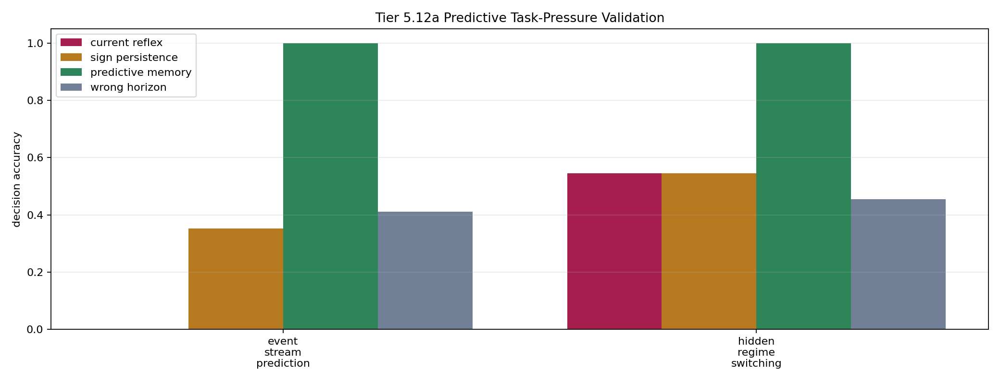

# Tier 5.12a Predictive Task-Pressure Validation Findings

- Generated: `2026-04-29T09:40:41+00:00`
- Status: **PASS**
- Steps: `180`
- Seeds: `42`
- Tasks: `hidden_regime_switching,event_stream_prediction`
- Selected standard baselines: `sign_persistence,online_perceptron`
- Smoke mode: `True`
- Output directory: `/Users/james/JKS:CRA/controlled_test_output/tier5_12a_20260429_054041`

Tier 5.12a validates predictive-pressure tasks before CRA predictive-coding/world-model mechanisms are tested.

## Claim Boundary

- This is task-validation evidence, not CRA predictive-coding evidence.
- `predictive_memory` is an oracle-like control showing the task is solvable with the missing predictive state.
- A pass authorizes Tier 5.12b predictive mechanism testing; it does not prove world modeling, language, planning, or hardware prediction.

## Predictive Pressure Comparisons

| Task | Current reflex acc | Sign persistence acc | Rolling majority acc | Predictive memory acc | Wrong horizon acc | Shuffled target acc | Best standard model | Best standard acc | Predictive edge vs best reflex | Predictive edge vs sham | Ambiguous current | Ambiguous last | Decisions |
| --- | ---: | ---: | ---: | ---: | ---: | ---: | --- | ---: | ---: | ---: | --- | --- | ---: |
| event_stream_prediction | 0 | 0.352941 | 0.294118 | 1 | 0.411765 | 0.411765 | `online_perceptron` | 0.470588 | 0.647059 | 0.588235 | True | True | 17 |
| hidden_regime_switching | 0.545455 | 0.545455 | 0.5 | 1 | 0.454545 | 0.454545 | `online_perceptron` | 0.590909 | 0.454545 | 0.545455 | True | True | 22 |

## Aggregate Matrix

| Task | Model | Family | Tail acc | All acc | Corr | Runtime s |
| --- | --- | --- | ---: | ---: | ---: | ---: |
| event_stream_prediction | `current_reflex` | predictive_control | 0 | 0 | None | 0.00198729 |
| event_stream_prediction | `online_perceptron` | linear | 0.333333 | 0.470588 | -0.0121614 | 0.00218075 |
| event_stream_prediction | `predictive_memory` | predictive_control | 1 | 1 | 1 | 0.0025265 |
| event_stream_prediction | `rolling_majority` | predictive_control | 0.666667 | 0.294118 | -0.382518 | 0.00264554 |
| event_stream_prediction | `shuffled_target_control` | predictive_control | 0.666667 | 0.411765 | -0.287879 | 0.001424 |
| event_stream_prediction | `sign_persistence` | rule | 0 | 0.352941 | -0.227273 | 0.00280804 |
| event_stream_prediction | `sign_persistence_control` | predictive_control | 0 | 0.352941 | -0.227273 | 0.00160117 |
| event_stream_prediction | `wrong_horizon_control` | predictive_control | 0.333333 | 0.411765 | -0.287879 | 0.00165617 |
| hidden_regime_switching | `current_reflex` | predictive_control | 0 | 0.545455 | 0.0833333 | 0.00212742 |
| hidden_regime_switching | `online_perceptron` | linear | 0.6 | 0.590909 | 0.535218 | 0.00197142 |
| hidden_regime_switching | `predictive_memory` | predictive_control | 1 | 1 | 1 | 0.0025525 |
| hidden_regime_switching | `rolling_majority` | predictive_control | 0.4 | 0.5 | -0.0356348 | 0.00224775 |
| hidden_regime_switching | `shuffled_target_control` | predictive_control | 0.6 | 0.454545 | -0.1 | 0.00188529 |
| hidden_regime_switching | `sign_persistence` | rule | 0 | 0.545455 | 0.0833333 | 0.00564396 |
| hidden_regime_switching | `sign_persistence_control` | predictive_control | 0 | 0.545455 | 0.0833333 | 0.00163429 |
| hidden_regime_switching | `wrong_horizon_control` | predictive_control | 0.6 | 0.454545 | -0.1 | 0.00152938 |

## Criteria

| Criterion | Value | Rule | Pass | Note |
| --- | --- | --- | --- | --- |
| full task/model/seed matrix completed | 16 | == 16 | yes |  |
| feedback timing has no leakage violations | 0 | == 0 | yes |  |
| current and last-sign shortcuts are ambiguous | True | == True | yes |  |

## Artifacts

- `tier5_12a_results.json`: machine-readable manifest.
- `tier5_12a_report.md`: human findings and claim boundary.
- `tier5_12a_summary.csv`: aggregate task/model metrics.
- `tier5_12a_comparisons.csv`: predictive-pressure comparison table.
- `tier5_12a_fairness_contract.json`: predeclared comparison/leakage rules.
- `tier5_12a_task_pressure.png`: predictive-pressure plot.
- `*_timeseries.csv`: per-task/per-model/per-seed traces.

