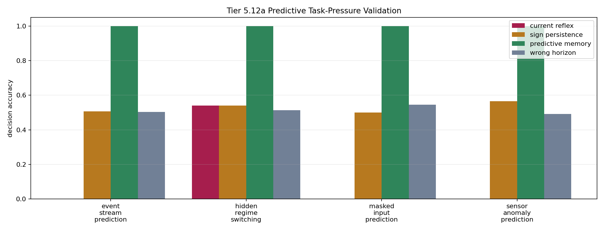

# Tier 5.12a Predictive Task-Pressure Validation Findings

- Generated: `2026-04-29T09:40:56+00:00`
- Status: **PASS**
- Steps: `720`
- Seeds: `42, 43, 44`
- Tasks: `hidden_regime_switching,masked_input_prediction,event_stream_prediction,sensor_anomaly_prediction`
- Selected standard baselines: `sign_persistence,online_perceptron,online_logistic_regression,echo_state_network,small_gru,stdp_only_snn`
- Smoke mode: `False`
- Output directory: `/Users/james/JKS:CRA/controlled_test_output/tier5_12a_20260429_054052`

Tier 5.12a validates predictive-pressure tasks before CRA predictive-coding/world-model mechanisms are tested.

## Claim Boundary

- This is task-validation evidence, not CRA predictive-coding evidence.
- `predictive_memory` is an oracle-like control showing the task is solvable with the missing predictive state.
- A pass authorizes Tier 5.12b predictive mechanism testing; it does not prove world modeling, language, planning, or hardware prediction.

## Predictive Pressure Comparisons

| Task | Current reflex acc | Sign persistence acc | Rolling majority acc | Predictive memory acc | Wrong horizon acc | Shuffled target acc | Best standard model | Best standard acc | Predictive edge vs best reflex | Predictive edge vs sham | Ambiguous current | Ambiguous last | Decisions |
| --- | ---: | ---: | ---: | ---: | ---: | ---: | --- | ---: | ---: | ---: | --- | --- | ---: |
| event_stream_prediction | 0 | 0.507042 | 0.474178 | 1 | 0.502347 | 0.530516 | `echo_state_network` | 0.525822 | 0.492958 | 0.469484 | True | True | 71 |
| hidden_regime_switching | 0.539326 | 0.539326 | 0.516854 | 1 | 0.513109 | 0.468165 | `online_perceptron` | 0.573034 | 0.460674 | 0.486891 | True | True | 89 |
| masked_input_prediction | 0 | 0.5 | 0.477778 | 1 | 0.544444 | 0.477778 | `stdp_only_snn` | 0.461111 | 0.5 | 0.455556 | True | True | 60 |
| sensor_anomaly_prediction | 0 | 0.564972 | 0.525424 | 1 | 0.491525 | 0.525424 | `online_logistic_regression` | 0.525424 | 0.435028 | 0.474576 | True | True | 59 |

## Aggregate Matrix

| Task | Model | Family | Tail acc | All acc | Corr | Runtime s |
| --- | --- | --- | ---: | ---: | ---: | ---: |
| event_stream_prediction | `current_reflex` | predictive_control | 0 | 0 | None | 0.00370878 |
| event_stream_prediction | `echo_state_network` | reservoir | 0.607843 | 0.525822 | 0.0931096 | 0.00849671 |
| event_stream_prediction | `online_logistic_regression` | linear | 0.529412 | 0.502347 | -0.0935331 | 0.00760621 |
| event_stream_prediction | `online_perceptron` | linear | 0.568627 | 0.478873 | -0.0525942 | 0.00518943 |
| event_stream_prediction | `predictive_memory` | predictive_control | 1 | 1 | 1 | 0.00378864 |
| event_stream_prediction | `rolling_majority` | predictive_control | 0.411765 | 0.474178 | -0.0546276 | 0.00462918 |
| event_stream_prediction | `shuffled_target_control` | predictive_control | 0.45098 | 0.530516 | 0.0579707 | 0.00356253 |
| event_stream_prediction | `sign_persistence` | rule | 0.509804 | 0.507042 | 0.0139815 | 0.00497383 |
| event_stream_prediction | `sign_persistence_control` | predictive_control | 0.509804 | 0.507042 | 0.0139815 | 0.00372469 |
| event_stream_prediction | `small_gru` | recurrent | 0.54902 | 0.511737 | -0.0300382 | 0.0180608 |
| event_stream_prediction | `stdp_only_snn` | snn_ablation | 0.411765 | 0.478873 | -0.109442 | 0.00907642 |
| event_stream_prediction | `wrong_horizon_control` | predictive_control | 0.509804 | 0.502347 | 0.00171135 | 0.00376588 |
| hidden_regime_switching | `current_reflex` | predictive_control | 0.571429 | 0.539326 | 0.0633409 | 0.00434539 |
| hidden_regime_switching | `echo_state_network` | reservoir | 0.507937 | 0.490637 | -0.0881097 | 0.0126507 |
| hidden_regime_switching | `online_logistic_regression` | linear | 0.460317 | 0.456929 | -0.186446 | 0.0059276 |
| hidden_regime_switching | `online_perceptron` | linear | 0.571429 | 0.573034 | 0.383852 | 0.00577754 |
| hidden_regime_switching | `predictive_memory` | predictive_control | 1 | 1 | 1 | 0.00376885 |
| hidden_regime_switching | `rolling_majority` | predictive_control | 0.507937 | 0.516854 | 0.0065117 | 0.00397976 |
| hidden_regime_switching | `shuffled_target_control` | predictive_control | 0.507937 | 0.468165 | -0.0895812 | 0.00407513 |
| hidden_regime_switching | `sign_persistence` | rule | 0.571429 | 0.539326 | 0.0633409 | 0.00694576 |
| hidden_regime_switching | `sign_persistence_control` | predictive_control | 0.571429 | 0.539326 | 0.0633409 | 0.00377203 |
| hidden_regime_switching | `small_gru` | recurrent | 0.47619 | 0.460674 | -0.168854 | 0.0227741 |
| hidden_regime_switching | `stdp_only_snn` | snn_ablation | 0.444444 | 0.475655 | 0.0548389 | 0.0130594 |
| hidden_regime_switching | `wrong_horizon_control` | predictive_control | 0.492063 | 0.513109 | 0.00264039 | 0.00458129 |
| masked_input_prediction | `current_reflex` | predictive_control | 0 | 0 | None | 0.00373551 |
| masked_input_prediction | `echo_state_network` | reservoir | 0.466667 | 0.527778 | 0.0298561 | 0.00878575 |
| masked_input_prediction | `online_logistic_regression` | linear | 0.4 | 0.455556 | -0.0953117 | 0.00589275 |
| masked_input_prediction | `online_perceptron` | linear | 0.466667 | 0.466667 | -0.00130035 | 0.00588807 |
| masked_input_prediction | `predictive_memory` | predictive_control | 1 | 1 | 1 | 0.00362704 |
| masked_input_prediction | `rolling_majority` | predictive_control | 0.377778 | 0.477778 | -0.0371457 | 0.00397631 |
| masked_input_prediction | `shuffled_target_control` | predictive_control | 0.377778 | 0.477778 | -0.0541158 | 0.00404272 |
| masked_input_prediction | `sign_persistence` | rule | 0.377778 | 0.5 | 0.00386136 | 0.00465237 |
| masked_input_prediction | `sign_persistence_control` | predictive_control | 0.377778 | 0.5 | 0.00386136 | 0.00377454 |
| masked_input_prediction | `small_gru` | recurrent | 0.488889 | 0.505556 | -0.104666 | 0.0198458 |
| masked_input_prediction | `stdp_only_snn` | snn_ablation | 0.6 | 0.461111 | 0.162436 | 0.00863158 |
| masked_input_prediction | `wrong_horizon_control` | predictive_control | 0.533333 | 0.544444 | 0.0809665 | 0.00341749 |
| sensor_anomaly_prediction | `current_reflex` | predictive_control | 0 | 0 | None | 0.00419951 |
| sensor_anomaly_prediction | `echo_state_network` | reservoir | 0.547619 | 0.463277 | -0.0598765 | 0.0108023 |
| sensor_anomaly_prediction | `online_logistic_regression` | linear | 0.571429 | 0.525424 | -0.0544302 | 0.00651014 |
| sensor_anomaly_prediction | `online_perceptron` | linear | 0.452381 | 0.525424 | 0.00222482 | 0.0046649 |
| sensor_anomaly_prediction | `predictive_memory` | predictive_control | 1 | 1 | 1 | 0.00346949 |
| sensor_anomaly_prediction | `rolling_majority` | predictive_control | 0.619048 | 0.525424 | 0.0350135 | 0.00473967 |
| sensor_anomaly_prediction | `shuffled_target_control` | predictive_control | 0.357143 | 0.525424 | 0.038532 | 0.00475425 |
| sensor_anomaly_prediction | `sign_persistence` | rule | 0.5 | 0.564972 | 0.130264 | 0.00467489 |
| sensor_anomaly_prediction | `sign_persistence_control` | predictive_control | 0.5 | 0.564972 | 0.130264 | 0.00471789 |
| sensor_anomaly_prediction | `small_gru` | recurrent | 0.547619 | 0.440678 | -0.164174 | 0.0171789 |
| sensor_anomaly_prediction | `stdp_only_snn` | snn_ablation | 0.357143 | 0.457627 | -0.0977103 | 0.0095405 |
| sensor_anomaly_prediction | `wrong_horizon_control` | predictive_control | 0.47619 | 0.491525 | -0.0299345 | 0.00348203 |

## Criteria

| Criterion | Value | Rule | Pass | Note |
| --- | --- | --- | --- | --- |
| full task/model/seed matrix completed | 144 | == 144 | yes |  |
| feedback timing has no leakage violations | 0 | == 0 | yes |  |
| current and last-sign shortcuts are ambiguous | True | == True | yes |  |
| current reflex does not solve predictive tasks | 0.539326 | <= 0.7 | yes | A predictive task cannot be solvable from the current sensory value alone. |
| sign persistence does not solve predictive tasks | 0.564972 | <= 0.75 | yes | A predictive task cannot collapse to last nonzero sign memory. |
| causal predictive memory solves tasks | 1 | >= 0.95 | yes | Proves the streams are solvable when the necessary predictive state is available. |
| predictive memory beats current reflex | 0.460674 | >= 0.2 | yes |  |
| predictive memory beats sign persistence | 0.435028 | >= 0.2 | yes |  |
| predictive memory beats best reflex shortcut | 0.435028 | >= 0.2 | yes |  |
| wrong/shuffled target controls fail | 0.544444 | <= 0.75 | yes | Prediction must depend on the correct binding/horizon rather than target leakage or generic rehearsal. |
| predictive memory beats best wrong/shuffled sham | 0.455556 | >= 0.2 | yes |  |

## Artifacts

- `tier5_12a_results.json`: machine-readable manifest.
- `tier5_12a_report.md`: human findings and claim boundary.
- `tier5_12a_summary.csv`: aggregate task/model metrics.
- `tier5_12a_comparisons.csv`: predictive-pressure comparison table.
- `tier5_12a_fairness_contract.json`: predeclared comparison/leakage rules.
- `tier5_12a_task_pressure.png`: predictive-pressure plot.
- `*_timeseries.csv`: per-task/per-model/per-seed traces.

