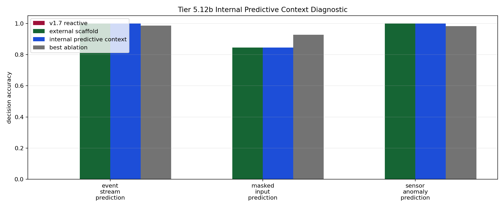

# Tier 5.12b Internal Predictive Context Mechanism Findings

- Generated: `2026-04-29T10:20:06+00:00`
- Status: **FAIL**
- Steps: `720`
- Seeds: `42, 43, 44`
- Tasks: `masked_input_prediction,event_stream_prediction,sensor_anomaly_prediction`
- Variants: `all`
- Selected standard baselines: `sign_persistence,online_perceptron,online_logistic_regression,echo_state_network,small_gru,stdp_only_snn`
- Backend: `nest`
- Smoke mode: `False`
- Output directory: `<repo>/controlled_test_output/tier5_12b_20260429_055923`

Tier 5.12b tests whether CRA can store a visible causal predictive precursor before feedback arrives and use it later at a decision point.

## Claim Boundary

- This is software mechanism evidence, not hardware evidence.
- This is visible predictive-context binding, not full world modeling or hidden-state inference.
- This does not prove language grounding, planning, or AGI capability.
- A pass authorizes compact regression/promotion review; it does not automatically freeze v1.8.
- `hidden_regime_switching` is intentionally excluded from the default mechanism run because that needs latent-regime inference, not visible precursor storage.

## Comparisons

| Task | v1.7 acc | Scaffold acc | Internal predictive acc | Best ablation | Ablation acc | Best control | Control acc | Best baseline | Baseline acc | Edge vs v1.7 | Edge vs ablation | Edge vs baseline | Updates | Active steps |
| --- | ---: | ---: | ---: | --- | ---: | --- | ---: | --- | ---: | ---: | ---: | ---: | ---: | ---: |
| event_stream_prediction | 0 | 1 | 1 | `wrong_predictive_context` | 0.985915 | `shuffled_target_control` | 0.530516 | `echo_state_network` | 0.525822 | 1 | 0.0140845 | 0.474178 | 213 | 213 |
| masked_input_prediction | 0 | 0.844444 | 0.844444 | `wrong_predictive_context` | 0.927778 | `wrong_horizon_control` | 0.544444 | `echo_state_network` | 0.527778 | 0.844444 | -0.0833333 | 0.316667 | 180 | 180 |
| sensor_anomaly_prediction | 0 | 1 | 1 | `wrong_predictive_context` | 0.983051 | `sign_persistence_control` | 0.564972 | `sign_persistence` | 0.564972 | 1 | 0.0169492 | 0.435028 | 177 | 177 |

## Aggregate Matrix

| Task | Model | Family | Group | Tail acc | All acc | Corr | Runtime s |
| --- | --- | --- | --- | ---: | ---: | ---: | ---: |
| event_stream_prediction | `current_reflex` | predictive_control | None | 0 | 0 | None | 0.00346597 |
| event_stream_prediction | `echo_state_network` | reservoir | None | 0.607843 | 0.525822 | 0.0931096 | 0.00966306 |
| event_stream_prediction | `external_predictive_scaffold` | CRA | external_scaffold | 1 | 1 | 1 | 22.8698 |
| event_stream_prediction | `internal_predictive_context` | CRA | candidate | 1 | 1 | 1 | 24.0211 |
| event_stream_prediction | `no_write_predictive_context` | CRA | predictive_ablation | 0 | 0 | None | 20.9368 |
| event_stream_prediction | `online_logistic_regression` | linear | None | 0.529412 | 0.502347 | -0.0935331 | 0.00505662 |
| event_stream_prediction | `online_perceptron` | linear | None | 0.568627 | 0.478873 | -0.0525942 | 0.00475353 |
| event_stream_prediction | `predictive_memory` | predictive_control | None | 1 | 1 | 1 | 0.00317236 |
| event_stream_prediction | `rolling_majority` | predictive_control | None | 0.411765 | 0.474178 | -0.0546276 | 0.00366763 |
| event_stream_prediction | `shuffled_predictive_context` | CRA | predictive_ablation | 0.529412 | 0.511737 | 0.0243562 | 24.3179 |
| event_stream_prediction | `shuffled_target_control` | predictive_control | None | 0.45098 | 0.530516 | 0.0579707 | 0.00320028 |
| event_stream_prediction | `sign_persistence` | rule | None | 0.509804 | 0.507042 | 0.0139815 | 0.00421372 |
| event_stream_prediction | `sign_persistence_control` | predictive_control | None | 0.509804 | 0.507042 | 0.0139815 | 0.00348722 |
| event_stream_prediction | `small_gru` | recurrent | None | 0.54902 | 0.511737 | -0.0300382 | 0.0159595 |
| event_stream_prediction | `stdp_only_snn` | snn_ablation | None | 0.411765 | 0.478873 | -0.109442 | 0.00799036 |
| event_stream_prediction | `v1_7_reactive` | CRA | frozen_baseline | 0 | 0 | None | 22.1515 |
| event_stream_prediction | `wrong_horizon_control` | predictive_control | None | 0.509804 | 0.502347 | 0.00171135 | 0.00327872 |
| event_stream_prediction | `wrong_predictive_context` | CRA | predictive_ablation | 1 | 0.985915 | 0.97212 | 24.4727 |
| masked_input_prediction | `current_reflex` | predictive_control | None | 0 | 0 | None | 0.00294217 |
| masked_input_prediction | `echo_state_network` | reservoir | None | 0.466667 | 0.527778 | 0.0298561 | 0.00901774 |
| masked_input_prediction | `external_predictive_scaffold` | CRA | external_scaffold | 0.888889 | 0.844444 | 0.68926 | 22.3956 |
| masked_input_prediction | `internal_predictive_context` | CRA | candidate | 0.888889 | 0.844444 | 0.68926 | 22.3619 |
| masked_input_prediction | `no_write_predictive_context` | CRA | predictive_ablation | 0 | 0 | None | 22.223 |
| masked_input_prediction | `online_logistic_regression` | linear | None | 0.4 | 0.455556 | -0.0953117 | 0.00499089 |
| masked_input_prediction | `online_perceptron` | linear | None | 0.466667 | 0.466667 | -0.00130035 | 0.0240466 |
| masked_input_prediction | `predictive_memory` | predictive_control | None | 1 | 1 | 1 | 0.00337715 |
| masked_input_prediction | `rolling_majority` | predictive_control | None | 0.377778 | 0.477778 | -0.0371457 | 0.00379869 |
| masked_input_prediction | `shuffled_predictive_context` | CRA | predictive_ablation | 0.466667 | 0.511111 | 0.0143599 | 27.5189 |
| masked_input_prediction | `shuffled_target_control` | predictive_control | None | 0.377778 | 0.477778 | -0.0541158 | 0.00330858 |
| masked_input_prediction | `sign_persistence` | rule | None | 0.377778 | 0.5 | 0.00386136 | 0.00407428 |
| masked_input_prediction | `sign_persistence_control` | predictive_control | None | 0.377778 | 0.5 | 0.00386136 | 0.00350681 |
| masked_input_prediction | `small_gru` | recurrent | None | 0.488889 | 0.505556 | -0.104666 | 0.0160425 |
| masked_input_prediction | `stdp_only_snn` | snn_ablation | None | 0.6 | 0.461111 | 0.162436 | 0.00724215 |
| masked_input_prediction | `v1_7_reactive` | CRA | frozen_baseline | 0 | 0 | None | 21.252 |
| masked_input_prediction | `wrong_horizon_control` | predictive_control | None | 0.533333 | 0.544444 | 0.0809665 | 0.0032771 |
| masked_input_prediction | `wrong_predictive_context` | CRA | predictive_ablation | 0.888889 | 0.927778 | 0.856075 | 24.7254 |
| sensor_anomaly_prediction | `current_reflex` | predictive_control | None | 0 | 0 | None | 0.00577433 |
| sensor_anomaly_prediction | `echo_state_network` | reservoir | None | 0.547619 | 0.463277 | -0.0598765 | 0.0091205 |
| sensor_anomaly_prediction | `external_predictive_scaffold` | CRA | external_scaffold | 1 | 1 | 1 | 22.564 |
| sensor_anomaly_prediction | `internal_predictive_context` | CRA | candidate | 1 | 1 | 1 | 22.1091 |
| sensor_anomaly_prediction | `no_write_predictive_context` | CRA | predictive_ablation | 0 | 0 | None | 22.4266 |
| sensor_anomaly_prediction | `online_logistic_regression` | linear | None | 0.571429 | 0.525424 | -0.0544302 | 0.00510969 |
| sensor_anomaly_prediction | `online_perceptron` | linear | None | 0.452381 | 0.525424 | 0.00222482 | 0.0248194 |
| sensor_anomaly_prediction | `predictive_memory` | predictive_control | None | 1 | 1 | 1 | 0.00345693 |
| sensor_anomaly_prediction | `rolling_majority` | predictive_control | None | 0.619048 | 0.525424 | 0.0350135 | 0.00399201 |
| sensor_anomaly_prediction | `shuffled_predictive_context` | CRA | predictive_ablation | 0.47619 | 0.468927 | -0.067391 | 22.3856 |
| sensor_anomaly_prediction | `shuffled_target_control` | predictive_control | None | 0.357143 | 0.525424 | 0.038532 | 0.00392596 |
| sensor_anomaly_prediction | `sign_persistence` | rule | None | 0.5 | 0.564972 | 0.130264 | 0.00672156 |
| sensor_anomaly_prediction | `sign_persistence_control` | predictive_control | None | 0.5 | 0.564972 | 0.130264 | 0.00348207 |
| sensor_anomaly_prediction | `small_gru` | recurrent | None | 0.547619 | 0.440678 | -0.164174 | 0.017095 |
| sensor_anomaly_prediction | `stdp_only_snn` | snn_ablation | None | 0.357143 | 0.457627 | -0.0977103 | 0.00779669 |
| sensor_anomaly_prediction | `v1_7_reactive` | CRA | frozen_baseline | 0 | 0 | None | 21.4492 |
| sensor_anomaly_prediction | `wrong_horizon_control` | predictive_control | None | 0.47619 | 0.491525 | -0.0299345 | 0.00342119 |
| sensor_anomaly_prediction | `wrong_predictive_context` | CRA | predictive_ablation | 1 | 0.983051 | 0.966293 | 22.0098 |

## Criteria

| Criterion | Value | Rule | Pass | Note |
| --- | --- | --- | --- | --- |
| full variant/baseline/control/task/seed matrix completed | 162 | == 162 | yes |  |
| feedback timing has no leakage violations | 0 | == 0 | yes |  |
| task remains shortcut-ambiguous | True | == True | yes |  |
| candidate predictive context feature is active | 570 | > 0 | yes |  |
| candidate receives predictive-context writes | 570 | > 0 | yes |  |
| metadata exposes precursor writes before decisions | 570 | > 0 | yes |  |
| candidate reaches minimum predictive-task accuracy | 0.844444 | >= 0.9 | no |  |
| candidate reaches minimum tail accuracy | 0.888889 | >= 0.9 | no |  |
| candidate improves over v1.7 reactive CRA | 0.844444 | >= 0.2 | yes |  |
| internal candidate approaches external predictive scaffold | 0 | >= -0.1 | yes | Internal predictive context can trail the external scaffold slightly but cannot collapse relative to it. |
| predictive ablations are worse than candidate | -0.0833333 | >= 0.2 | no |  |
| candidate beats best shortcut control | 0.3 | >= 0.2 | yes |  |
| candidate beats best selected external baseline | 0.316667 | >= 0.2 | yes |  |

Failure: Failed criteria: candidate reaches minimum predictive-task accuracy, candidate reaches minimum tail accuracy, predictive ablations are worse than candidate

## Artifacts

- `tier5_12b_results.json`: machine-readable manifest.
- `tier5_12b_report.md`: human findings and claim boundary.
- `tier5_12b_summary.csv`: aggregate task/model metrics.
- `tier5_12b_comparisons.csv`: predictive-context comparison table.
- `tier5_12b_fairness_contract.json`: predeclared comparison/leakage rules.
- `tier5_12b_predictive_context.png`: comparison plot.
- `*_timeseries.csv`: per-task/per-model/per-seed traces.

