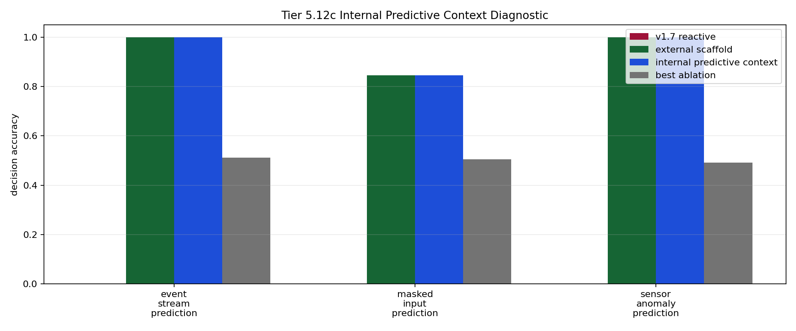

# Tier 5.12c Internal Predictive Context Mechanism Findings

- Generated: `2026-04-29T10:49:27+00:00`
- Status: **PASS**
- Steps: `720`
- Seeds: `42, 43, 44`
- Tasks: `masked_input_prediction,event_stream_prediction,sensor_anomaly_prediction`
- Variants: `all`
- Selected standard baselines: `sign_persistence,online_perceptron,online_logistic_regression,echo_state_network,small_gru,stdp_only_snn`
- Backend: `nest`
- Smoke mode: `False`
- Output directory: `/Users/james/JKS:CRA/controlled_test_output/tier5_12c_20260429_062256`

Tier 5.12c tests whether CRA can store a visible causal predictive precursor before feedback arrives and use it later at a decision point.

## Claim Boundary

- This is software mechanism evidence, not hardware evidence.
- This is visible predictive-context binding, not full world modeling or hidden-state inference.
- This does not prove language grounding, planning, or AGI capability.
- A pass authorizes compact regression/promotion review; it does not automatically freeze v1.8.
- `hidden_regime_switching` is intentionally excluded from the default mechanism run because that needs latent-regime inference, not visible precursor storage.

## Comparisons

| Task | v1.7 acc | Scaffold acc | Internal predictive acc | Best ablation | Ablation acc | Best control | Control acc | Best baseline | Baseline acc | Edge vs v1.7 | Edge vs ablation | Edge vs baseline | Updates | Active steps |
| --- | ---: | ---: | ---: | --- | ---: | --- | ---: | --- | ---: | ---: | ---: | ---: | ---: | ---: |
| event_stream_prediction | 0 | 1 | 1 | `shuffled_predictive_context` | 0.511737 | `shuffled_target_control` | 0.530516 | `echo_state_network` | 0.525822 | 1 | 0.488263 | 0.474178 | 213 | 213 |
| masked_input_prediction | 0 | 0.844444 | 0.844444 | `permuted_predictive_context` | 0.505556 | `wrong_horizon_control` | 0.544444 | `echo_state_network` | 0.527778 | 0.844444 | 0.338889 | 0.316667 | 180 | 180 |
| sensor_anomaly_prediction | 0 | 1 | 1 | `permuted_predictive_context` | 0.491525 | `sign_persistence_control` | 0.564972 | `sign_persistence` | 0.564972 | 1 | 0.508475 | 0.435028 | 177 | 177 |

## Aggregate Matrix

| Task | Model | Family | Group | Tail acc | All acc | Corr | Runtime s |
| --- | --- | --- | --- | ---: | ---: | ---: | ---: |
| event_stream_prediction | `current_reflex` | predictive_control | None | 0 | 0 | None | 0.00365169 |
| event_stream_prediction | `echo_state_network` | reservoir | None | 0.607843 | 0.525822 | 0.0931096 | 0.0117898 |
| event_stream_prediction | `external_predictive_scaffold` | CRA | external_scaffold | 1 | 1 | 1 | 22.6556 |
| event_stream_prediction | `internal_predictive_context` | CRA | candidate | 1 | 1 | 1 | 22.9954 |
| event_stream_prediction | `no_write_predictive_context` | CRA | predictive_ablation | 0 | 0 | None | 29.2111 |
| event_stream_prediction | `online_logistic_regression` | linear | None | 0.529412 | 0.502347 | -0.0935331 | 0.00873943 |
| event_stream_prediction | `online_perceptron` | linear | None | 0.568627 | 0.478873 | -0.0525942 | 0.00583492 |
| event_stream_prediction | `permuted_predictive_context` | CRA | predictive_ablation | 0.54902 | 0.474178 | -0.0509712 | 27.8416 |
| event_stream_prediction | `predictive_memory` | predictive_control | None | 1 | 1 | 1 | 0.00537537 |
| event_stream_prediction | `rolling_majority` | predictive_control | None | 0.411765 | 0.474178 | -0.0546276 | 0.00562336 |
| event_stream_prediction | `shuffled_predictive_context` | CRA | predictive_ablation | 0.529412 | 0.511737 | 0.0243562 | 23.4697 |
| event_stream_prediction | `shuffled_target_control` | predictive_control | None | 0.45098 | 0.530516 | 0.0579707 | 0.00358553 |
| event_stream_prediction | `sign_persistence` | rule | None | 0.509804 | 0.507042 | 0.0139815 | 0.0101847 |
| event_stream_prediction | `sign_persistence_control` | predictive_control | None | 0.509804 | 0.507042 | 0.0139815 | 0.00521928 |
| event_stream_prediction | `small_gru` | recurrent | None | 0.54902 | 0.511737 | -0.0300382 | 0.0222145 |
| event_stream_prediction | `stdp_only_snn` | snn_ablation | None | 0.411765 | 0.478873 | -0.109442 | 0.0109591 |
| event_stream_prediction | `v1_7_reactive` | CRA | frozen_baseline | 0 | 0 | None | 21.8019 |
| event_stream_prediction | `wrong_horizon_control` | predictive_control | None | 0.509804 | 0.502347 | 0.00171135 | 0.00408936 |
| event_stream_prediction | `wrong_predictive_context` | CRA | alternate_code_control | 1 | 0.985915 | 0.97212 | 23.9533 |
| masked_input_prediction | `current_reflex` | predictive_control | None | 0 | 0 | None | 0.00343776 |
| masked_input_prediction | `echo_state_network` | reservoir | None | 0.466667 | 0.527778 | 0.0298561 | 0.00874424 |
| masked_input_prediction | `external_predictive_scaffold` | CRA | external_scaffold | 0.888889 | 0.844444 | 0.68926 | 22.9155 |
| masked_input_prediction | `internal_predictive_context` | CRA | candidate | 0.888889 | 0.844444 | 0.68926 | 34.7483 |
| masked_input_prediction | `no_write_predictive_context` | CRA | predictive_ablation | 0 | 0 | None | 22.077 |
| masked_input_prediction | `online_logistic_regression` | linear | None | 0.4 | 0.455556 | -0.0953117 | 0.00521243 |
| masked_input_prediction | `online_perceptron` | linear | None | 0.466667 | 0.466667 | -0.00130035 | 0.00527028 |
| masked_input_prediction | `permuted_predictive_context` | CRA | predictive_ablation | 0.555556 | 0.505556 | 0.0113899 | 24.0785 |
| masked_input_prediction | `predictive_memory` | predictive_control | None | 1 | 1 | 1 | 0.00403763 |
| masked_input_prediction | `rolling_majority` | predictive_control | None | 0.377778 | 0.477778 | -0.0371457 | 0.0041086 |
| masked_input_prediction | `shuffled_predictive_context` | CRA | predictive_ablation | 0.466667 | 0.511111 | 0.0143599 | 24.2198 |
| masked_input_prediction | `shuffled_target_control` | predictive_control | None | 0.377778 | 0.477778 | -0.0541158 | 0.00342592 |
| masked_input_prediction | `sign_persistence` | rule | None | 0.377778 | 0.5 | 0.00386136 | 0.00455692 |
| masked_input_prediction | `sign_persistence_control` | predictive_control | None | 0.377778 | 0.5 | 0.00386136 | 0.00368394 |
| masked_input_prediction | `small_gru` | recurrent | None | 0.488889 | 0.505556 | -0.104666 | 0.0158509 |
| masked_input_prediction | `stdp_only_snn` | snn_ablation | None | 0.6 | 0.461111 | 0.162436 | 0.00747308 |
| masked_input_prediction | `v1_7_reactive` | CRA | frozen_baseline | 0 | 0 | None | 22.3659 |
| masked_input_prediction | `wrong_horizon_control` | predictive_control | None | 0.533333 | 0.544444 | 0.0809665 | 0.00357925 |
| masked_input_prediction | `wrong_predictive_context` | CRA | alternate_code_control | 0.888889 | 0.927778 | 0.856075 | 30.2248 |
| sensor_anomaly_prediction | `current_reflex` | predictive_control | None | 0 | 0 | None | 0.00334319 |
| sensor_anomaly_prediction | `echo_state_network` | reservoir | None | 0.547619 | 0.463277 | -0.0598765 | 0.00960608 |
| sensor_anomaly_prediction | `external_predictive_scaffold` | CRA | external_scaffold | 1 | 1 | 1 | 25.1553 |
| sensor_anomaly_prediction | `internal_predictive_context` | CRA | candidate | 1 | 1 | 1 | 26.8564 |
| sensor_anomaly_prediction | `no_write_predictive_context` | CRA | predictive_ablation | 0 | 0 | None | 21.8532 |
| sensor_anomaly_prediction | `online_logistic_regression` | linear | None | 0.571429 | 0.525424 | -0.0544302 | 0.00494394 |
| sensor_anomaly_prediction | `online_perceptron` | linear | None | 0.452381 | 0.525424 | 0.00222482 | 0.00469172 |
| sensor_anomaly_prediction | `permuted_predictive_context` | CRA | predictive_ablation | 0.52381 | 0.491525 | -0.0207231 | 24.0607 |
| sensor_anomaly_prediction | `predictive_memory` | predictive_control | None | 1 | 1 | 1 | 0.00358993 |
| sensor_anomaly_prediction | `rolling_majority` | predictive_control | None | 0.619048 | 0.525424 | 0.0350135 | 0.00442206 |
| sensor_anomaly_prediction | `shuffled_predictive_context` | CRA | predictive_ablation | 0.47619 | 0.468927 | -0.067391 | 28.1679 |
| sensor_anomaly_prediction | `shuffled_target_control` | predictive_control | None | 0.357143 | 0.525424 | 0.038532 | 0.0033959 |
| sensor_anomaly_prediction | `sign_persistence` | rule | None | 0.5 | 0.564972 | 0.130264 | 0.00448369 |
| sensor_anomaly_prediction | `sign_persistence_control` | predictive_control | None | 0.5 | 0.564972 | 0.130264 | 0.00424103 |
| sensor_anomaly_prediction | `small_gru` | recurrent | None | 0.547619 | 0.440678 | -0.164174 | 0.0163177 |
| sensor_anomaly_prediction | `stdp_only_snn` | snn_ablation | None | 0.357143 | 0.457627 | -0.0977103 | 0.00723915 |
| sensor_anomaly_prediction | `v1_7_reactive` | CRA | frozen_baseline | 0 | 0 | None | 25.2645 |
| sensor_anomaly_prediction | `wrong_horizon_control` | predictive_control | None | 0.47619 | 0.491525 | -0.0299345 | 0.00370408 |
| sensor_anomaly_prediction | `wrong_predictive_context` | CRA | alternate_code_control | 1 | 0.983051 | 0.966293 | 23.6311 |

## Criteria

| Criterion | Value | Rule | Pass | Note |
| --- | --- | --- | --- | --- |
| full variant/baseline/control/task/seed matrix completed | 171 | == 171 | yes |  |
| feedback timing has no leakage violations | 0 | == 0 | yes |  |
| task remains shortcut-ambiguous | True | == True | yes |  |
| candidate predictive context feature is active | 570 | > 0 | yes |  |
| candidate receives predictive-context writes | 570 | > 0 | yes |  |
| metadata exposes precursor writes before decisions | 570 | > 0 | yes |  |
| candidate reaches minimum predictive-task accuracy | 0.844444 | >= 0.8 | yes |  |
| candidate reaches minimum tail accuracy | 0.888889 | >= 0.85 | yes |  |
| candidate improves over v1.7 reactive CRA | 0.844444 | >= 0.2 | yes |  |
| internal candidate approaches external predictive scaffold | 0 | >= -0.1 | yes | Internal predictive context can trail the external scaffold slightly but cannot collapse relative to it. |
| information-destroying predictive shams are worse than candidate | 0.338889 | >= 0.2 | yes | Stable wrong-sign coding is reported separately because it can remain learnably informative; the gate uses shuffled/permuted/no-write shams. |
| candidate beats best shortcut control | 0.3 | >= 0.2 | yes |  |
| candidate beats best selected external baseline | 0.316667 | >= 0.2 | yes |  |

## Artifacts

- `tier5_12c_results.json`: machine-readable manifest.
- `tier5_12c_report.md`: human findings and claim boundary.
- `tier5_12c_summary.csv`: aggregate task/model metrics.
- `tier5_12c_comparisons.csv`: predictive-context comparison table.
- `tier5_12c_fairness_contract.json`: predeclared comparison/leakage rules.
- `tier5_12c_predictive_context.png`: comparison plot.
- `*_timeseries.csv`: per-task/per-model/per-seed traces.

