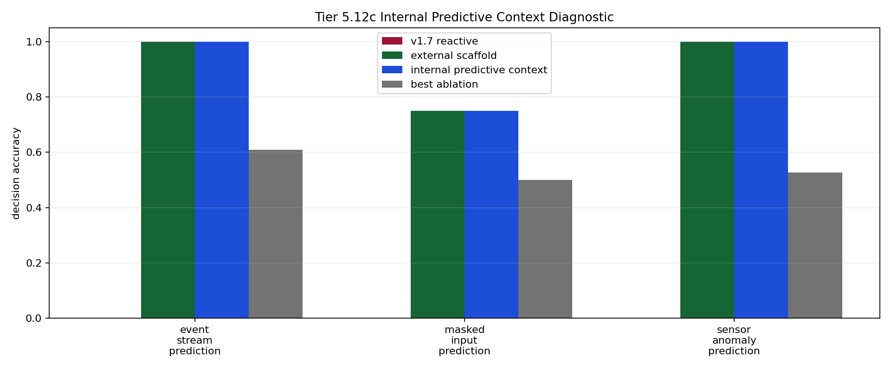

# Tier 5.12c Internal Predictive Context Mechanism Findings

- Generated: `2026-04-29T11:11:35+00:00`
- Status: **PASS**
- Steps: `240`
- Seeds: `42`
- Tasks: `masked_input_prediction,event_stream_prediction,sensor_anomaly_prediction`
- Variants: `all`
- Selected standard baselines: `sign_persistence,online_perceptron`
- Backend: `nest`
- Smoke mode: `False`
- Output directory: `/Users/james/JKS:CRA/controlled_test_output/tier5_12d_20260429_070615/predictive_context_guardrail`

Tier 5.12c tests whether CRA can store a visible causal predictive precursor before feedback arrives and use it later at a decision point.

## Claim Boundary

- This is software mechanism evidence, not hardware evidence.
- This is visible predictive-context binding, not full world modeling or hidden-state inference.
- This does not prove language grounding, planning, or AGI capability.
- A pass authorizes compact regression/promotion review; it does not automatically freeze v1.8.
- `hidden_regime_switching` is intentionally excluded from the default mechanism run because that needs latent-regime inference, not visible precursor storage.

## Comparisons

| Task | v1.7 acc | Scaffold acc | Internal predictive acc | Best ablation | Ablation acc | Best control | Control acc | Best baseline | Baseline acc | Edge vs v1.7 | Edge vs ablation | Edge vs baseline | Updates | Active steps |
| --- | ---: | ---: | ---: | --- | ---: | --- | ---: | --- | ---: | ---: | ---: | ---: | ---: | ---: |
| event_stream_prediction | 0 | 1 | 1 | `permuted_predictive_context` | 0.608696 | `shuffled_target_control` | 0.652174 | `online_perceptron` | 0.391304 | 1 | 0.391304 | 0.608696 | 23 | 23 |
| masked_input_prediction | 0 | 0.75 | 0.75 | `permuted_predictive_context` | 0.5 | `rolling_majority` | 0.6 | `sign_persistence` | 0.5 | 0.75 | 0.25 | 0.25 | 20 | 20 |
| sensor_anomaly_prediction | 0 | 1 | 1 | `shuffled_predictive_context` | 0.526316 | `sign_persistence_control` | 0.631579 | `sign_persistence` | 0.631579 | 1 | 0.473684 | 0.368421 | 19 | 19 |

## Aggregate Matrix

| Task | Model | Family | Group | Tail acc | All acc | Corr | Runtime s |
| --- | --- | --- | --- | ---: | ---: | ---: | ---: |
| event_stream_prediction | `current_reflex` | predictive_control | None | 0 | 0 | None | 0.00107263 |
| event_stream_prediction | `external_predictive_scaffold` | CRA | external_scaffold | 1 | 1 | 1 | 6.52428 |
| event_stream_prediction | `internal_predictive_context` | CRA | candidate | 1 | 1 | 1 | 6.40018 |
| event_stream_prediction | `no_write_predictive_context` | CRA | predictive_ablation | 0 | 0 | None | 6.36287 |
| event_stream_prediction | `online_perceptron` | linear | None | 0.2 | 0.391304 | -0.163133 | 0.00173292 |
| event_stream_prediction | `permuted_predictive_context` | CRA | predictive_ablation | 0.4 | 0.608696 | 0.195005 | 6.57663 |
| event_stream_prediction | `predictive_memory` | predictive_control | None | 1 | 1 | 1 | 0.00111325 |
| event_stream_prediction | `rolling_majority` | predictive_control | None | 0.2 | 0.26087 | -0.452381 | 0.00137046 |
| event_stream_prediction | `shuffled_predictive_context` | CRA | predictive_ablation | 0.4 | 0.391304 | -0.2599 | 6.47622 |
| event_stream_prediction | `shuffled_target_control` | predictive_control | None | 0.8 | 0.652174 | 0.269841 | 0.00114 |
| event_stream_prediction | `sign_persistence` | rule | None | 0.4 | 0.391304 | -0.195336 | 0.00148825 |
| event_stream_prediction | `sign_persistence_control` | predictive_control | None | 0.4 | 0.391304 | -0.195336 | 0.00111146 |
| event_stream_prediction | `v1_7_reactive` | CRA | frozen_baseline | 0 | 0 | None | 6.25545 |
| event_stream_prediction | `wrong_horizon_control` | predictive_control | None | 0.4 | 0.391304 | -0.277778 | 0.00108546 |
| event_stream_prediction | `wrong_predictive_context` | CRA | alternate_code_control | 1 | 0.956522 | 0.914174 | 6.4448 |
| masked_input_prediction | `current_reflex` | predictive_control | None | 0 | 0 | None | 0.000996291 |
| masked_input_prediction | `external_predictive_scaffold` | CRA | external_scaffold | 0.8 | 0.75 | 0.486919 | 6.34747 |
| masked_input_prediction | `internal_predictive_context` | CRA | candidate | 0.8 | 0.75 | 0.486919 | 6.44339 |
| masked_input_prediction | `no_write_predictive_context` | CRA | predictive_ablation | 0 | 0 | None | 6.35414 |
| masked_input_prediction | `online_perceptron` | linear | None | 0.6 | 0.4 | -0.00983157 | 0.00165008 |
| masked_input_prediction | `permuted_predictive_context` | CRA | predictive_ablation | 0 | 0.5 | -0.01082 | 6.60013 |
| masked_input_prediction | `predictive_memory` | predictive_control | None | 1 | 1 | 1 | 0.00117521 |
| masked_input_prediction | `rolling_majority` | predictive_control | None | 0.6 | 0.6 | 0.24232 | 0.0013285 |
| masked_input_prediction | `shuffled_predictive_context` | CRA | predictive_ablation | 0.2 | 0.35 | -0.288854 | 6.43363 |
| masked_input_prediction | `shuffled_target_control` | predictive_control | None | 0.6 | 0.6 | 0.191919 | 0.00108875 |
| masked_input_prediction | `sign_persistence` | rule | None | 1 | 0.5 | 0.031607 | 0.00164021 |
| masked_input_prediction | `sign_persistence_control` | predictive_control | None | 1 | 0.5 | 0.031607 | 0.00138221 |
| masked_input_prediction | `v1_7_reactive` | CRA | frozen_baseline | 0 | 0 | None | 6.41619 |
| masked_input_prediction | `wrong_horizon_control` | predictive_control | None | 0.2 | 0.3 | -0.414141 | 0.00124562 |
| masked_input_prediction | `wrong_predictive_context` | CRA | alternate_code_control | 1 | 0.95 | 0.904534 | 6.39776 |
| sensor_anomaly_prediction | `current_reflex` | predictive_control | None | 0 | 0 | None | 0.00110546 |
| sensor_anomaly_prediction | `external_predictive_scaffold` | CRA | external_scaffold | 1 | 1 | 1 | 7.74126 |
| sensor_anomaly_prediction | `internal_predictive_context` | CRA | candidate | 1 | 1 | 1 | 6.83179 |
| sensor_anomaly_prediction | `no_write_predictive_context` | CRA | predictive_ablation | 0 | 0 | None | 8.44903 |
| sensor_anomaly_prediction | `online_perceptron` | linear | None | 0.75 | 0.526316 | 0.0511881 | 0.00164571 |
| sensor_anomaly_prediction | `permuted_predictive_context` | CRA | predictive_ablation | 0 | 0.421053 | -0.147138 | 7.74267 |
| sensor_anomaly_prediction | `predictive_memory` | predictive_control | None | 1 | 1 | 1 | 0.00125329 |
| sensor_anomaly_prediction | `rolling_majority` | predictive_control | None | 0.25 | 0.421053 | -0.16855 | 0.00149067 |
| sensor_anomaly_prediction | `shuffled_predictive_context` | CRA | predictive_ablation | 0.25 | 0.526316 | 0.0449677 | 7.79218 |
| sensor_anomaly_prediction | `shuffled_target_control` | predictive_control | None | 0.25 | 0.473684 | -0.0555556 | 0.00120775 |
| sensor_anomaly_prediction | `sign_persistence` | rule | None | 0.5 | 0.631579 | 0.287527 | 0.00154212 |
| sensor_anomaly_prediction | `sign_persistence_control` | predictive_control | None | 0.5 | 0.631579 | 0.287527 | 0.00169733 |
| sensor_anomaly_prediction | `v1_7_reactive` | CRA | frozen_baseline | 0 | 0 | None | 6.34323 |
| sensor_anomaly_prediction | `wrong_horizon_control` | predictive_control | None | 0.25 | 0.473684 | -0.0555556 | 0.00119117 |
| sensor_anomaly_prediction | `wrong_predictive_context` | CRA | alternate_code_control | 1 | 0.947368 | 0.9 | 7.7449 |

## Criteria

| Criterion | Value | Rule | Pass | Note |
| --- | --- | --- | --- | --- |
| full variant/baseline/control/task/seed matrix completed | 45 | == 45 | yes |  |
| feedback timing has no leakage violations | 0 | == 0 | yes |  |
| task remains shortcut-ambiguous | True | == True | yes |  |
| candidate predictive context feature is active | 62 | > 0 | yes |  |
| candidate receives predictive-context writes | 62 | > 0 | yes |  |
| metadata exposes precursor writes before decisions | 62 | > 0 | yes |  |
| candidate reaches minimum predictive-task accuracy | 0.75 | >= 0.7 | yes |  |
| candidate reaches minimum tail accuracy | 0.8 | >= 0.75 | yes |  |
| candidate improves over v1.7 reactive CRA | 0.75 | >= 0.15 | yes |  |
| internal candidate approaches external predictive scaffold | 0 | >= -0.1 | yes | Internal predictive context can trail the external scaffold slightly but cannot collapse relative to it. |
| information-destroying predictive shams are worse than candidate | 0.25 | >= 0.15 | yes | Stable wrong-sign coding is reported separately because it can remain learnably informative; the gate uses shuffled/permuted/no-write shams. |
| candidate beats best shortcut control | 0.15 | >= 0.15 | yes |  |
| candidate beats best selected external baseline | 0.25 | >= 0.1 | yes |  |

## Artifacts

- `tier5_12c_results.json`: machine-readable manifest.
- `tier5_12c_report.md`: human findings and claim boundary.
- `tier5_12c_summary.csv`: aggregate task/model metrics.
- `tier5_12c_comparisons.csv`: predictive-context comparison table.
- `tier5_12c_fairness_contract.json`: predeclared comparison/leakage rules.
- `tier5_12c_predictive_context.png`: comparison plot.
- `*_timeseries.csv`: per-task/per-model/per-seed traces.

