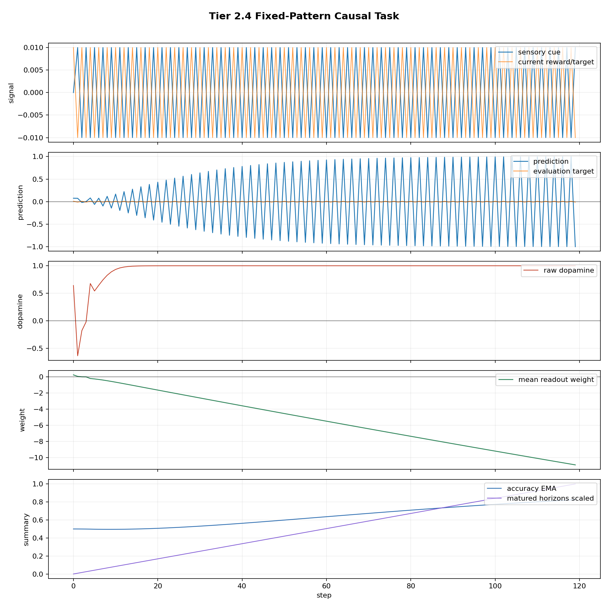
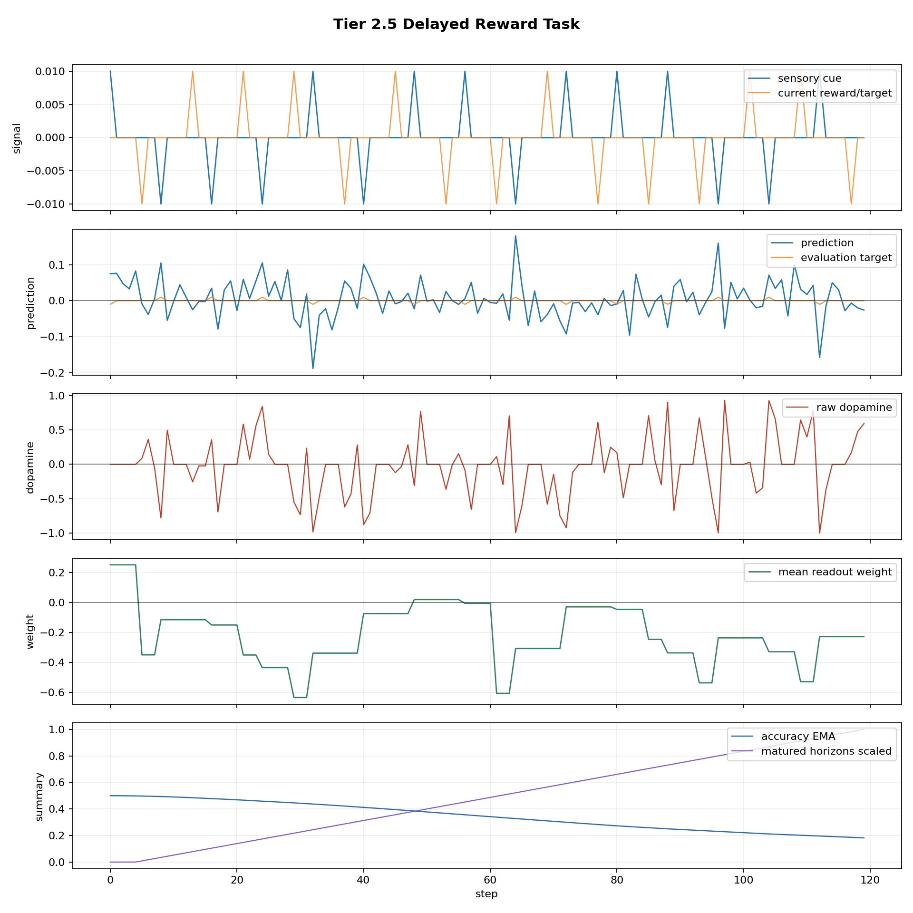
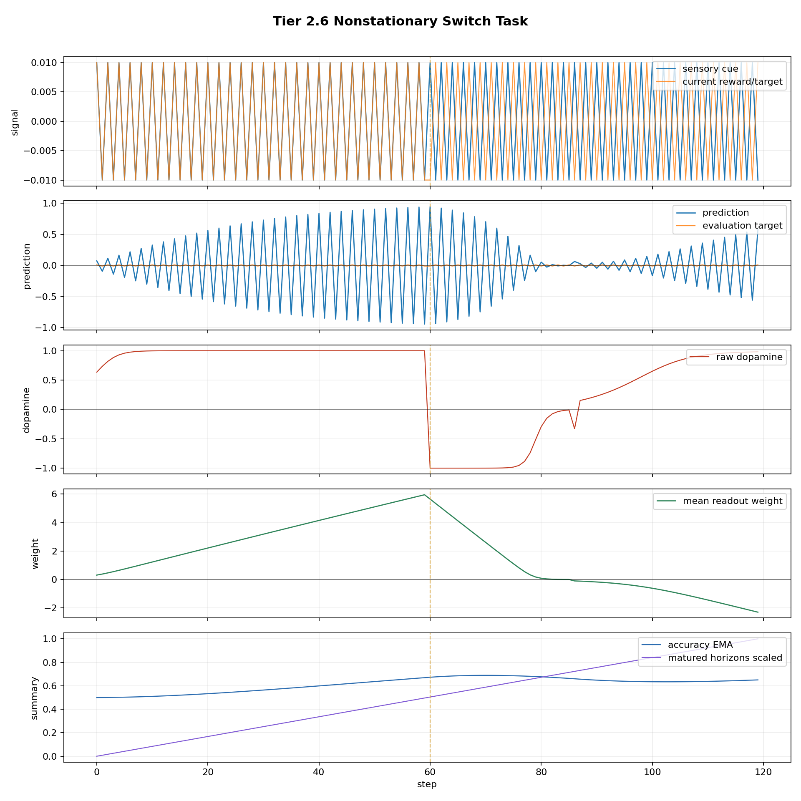

# Tier 2 Controlled Learning Findings

- Generated: `2026-04-29T16:11:28+00:00`
- Backend: `mock`
- Overall status: **PASS**
- Steps per run: `120`
- Base seed: `42`
- Fixed population: `True`
- Output directory: `<repo>/controlled_test_output/tier5_12d_20260429_121121/tier2_learning`

Tier 2 is a positive-control tier. These tests check whether the organism can learn causal cue/outcome structure, delayed consequence, and a switched rule after Tier 1 ruled out obvious fake learning.

## Artifact Index

- JSON manifest: `tier2_results.json`
- Summary CSV: `tier2_summary.csv`

## Summary

| Test | Status | Key metric | Notes |
| --- | --- | --- | --- |
| `fixed_pattern` | **PASS** | tail_acc=1, weight=-10.9131 | criteria satisfied |
| `delayed_reward` | **PASS** | tail_cue_acc=1, matured=115 | criteria satisfied |
| `nonstationary_switch` | **PASS** | pre=1, post_final=1, recovery=24 | criteria satisfied |

## fixed_pattern

Status: **PASS**

Criteria:

| Criterion | Value | Rule | Pass |
| --- | ---: | --- | --- |
| tail strict accuracy | 1 | >= 0.8 | yes |
| tail prediction/target correlation | 0.999994 | >= 0.7 | yes |
| learned inverse readout weight | -10.9131 | <= -0.05 | yes |

Artifacts:

- `timeseries_csv`: `fixed_pattern_timeseries.csv`
- `plot_png`: `fixed_pattern_timeseries.png`

## delayed_reward

Status: **PASS**

Criteria:

| Criterion | Value | Rule | Pass |
| --- | ---: | --- | --- |
| tail cue-time strict accuracy | 1 | >= 0.65 | yes |
| matured delayed horizons | 115 | >= 1 | yes |
| delayed inverse readout weight | -0.228741 | <= -0.05 | yes |
| tail prediction/target correlation | 0.962519 | >= 0.5 | yes |

Artifacts:

- `timeseries_csv`: `delayed_reward_timeseries.csv`
- `plot_png`: `delayed_reward_timeseries.png`

## nonstationary_switch

Status: **PASS**

Criteria:

| Criterion | Value | Rule | Pass |
| --- | ---: | --- | --- |
| pre-switch accuracy | 1 | >= 0.8 | yes |
| post-switch disruption | 0 | <= 0.9 | yes |
| final post-switch accuracy | 1 | >= 0.8 | yes |
| recovery time | 24 | <= 60 | yes |
| final inverse readout weight | -2.29254 | <= 0 | yes |

Artifacts:

- `timeseries_csv`: `nonstationary_switch_timeseries.csv`
- `plot_png`: `nonstationary_switch_timeseries.png`

