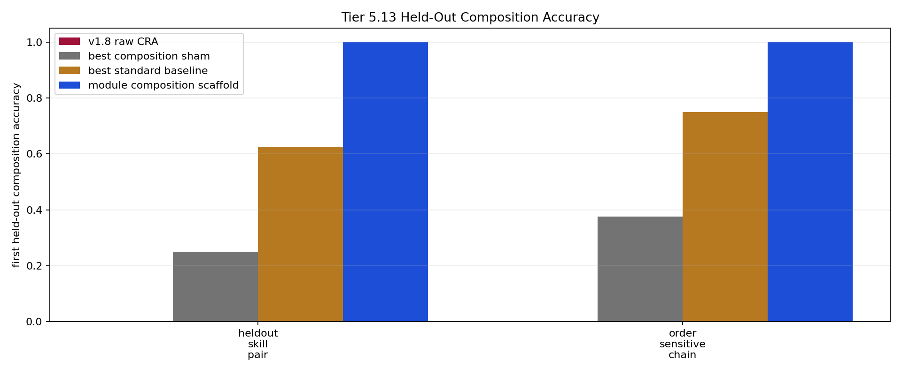

# Tier 5.13 Compositional Skill Reuse Diagnostic Findings

- Generated: `2026-04-29T11:55:32+00:00`
- Status: **PASS**
- Backend for CRA comparators: `mock`
- Steps: `360`
- Seeds: `42`
- Tasks: `heldout_skill_pair,order_sensitive_chain`
- Variants: `all`
- Selected standard baselines: `sign_persistence,online_perceptron`
- Smoke mode: `True`
- Output directory: `/Users/james/JKS:CRA/controlled_test_output/tier5_13_20260429_075527`

Tier 5.13 tests held-out skill composition: primitive skills are learned separately, then reused on unseen skill-pair combinations.

## Claim Boundary

- This is software diagnostic evidence, not hardware evidence.
- The candidate is an explicit host-side reusable-module scaffold, not native/internal CRA composition yet.
- This does not prove module routing, language reasoning, long-horizon planning, or AGI.
- A pass authorizes an internal CRA composition/routing implementation; it does not freeze a new baseline by itself.

## Task Comparisons

| Task | Candidate heldout first | Candidate heldout all | v1.8 heldout first | Bridge heldout first | Best sham | Sham heldout first | Combo heldout first | Best baseline | Baseline heldout first | Edge vs v1.8 | Edge vs sham | Edge vs combo | Edge vs baseline | Updates | Uses |
| --- | ---: | ---: | ---: | ---: | --- | ---: | ---: | --- | ---: | ---: | ---: | ---: | ---: | ---: | ---: |
| heldout_skill_pair | 1 | 1 | 0 | 1 | `module_shuffle_ablation` | 0.25 | 0 | `online_perceptron` | 0.625 | 1 | 0.75 | 1 | 0.375 | 32 | 40 |
| order_sensitive_chain | 1 | 1 | 0 | 1 | `module_shuffle_ablation` | 0.375 | 0 | `online_perceptron` | 0.75 | 1 | 0.625 | 1 | 0.25 | 32 | 40 |

## Aggregate Matrix

| Task | Model | Family | Group | All acc | Heldout acc | Heldout first | Primitive acc | Runtime s |
| --- | --- | --- | --- | ---: | ---: | ---: | ---: | ---: |
| heldout_skill_pair | `combo_memorization_control` | composition_scaffold | shortcut_control | 0.0909091 | 0 | 0 | 0 | 0.00223758 |
| heldout_skill_pair | `module_composition_scaffold` | composition_scaffold | candidate_scaffold | 0.909091 | 1 | 1 | 0.75 | 0.002429 |
| heldout_skill_pair | `module_order_shuffle_ablation` | composition_scaffold | composition_ablation | 0.454545 | 0 | 0 | 0.75 | 0.00256312 |
| heldout_skill_pair | `module_reset_ablation` | composition_scaffold | composition_ablation | 0.454545 | 0 | 0 | 0.75 | 0.00227912 |
| heldout_skill_pair | `module_shuffle_ablation` | composition_scaffold | composition_ablation | 0.306818 | 0.25 | 0.25 | 0.40625 | 0.00246729 |
| heldout_skill_pair | `oracle_composition` | composition_scaffold | oracle_upper_bound | 1 | 1 | 1 | 1 | 0.00246496 |
| heldout_skill_pair | `cra_composition_input_scaffold` | CRA | candidate_bridge | 0.954545 | 1 | 1 | 0.875 | 1.12532 |
| heldout_skill_pair | `online_perceptron` | linear |  | 0.590909 | 0.65 | 0.625 | 0.4375 | 0.00283971 |
| heldout_skill_pair | `sign_persistence` | rule |  | 0.454545 | 0.5 | 0.5 | 0.5 | 0.00265246 |
| heldout_skill_pair | `v1_8_raw_cra` | CRA | frozen_baseline | 0.159091 | 0 | 0 | 0.4375 | 1.12977 |
| order_sensitive_chain | `combo_memorization_control` | composition_scaffold | shortcut_control | 0.0909091 | 0 | 0 | 0 | 0.00218304 |
| order_sensitive_chain | `module_composition_scaffold` | composition_scaffold | candidate_scaffold | 0.909091 | 1 | 1 | 0.75 | 0.00268146 |
| order_sensitive_chain | `module_order_shuffle_ablation` | composition_scaffold | composition_ablation | 0.363636 | 0 | 0 | 0.75 | 0.00246462 |
| order_sensitive_chain | `module_reset_ablation` | composition_scaffold | composition_ablation | 0.454545 | 0 | 0 | 0.75 | 0.00232471 |
| order_sensitive_chain | `module_shuffle_ablation` | composition_scaffold | composition_ablation | 0.340909 | 0.375 | 0.375 | 0.40625 | 0.00254938 |
| order_sensitive_chain | `oracle_composition` | composition_scaffold | oracle_upper_bound | 1 | 1 | 1 | 1 | 0.00250375 |
| order_sensitive_chain | `cra_composition_input_scaffold` | CRA | candidate_bridge | 0.954545 | 1 | 1 | 0.875 | 1.11649 |
| order_sensitive_chain | `online_perceptron` | linear |  | 0.715909 | 0.95 | 0.75 | 0.4375 | 0.00267483 |
| order_sensitive_chain | `sign_persistence` | rule |  | 0.5 | 0.5 | 0.5 | 0.5 | 0.00242138 |
| order_sensitive_chain | `v1_8_raw_cra` | CRA | frozen_baseline | 0.159091 | 0 | 0 | 0.4375 | 1.1268 |

## Criteria

| Criterion | Value | Rule | Pass | Note |
| --- | --- | --- | --- | --- |
| full variant/baseline/task/seed matrix completed | 20 | == 20 | yes |  |
| feedback timing has no leakage violations | 0 | == 0 | yes |  |
| tasks contain shortcut-ambiguous held-out compositions | True | == True | yes |  |
| candidate module scaffold activates on held-out composition | 80 | > 0 | yes |  |
| candidate learns primitive module tables before composition | 64 | > 0 | yes |  |
| candidate performs held-out module composition | 80 | > 0 | yes |  |

## Artifacts

- `tier5_13_results.json`: machine-readable manifest.
- `tier5_13_report.md`: human findings and claim boundary.
- `tier5_13_summary.csv`: aggregate task/model metrics.
- `tier5_13_comparisons.csv`: candidate-vs-sham/baseline table.
- `tier5_13_fairness_contract.json`: predeclared comparison/leakage rules.
- `tier5_13_composition.png`: held-out composition plot.
- `*_timeseries.csv`: per-task/per-model/per-seed traces.

