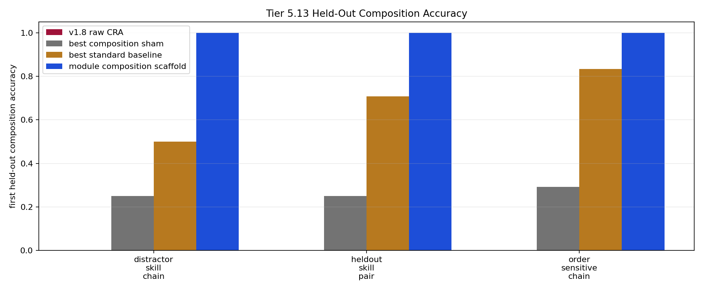

# Tier 5.13 Compositional Skill Reuse Diagnostic Findings

- Generated: `2026-04-29T11:56:47+00:00`
- Status: **PASS**
- Backend for CRA comparators: `mock`
- Steps: `720`
- Seeds: `42, 43, 44`
- Tasks: `heldout_skill_pair,order_sensitive_chain,distractor_skill_chain`
- Variants: `all`
- Selected standard baselines: `sign_persistence,online_perceptron,online_logistic_regression,echo_state_network,small_gru,stdp_only_snn`
- Smoke mode: `False`
- Output directory: `<repo>/controlled_test_output/tier5_13_20260429_075539`

Tier 5.13 tests held-out skill composition: primitive skills are learned separately, then reused on unseen skill-pair combinations.

## Claim Boundary

- This is software diagnostic evidence, not hardware evidence.
- The candidate is an explicit host-side reusable-module scaffold, not native/internal CRA composition yet.
- This does not prove module routing, language reasoning, long-horizon planning, or AGI.
- A pass authorizes an internal CRA composition/routing implementation; it does not freeze a new baseline by itself.

## Task Comparisons

| Task | Candidate heldout first | Candidate heldout all | v1.8 heldout first | Bridge heldout first | Best sham | Sham heldout first | Combo heldout first | Best baseline | Baseline heldout first | Edge vs v1.8 | Edge vs sham | Edge vs combo | Edge vs baseline | Updates | Uses |
| --- | ---: | ---: | ---: | ---: | --- | ---: | ---: | --- | ---: | ---: | ---: | ---: | ---: | ---: | ---: |
| distractor_skill_chain | 1 | 1 | 0 | 1 | `module_shuffle_ablation` | 0.25 | 0 | `sign_persistence` | 0.5 | 1 | 0.75 | 1 | 0.5 | 32 | 120 |
| heldout_skill_pair | 1 | 1 | 0 | 1 | `module_shuffle_ablation` | 0.25 | 0 | `online_perceptron` | 0.708333 | 1 | 0.75 | 1 | 0.291667 | 32 | 120 |
| order_sensitive_chain | 1 | 1 | 0 | 1 | `module_shuffle_ablation` | 0.291667 | 0 | `online_logistic_regression` | 0.833333 | 1 | 0.708333 | 1 | 0.166667 | 32 | 120 |

## Aggregate Matrix

| Task | Model | Family | Group | All acc | Heldout acc | Heldout first | Primitive acc | Runtime s |
| --- | --- | --- | --- | ---: | ---: | ---: | ---: | ---: |
| distractor_skill_chain | `combo_memorization_control` | composition_scaffold | shortcut_control | 0.0714286 | 0 | 0 | 0 | 0.00436439 |
| distractor_skill_chain | `module_composition_scaffold` | composition_scaffold | candidate_scaffold | 0.904762 | 1 | 1 | 0.75 | 0.00394082 |
| distractor_skill_chain | `module_order_shuffle_ablation` | composition_scaffold | composition_ablation | 0.428571 | 0 | 0 | 0.75 | 0.00410892 |
| distractor_skill_chain | `module_reset_ablation` | composition_scaffold | composition_ablation | 0.428571 | 0 | 0 | 0.75 | 0.00396739 |
| distractor_skill_chain | `module_shuffle_ablation` | composition_scaffold | composition_ablation | 0.353175 | 0.25 | 0.25 | 0.427083 | 0.00416367 |
| distractor_skill_chain | `oracle_composition` | composition_scaffold | oracle_upper_bound | 1 | 1 | 1 | 1 | 0.00394637 |
| distractor_skill_chain | `cra_composition_input_scaffold` | CRA | candidate_bridge | 0.952381 | 1 | 1 | 0.875 | 3.46774 |
| distractor_skill_chain | `echo_state_network` | reservoir |  | 0.293651 | 0.383333 | 0.458333 | 0.197917 | 0.00904985 |
| distractor_skill_chain | `online_logistic_regression` | linear |  | 0.400794 | 0.391667 | 0.291667 | 0.375 | 0.00565625 |
| distractor_skill_chain | `online_perceptron` | linear |  | 0.480159 | 0.533333 | 0.291667 | 0.4375 | 0.00511604 |
| distractor_skill_chain | `sign_persistence` | rule |  | 0.47619 | 0.5 | 0.5 | 0.5 | 0.00480803 |
| distractor_skill_chain | `small_gru` | recurrent |  | 0.269841 | 0.358333 | 0.416667 | 0.1875 | 0.01931 |
| distractor_skill_chain | `stdp_only_snn` | snn_ablation |  | 0.5 | 0.5 | 0.5 | 0.5 | 0.00821749 |
| distractor_skill_chain | `v1_8_raw_cra` | CRA | frozen_baseline | 0.166667 | 0 | 0 | 0.4375 | 3.50805 |
| heldout_skill_pair | `combo_memorization_control` | composition_scaffold | shortcut_control | 0.0909091 | 0 | 0 | 0 | 0.00424937 |
| heldout_skill_pair | `module_composition_scaffold` | composition_scaffold | candidate_scaffold | 0.909091 | 1 | 1 | 0.75 | 0.00431832 |
| heldout_skill_pair | `module_order_shuffle_ablation` | composition_scaffold | composition_ablation | 0.454545 | 0 | 0 | 0.75 | 0.00446703 |
| heldout_skill_pair | `module_reset_ablation` | composition_scaffold | composition_ablation | 0.454545 | 0 | 0 | 0.75 | 0.0040624 |
| heldout_skill_pair | `module_shuffle_ablation` | composition_scaffold | composition_ablation | 0.375 | 0.25 | 0.25 | 0.427083 | 0.00522882 |
| heldout_skill_pair | `oracle_composition` | composition_scaffold | oracle_upper_bound | 1 | 1 | 1 | 1 | 0.00409722 |
| heldout_skill_pair | `cra_composition_input_scaffold` | CRA | candidate_bridge | 0.954545 | 1 | 1 | 0.875 | 3.5539 |
| heldout_skill_pair | `echo_state_network` | reservoir |  | 0.363636 | 0.408333 | 0.416667 | 0.197917 | 0.00863847 |
| heldout_skill_pair | `online_logistic_regression` | linear |  | 0.583333 | 0.733333 | 0.541667 | 0.375 | 0.006677 |
| heldout_skill_pair | `online_perceptron` | linear |  | 0.621212 | 0.716667 | 0.708333 | 0.4375 | 0.0052069 |
| heldout_skill_pair | `sign_persistence` | rule |  | 0.454545 | 0.5 | 0.5 | 0.5 | 0.00441794 |
| heldout_skill_pair | `small_gru` | recurrent |  | 0.340909 | 0.391667 | 0.416667 | 0.1875 | 0.0160838 |
| heldout_skill_pair | `stdp_only_snn` | snn_ablation |  | 0.5 | 0.5 | 0.5 | 0.5 | 0.00776829 |
| heldout_skill_pair | `v1_8_raw_cra` | CRA | frozen_baseline | 0.159091 | 0 | 0 | 0.4375 | 3.51761 |
| order_sensitive_chain | `combo_memorization_control` | composition_scaffold | shortcut_control | 0.0909091 | 0 | 0 | 0 | 0.00399238 |
| order_sensitive_chain | `module_composition_scaffold` | composition_scaffold | candidate_scaffold | 0.909091 | 1 | 1 | 0.75 | 0.00410344 |
| order_sensitive_chain | `module_order_shuffle_ablation` | composition_scaffold | composition_ablation | 0.363636 | 0 | 0 | 0.75 | 0.00409457 |
| order_sensitive_chain | `module_reset_ablation` | composition_scaffold | composition_ablation | 0.454545 | 0 | 0 | 0.75 | 0.00384256 |
| order_sensitive_chain | `module_shuffle_ablation` | composition_scaffold | composition_ablation | 0.386364 | 0.291667 | 0.291667 | 0.427083 | 0.00395454 |
| order_sensitive_chain | `oracle_composition` | composition_scaffold | oracle_upper_bound | 1 | 1 | 1 | 1 | 0.00403821 |
| order_sensitive_chain | `cra_composition_input_scaffold` | CRA | candidate_bridge | 0.954545 | 1 | 1 | 0.875 | 3.52714 |
| order_sensitive_chain | `echo_state_network` | reservoir |  | 0.405303 | 0.608333 | 0.583333 | 0.197917 | 0.00888599 |
| order_sensitive_chain | `online_logistic_regression` | linear |  | 0.689394 | 0.966667 | 0.833333 | 0.375 | 0.00659175 |
| order_sensitive_chain | `online_perceptron` | linear |  | 0.715909 | 0.95 | 0.833333 | 0.4375 | 0.00585576 |
| order_sensitive_chain | `sign_persistence` | rule |  | 0.5 | 0.5 | 0.5 | 0.5 | 0.00618167 |
| order_sensitive_chain | `small_gru` | recurrent |  | 0.363636 | 0.516667 | 0.5 | 0.1875 | 0.0159651 |
| order_sensitive_chain | `stdp_only_snn` | snn_ablation |  | 0.5 | 0.5 | 0.5 | 0.5 | 0.00777393 |
| order_sensitive_chain | `v1_8_raw_cra` | CRA | frozen_baseline | 0.159091 | 0 | 0 | 0.4375 | 3.58878 |

## Criteria

| Criterion | Value | Rule | Pass | Note |
| --- | --- | --- | --- | --- |
| full variant/baseline/task/seed matrix completed | 126 | == 126 | yes |  |
| feedback timing has no leakage violations | 0 | == 0 | yes |  |
| tasks contain shortcut-ambiguous held-out compositions | True | == True | yes |  |
| candidate module scaffold activates on held-out composition | 360 | > 0 | yes |  |
| candidate learns primitive module tables before composition | 96 | > 0 | yes |  |
| candidate performs held-out module composition | 360 | > 0 | yes |  |
| candidate reaches minimum first-heldout composition accuracy | 1 | >= 0.95 | yes |  |
| candidate reaches minimum total heldout composition accuracy | 1 | >= 0.95 | yes |  |
| candidate improves over raw v1.8 CRA on first heldout compositions | 1 | >= 0.2 | yes |  |
| composition shams are worse than candidate | 0.708333 | >= 0.2 | yes |  |
| candidate beats combo memorization on first heldout compositions | 1 | >= 0.2 | yes |  |
| candidate beats best selected standard baseline on first heldout compositions | 0.166667 | >= 0.1 | yes |  |

## Artifacts

- `tier5_13_results.json`: machine-readable manifest.
- `tier5_13_report.md`: human findings and claim boundary.
- `tier5_13_summary.csv`: aggregate task/model metrics.
- `tier5_13_comparisons.csv`: candidate-vs-sham/baseline table.
- `tier5_13_fairness_contract.json`: predeclared comparison/leakage rules.
- `tier5_13_composition.png`: held-out composition plot.
- `*_timeseries.csv`: per-task/per-model/per-seed traces.

