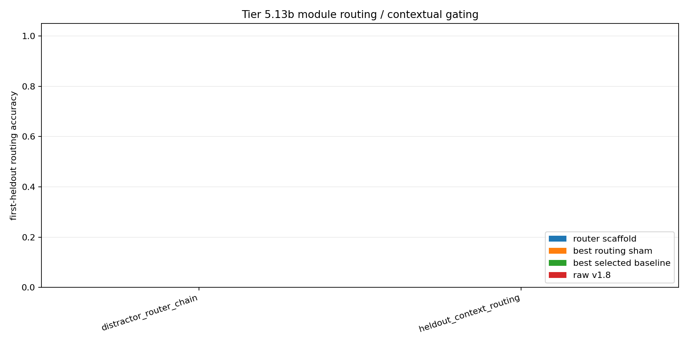

# Tier 5.13b Module Routing / Contextual Gating Diagnostic Findings

- Generated: `2026-04-29T12:13:27+00:00`
- Status: **FAIL**
- Backend for CRA comparators: `mock`
- Steps: `420`
- Seeds: `42`
- Tasks: `heldout_context_routing,distractor_router_chain`
- Variants: `all`
- Selected standard baselines: `sign_persistence,online_perceptron`
- Smoke mode: `True`
- Output directory: `/Users/james/JKS:CRA/controlled_test_output/tier5_13b_20260429_121321`

Tier 5.13b tests contextual module routing: primitive modules are learned first, context-to-module routing is learned next, and held-out delayed-context trials require selecting the right module before feedback.

## Claim Boundary

- This is software diagnostic evidence, not hardware evidence.
- The candidate is an explicit host-side contextual router scaffold, not native/internal CRA routing yet.
- This does not prove language reasoning, long-horizon planning, AGI, or on-chip routing.
- A pass authorizes internal CRA routing/gating implementation; it does not freeze a new baseline by itself.

## Task Comparisons

| Task | Candidate first | Candidate heldout | Router acc | v1.8 first | Bridge first | Best sham | Sham first | Best baseline | Baseline first | Edge vs v1.8 | Edge vs sham | Edge vs baseline | Updates | Route uses |
| --- | ---: | ---: | ---: | ---: | ---: | --- | ---: | --- | ---: | ---: | ---: | ---: | ---: | ---: |
| distractor_router_chain | None | None | None | None | None | `always_on_modules` | None | `online_perceptron` | None | 0 | 0 | 0 | 19 | 0 |
| heldout_context_routing | None | None | None | None | None | `always_on_modules` | None | `online_perceptron` | None | 0 | 0 | 0 | 23 | 0 |

## Aggregate Matrix

| Task | Model | Family | Group | All acc | Heldout acc | First heldout | Router acc | Runtime s |
| --- | --- | --- | --- | ---: | ---: | ---: | ---: | ---: |
| distractor_router_chain | `online_perceptron` | linear |  | 0.519231 | None | None | None | 0.00323383 |
| distractor_router_chain | `sign_persistence` | rule |  | 0.5 | None | None | None | 0.00304304 |
| distractor_router_chain | `cra_router_input_scaffold` | CRA | candidate_bridge | 0.269231 | None | None | None | 1.39628 |
| distractor_router_chain | `contextual_router_scaffold` | routing_scaffold | candidate_scaffold | 0.269231 | None | None | None | 0.00262725 |
| distractor_router_chain | `v1_8_raw_cra` | CRA | frozen_baseline | 0.269231 | None | None | None | 1.49911 |
| distractor_router_chain | `oracle_router` | routing_scaffold | oracle_upper_bound | 0.384615 | None | None | None | 0.00267204 |
| distractor_router_chain | `always_on_modules` | routing_scaffold | routing_ablation | 0 | None | None | None | 0.00268213 |
| distractor_router_chain | `context_shuffle_ablation` | routing_scaffold | routing_ablation | 0.0961538 | None | None | None | 0.00270708 |
| distractor_router_chain | `random_router` | routing_scaffold | routing_ablation | 0.403846 | None | None | None | 0.003037 |
| distractor_router_chain | `router_reset_ablation` | routing_scaffold | routing_ablation | 0.269231 | None | None | None | 0.00276892 |
| heldout_context_routing | `online_perceptron` | linear |  | 0.517857 | None | None | None | 0.00366208 |
| heldout_context_routing | `sign_persistence` | rule |  | 0.5 | None | None | None | 0.0030335 |
| heldout_context_routing | `cra_router_input_scaffold` | CRA | candidate_bridge | 0.25 | None | None | None | 1.40681 |
| heldout_context_routing | `contextual_router_scaffold` | routing_scaffold | candidate_scaffold | 0.321429 | None | None | None | 0.002926 |
| heldout_context_routing | `v1_8_raw_cra` | CRA | frozen_baseline | 0.25 | None | None | None | 1.46791 |
| heldout_context_routing | `oracle_router` | routing_scaffold | oracle_upper_bound | 0.428571 | None | None | None | 0.00271796 |
| heldout_context_routing | `always_on_modules` | routing_scaffold | routing_ablation | 0 | None | None | None | 0.00272292 |
| heldout_context_routing | `context_shuffle_ablation` | routing_scaffold | routing_ablation | 0.107143 | None | None | None | 0.00278637 |
| heldout_context_routing | `random_router` | routing_scaffold | routing_ablation | 0.446429 | None | None | None | 0.00304321 |
| heldout_context_routing | `router_reset_ablation` | routing_scaffold | routing_ablation | 0.321429 | None | None | None | 0.00265871 |

## Criteria

| Criterion | Value | Rule | Pass | Note |
| --- | --- | --- | --- | --- |
| full variant/baseline/task/seed matrix completed | 20 | == 20 | yes |  |
| feedback timing has no leakage violations | 0 | == 0 | yes |  |
| tasks require context routing beyond current input/history | False | == True | no |  |
| candidate learned primitive modules | 64 | > 0 | yes |  |
| candidate learned context router | 42 | > 0 | yes |  |
| candidate selects routes before feedback | 0 | > 0 | no |  |
| candidate router activates on held-out trials | 0 | > 0 | no |  |

## Artifacts

- `tier5_13b_results.json`: machine-readable manifest.
- `tier5_13b_report.md`: human findings and claim boundary.
- `tier5_13b_summary.csv`: aggregate task/model metrics.
- `tier5_13b_comparisons.csv`: candidate-vs-sham/baseline table.
- `tier5_13b_fairness_contract.json`: predeclared comparison/leakage rules.
- `tier5_13b_routing.png`: first-heldout routing plot.
- `*_timeseries.csv`: per-task/per-model/per-seed traces.

