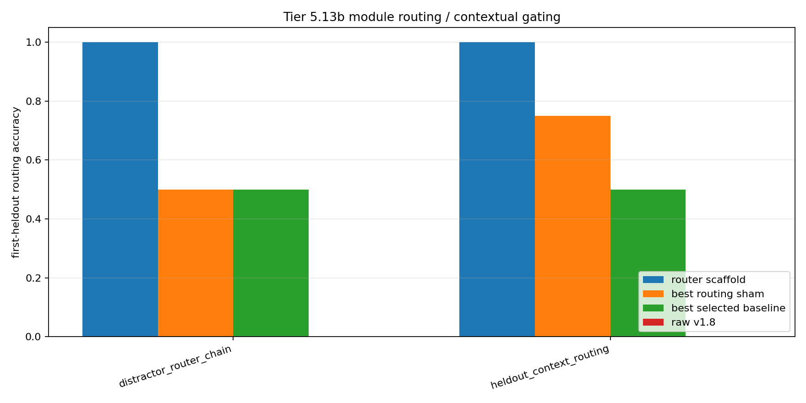

# Tier 5.13b Module Routing / Contextual Gating Diagnostic Findings

- Generated: `2026-04-29T12:14:13+00:00`
- Status: **PASS**
- Backend for CRA comparators: `mock`
- Steps: `760`
- Seeds: `42`
- Tasks: `heldout_context_routing,distractor_router_chain`
- Variants: `all`
- Selected standard baselines: `sign_persistence,online_perceptron`
- Smoke mode: `True`
- Output directory: `<repo>/controlled_test_output/tier5_13b_20260429_121356`

Tier 5.13b tests contextual module routing: primitive modules are learned first, context-to-module routing is learned next, and held-out delayed-context trials require selecting the right module before feedback.

## Claim Boundary

- This is software diagnostic evidence, not hardware evidence.
- The candidate is an explicit host-side contextual router scaffold, not native/internal CRA routing yet.
- This does not prove language reasoning, long-horizon planning, AGI, or on-chip routing.
- A pass authorizes internal CRA routing/gating implementation; it does not freeze a new baseline by itself.

## Task Comparisons

| Task | Candidate first | Candidate heldout | Router acc | v1.8 first | Bridge first | Best sham | Sham first | Best baseline | Baseline first | Edge vs v1.8 | Edge vs sham | Edge vs baseline | Updates | Route uses |
| --- | ---: | ---: | ---: | ---: | ---: | --- | ---: | --- | ---: | ---: | ---: | ---: | ---: | ---: |
| distractor_router_chain | 1 | 1 | 1 | 0 | 0 | `random_router` | 0.5 | `sign_persistence` | 0.5 | 1 | 0.5 | 0.5 | 32 | 9 |
| heldout_context_routing | 1 | 1 | 1 | 0 | 0 | `random_router` | 0.75 | `sign_persistence` | 0.5 | 1 | 0.25 | 0.5 | 32 | 19 |

## Aggregate Matrix

| Task | Model | Family | Group | All acc | Heldout acc | First heldout | Router acc | Runtime s |
| --- | --- | --- | --- | ---: | ---: | ---: | ---: | ---: |
| distractor_router_chain | `online_perceptron` | linear |  | 0.465753 | 0.333333 | 0.375 | None | 0.00634058 |
| distractor_router_chain | `sign_persistence` | rule |  | 0.506849 | 0.555556 | 0.5 | None | 0.00517225 |
| distractor_router_chain | `cra_router_input_scaffold` | CRA | candidate_bridge | 0.191781 | 0 | 0 | 1 | 3.73647 |
| distractor_router_chain | `contextual_router_scaffold` | routing_scaffold | candidate_scaffold | 0.479452 | 1 | 1 | 1 | 0.00444479 |
| distractor_router_chain | `v1_8_raw_cra` | CRA | frozen_baseline | 0.191781 | 0 | 0 | None | 4.26496 |
| distractor_router_chain | `oracle_router` | routing_scaffold | oracle_upper_bound | 0.561644 | 1 | 1 | 1 | 0.00511933 |
| distractor_router_chain | `always_on_modules` | routing_scaffold | routing_ablation | 0 | 0 | 0 | 0 | 0.00451258 |
| distractor_router_chain | `context_shuffle_ablation` | routing_scaffold | routing_ablation | 0.136986 | 0.222222 | 0.25 | 0 | 0.00462342 |
| distractor_router_chain | `random_router` | routing_scaffold | routing_ablation | 0.39726 | 0.444444 | 0.5 | 0.333333 | 0.00560987 |
| distractor_router_chain | `router_reset_ablation` | routing_scaffold | routing_ablation | 0.356164 | 0 | 0 | None | 0.00467633 |
| heldout_context_routing | `online_perceptron` | linear |  | 0.457831 | 0.263158 | 0.25 | None | 0.00609387 |
| heldout_context_routing | `sign_persistence` | rule |  | 0.506024 | 0.526316 | 0.5 | None | 0.00530963 |
| heldout_context_routing | `cra_router_input_scaffold` | CRA | candidate_bridge | 0.168675 | 0 | 0 | 1 | 3.79701 |
| heldout_context_routing | `contextual_router_scaffold` | routing_scaffold | candidate_scaffold | 0.542169 | 1 | 1 | 1 | 0.00457479 |
| heldout_context_routing | `v1_8_raw_cra` | CRA | frozen_baseline | 0.168675 | 0 | 0 | None | 3.76806 |
| heldout_context_routing | `oracle_router` | routing_scaffold | oracle_upper_bound | 0.614458 | 1 | 1 | 1 | 0.0061635 |
| heldout_context_routing | `always_on_modules` | routing_scaffold | routing_ablation | 0 | 0 | 0 | 0 | 0.00519529 |
| heldout_context_routing | `context_shuffle_ablation` | routing_scaffold | routing_ablation | 0.144578 | 0.210526 | 0.25 | 0 | 0.00578887 |
| heldout_context_routing | `random_router` | routing_scaffold | routing_ablation | 0.46988 | 0.421053 | 0.75 | 0.263158 | 0.00509208 |
| heldout_context_routing | `router_reset_ablation` | routing_scaffold | routing_ablation | 0.313253 | 0 | 0 | None | 0.00470667 |

## Criteria

| Criterion | Value | Rule | Pass | Note |
| --- | --- | --- | --- | --- |
| full variant/baseline/task/seed matrix completed | 20 | == 20 | yes |  |
| feedback timing has no leakage violations | 0 | == 0 | yes |  |
| tasks require context routing beyond current input/history | True | == True | yes |  |
| candidate learned primitive modules | 64 | > 0 | yes |  |
| candidate learned context router | 64 | > 0 | yes |  |
| candidate selects routes before feedback | 28 | > 0 | yes |  |
| candidate router activates on held-out trials | 28 | > 0 | yes |  |

## Artifacts

- `tier5_13b_results.json`: machine-readable manifest.
- `tier5_13b_report.md`: human findings and claim boundary.
- `tier5_13b_summary.csv`: aggregate task/model metrics.
- `tier5_13b_comparisons.csv`: candidate-vs-sham/baseline table.
- `tier5_13b_fairness_contract.json`: predeclared comparison/leakage rules.
- `tier5_13b_routing.png`: first-heldout routing plot.
- `*_timeseries.csv`: per-task/per-model/per-seed traces.

