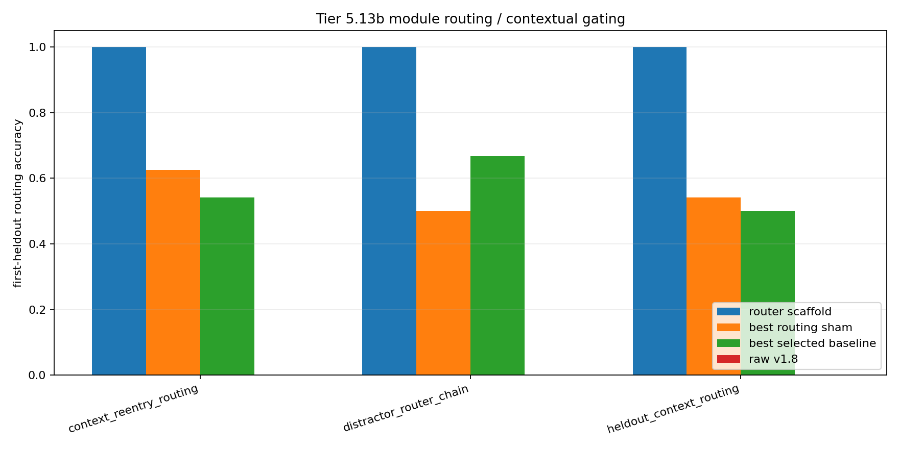

# Tier 5.13b Module Routing / Contextual Gating Diagnostic Findings

- Generated: `2026-04-29T12:15:44+00:00`
- Status: **FAIL**
- Backend for CRA comparators: `mock`
- Steps: `720`
- Seeds: `42, 43, 44`
- Tasks: `heldout_context_routing,distractor_router_chain,context_reentry_routing`
- Variants: `all`
- Selected standard baselines: `sign_persistence,online_perceptron,online_logistic_regression,echo_state_network,small_gru,stdp_only_snn`
- Smoke mode: `False`
- Output directory: `/Users/james/JKS:CRA/controlled_test_output/tier5_13b_20260429_121425`

Tier 5.13b tests contextual module routing: primitive modules are learned first, context-to-module routing is learned next, and held-out delayed-context trials require selecting the right module before feedback.

## Claim Boundary

- This is software diagnostic evidence, not hardware evidence.
- The candidate is an explicit host-side contextual router scaffold, not native/internal CRA routing yet.
- This does not prove language reasoning, long-horizon planning, AGI, or on-chip routing.
- A pass authorizes internal CRA routing/gating implementation; it does not freeze a new baseline by itself.

## Task Comparisons

| Task | Candidate first | Candidate heldout | Router acc | v1.8 first | Bridge first | Best sham | Sham first | Best baseline | Baseline first | Edge vs v1.8 | Edge vs sham | Edge vs baseline | Updates | Route uses |
| --- | ---: | ---: | ---: | ---: | ---: | --- | ---: | --- | ---: | ---: | ---: | ---: | ---: | ---: |
| context_reentry_routing | 1 | 1 | 1 | 0 | 0 | `random_router` | 0.625 | `echo_state_network` | 0.541667 | 1 | 0.375 | 0.458333 | 24 | 60 |
| distractor_router_chain | 1 | 1 | 1 | 0 | 0 | `random_router` | 0.5 | `sign_persistence` | 0.666667 | 1 | 0.5 | 0.333333 | 32 | 18 |
| heldout_context_routing | 1 | 1 | 1 | 0 | 0 | `random_router` | 0.541667 | `sign_persistence` | 0.5 | 1 | 0.458333 | 0.5 | 32 | 45 |

## Aggregate Matrix

| Task | Model | Family | Group | All acc | Heldout acc | First heldout | Router acc | Runtime s |
| --- | --- | --- | --- | ---: | ---: | ---: | ---: | ---: |
| context_reentry_routing | `echo_state_network` | reservoir |  | 0.355263 | 0.483333 | 0.541667 | None | 0.00965194 |
| context_reentry_routing | `online_logistic_regression` | linear |  | 0.311404 | 0.316667 | 0.291667 | None | 0.00647012 |
| context_reentry_routing | `online_perceptron` | linear |  | 0.407895 | 0.366667 | 0.458333 | None | 0.00606135 |
| context_reentry_routing | `sign_persistence` | rule |  | 0.495614 | 0.483333 | 0.5 | None | 0.00520894 |
| context_reentry_routing | `small_gru` | recurrent |  | 0.328947 | 0.4 | 0.416667 | None | 0.03038 |
| context_reentry_routing | `stdp_only_snn` | snn_ablation |  | 0.504386 | 0.516667 | 0.5 | None | 0.0104707 |
| context_reentry_routing | `cra_router_input_scaffold` | CRA | candidate_bridge | 0.184211 | 0 | 0 | 1 | 3.84341 |
| context_reentry_routing | `contextual_router_scaffold` | routing_scaffold | candidate_scaffold | 0.5 | 1 | 1 | 1 | 0.00459718 |
| context_reentry_routing | `v1_8_raw_cra` | CRA | frozen_baseline | 0.184211 | 0 | 0 | None | 3.97017 |
| context_reentry_routing | `oracle_router` | routing_scaffold | oracle_upper_bound | 0.578947 | 1 | 1 | 1 | 0.00635703 |
| context_reentry_routing | `always_on_modules` | routing_scaffold | routing_ablation | 0 | 0 | 0 | 0 | 0.00487922 |
| context_reentry_routing | `context_shuffle_ablation` | routing_scaffold | routing_ablation | 0.135965 | 0.266667 | 0.25 | 0 | 0.00498732 |
| context_reentry_routing | `random_router` | routing_scaffold | routing_ablation | 0.464912 | 0.616667 | 0.625 | 0.3 | 0.00537549 |
| context_reentry_routing | `router_reset_ablation` | routing_scaffold | routing_ablation | 0.236842 | 0 | 0 | None | 0.00465381 |
| distractor_router_chain | `echo_state_network` | reservoir |  | 0.319048 | 0.222222 | 0.222222 | None | 0.0114553 |
| distractor_router_chain | `online_logistic_regression` | linear |  | 0.328571 | 0.333333 | 0.333333 | None | 0.00672485 |
| distractor_router_chain | `online_perceptron` | linear |  | 0.447619 | 0.444444 | 0.444444 | None | 0.00944735 |
| distractor_router_chain | `sign_persistence` | rule |  | 0.514286 | 0.666667 | 0.666667 | None | 0.00541212 |
| distractor_router_chain | `small_gru` | recurrent |  | 0.261905 | 0.333333 | 0.333333 | None | 0.0174852 |
| distractor_router_chain | `stdp_only_snn` | snn_ablation |  | 0.5 | 0.5 | 0.5 | None | 0.00949553 |
| distractor_router_chain | `cra_router_input_scaffold` | CRA | candidate_bridge | 0.2 | 0 | 0 | 1 | 4.41675 |
| distractor_router_chain | `contextual_router_scaffold` | routing_scaffold | candidate_scaffold | 0.457143 | 1 | 1 | 1 | 0.00456893 |
| distractor_router_chain | `v1_8_raw_cra` | CRA | frozen_baseline | 0.2 | 0 | 0 | None | 3.63822 |
| distractor_router_chain | `oracle_router` | routing_scaffold | oracle_upper_bound | 0.542857 | 1 | 1 | 1 | 0.00462747 |
| distractor_router_chain | `always_on_modules` | routing_scaffold | routing_ablation | 0 | 0 | 0 | 0 | 0.0049974 |
| distractor_router_chain | `context_shuffle_ablation` | routing_scaffold | routing_ablation | 0.12381 | 0.166667 | 0.166667 | 0 | 0.00585662 |
| distractor_router_chain | `random_router` | routing_scaffold | routing_ablation | 0.419048 | 0.5 | 0.5 | 0.333333 | 0.00533885 |
| distractor_router_chain | `router_reset_ablation` | routing_scaffold | routing_ablation | 0.371429 | 0 | 0 | None | 0.00540647 |
| heldout_context_routing | `echo_state_network` | reservoir |  | 0.312236 | 0.222222 | 0.291667 | None | 0.00944235 |
| heldout_context_routing | `online_logistic_regression` | linear |  | 0.320675 | 0.244444 | 0.125 | None | 0.00595097 |
| heldout_context_routing | `online_perceptron` | linear |  | 0.481013 | 0.355556 | 0.291667 | None | 0.0055939 |
| heldout_context_routing | `sign_persistence` | rule |  | 0.49789 | 0.488889 | 0.5 | None | 0.00630933 |
| heldout_context_routing | `small_gru` | recurrent |  | 0.299578 | 0.222222 | 0.25 | None | 0.0167248 |
| heldout_context_routing | `stdp_only_snn` | snn_ablation |  | 0.50211 | 0.511111 | 0.5 | None | 0.00875847 |
| heldout_context_routing | `cra_router_input_scaffold` | CRA | candidate_bridge | 0.177215 | 0 | 0 | 1 | 5.21505 |
| heldout_context_routing | `contextual_router_scaffold` | routing_scaffold | candidate_scaffold | 0.518987 | 1 | 1 | 1 | 0.00647497 |
| heldout_context_routing | `v1_8_raw_cra` | CRA | frozen_baseline | 0.177215 | 0 | 0 | None | 3.69934 |
| heldout_context_routing | `oracle_router` | routing_scaffold | oracle_upper_bound | 0.594937 | 1 | 1 | 1 | 0.00527087 |
| heldout_context_routing | `always_on_modules` | routing_scaffold | routing_ablation | 0 | 0 | 0 | 0 | 0.00458521 |
| heldout_context_routing | `context_shuffle_ablation` | routing_scaffold | routing_ablation | 0.139241 | 0.2 | 0.25 | 0 | 0.00478576 |
| heldout_context_routing | `random_router` | routing_scaffold | routing_ablation | 0.438819 | 0.466667 | 0.541667 | 0.288889 | 0.005928 |
| heldout_context_routing | `router_reset_ablation` | routing_scaffold | routing_ablation | 0.329114 | 0 | 0 | None | 0.00544632 |

## Criteria

| Criterion | Value | Rule | Pass | Note |
| --- | --- | --- | --- | --- |
| full variant/baseline/task/seed matrix completed | 126 | == 126 | yes |  |
| feedback timing has no leakage violations | 0 | == 0 | yes |  |
| tasks require context routing beyond current input/history | False | == True | no |  |
| candidate learned primitive modules | 96 | > 0 | yes |  |
| candidate learned context router | 88 | > 0 | yes |  |
| candidate selects routes before feedback | 123 | > 0 | yes |  |
| candidate router activates on held-out trials | 123 | > 0 | yes |  |
| candidate reaches minimum first-heldout routing accuracy | 1 | >= 0.95 | yes |  |
| candidate reaches minimum total heldout routing accuracy | 1 | >= 0.95 | yes |  |
| candidate route selection is correct | 1 | >= 0.95 | yes |  |
| candidate improves over raw v1.8 on first-heldout routing | 1 | >= 0.2 | yes |  |
| routing shams are worse than candidate | 0.375 | >= 0.2 | yes |  |
| candidate beats best selected standard baseline on first-heldout routing | 0.333333 | >= 0.1 | yes |  |

## Artifacts

- `tier5_13b_results.json`: machine-readable manifest.
- `tier5_13b_report.md`: human findings and claim boundary.
- `tier5_13b_summary.csv`: aggregate task/model metrics.
- `tier5_13b_comparisons.csv`: candidate-vs-sham/baseline table.
- `tier5_13b_fairness_contract.json`: predeclared comparison/leakage rules.
- `tier5_13b_routing.png`: first-heldout routing plot.
- `*_timeseries.csv`: per-task/per-model/per-seed traces.

