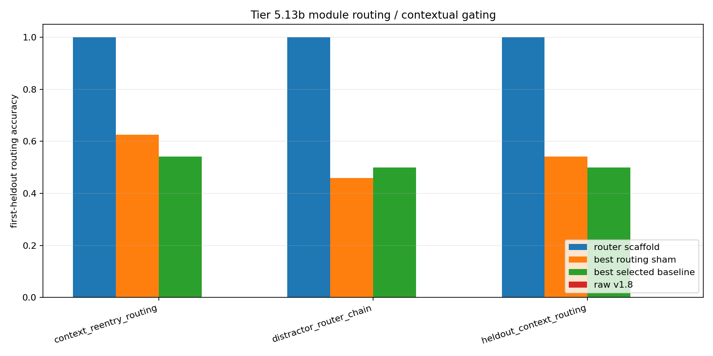

# Tier 5.13b Module Routing / Contextual Gating Diagnostic Findings

- Generated: `2026-04-29T12:18:12+00:00`
- Status: **PASS**
- Backend for CRA comparators: `mock`
- Steps: `960`
- Seeds: `42, 43, 44`
- Tasks: `heldout_context_routing,distractor_router_chain,context_reentry_routing`
- Variants: `all`
- Selected standard baselines: `sign_persistence,online_perceptron,online_logistic_regression,echo_state_network,small_gru,stdp_only_snn`
- Smoke mode: `False`
- Output directory: `<repo>/controlled_test_output/tier5_13b_20260429_121615`

Tier 5.13b tests contextual module routing: primitive modules are learned first, context-to-module routing is learned next, and held-out delayed-context trials require selecting the right module before feedback.

## Claim Boundary

- This is software diagnostic evidence, not hardware evidence.
- The candidate is an explicit host-side contextual router scaffold, not native/internal CRA routing yet.
- This does not prove language reasoning, long-horizon planning, AGI, or on-chip routing.
- A pass authorizes internal CRA routing/gating implementation; it does not freeze a new baseline by itself.

## Task Comparisons

| Task | Candidate first | Candidate heldout | Router acc | v1.8 first | Bridge first | Best sham | Sham first | Best baseline | Baseline first | Edge vs v1.8 | Edge vs sham | Edge vs baseline | Updates | Route uses |
| --- | ---: | ---: | ---: | ---: | ---: | --- | ---: | --- | ---: | ---: | ---: | ---: | ---: | ---: |
| context_reentry_routing | 1 | 1 | 1 | 0 | 0 | `random_router` | 0.625 | `echo_state_network` | 0.541667 | 1 | 0.375 | 0.458333 | 24 | 111 |
| distractor_router_chain | 1 | 1 | 1 | 0 | 0 | `random_router` | 0.458333 | `sign_persistence` | 0.5 | 1 | 0.541667 | 0.5 | 32 | 63 |
| heldout_context_routing | 1 | 1 | 1 | 0 | 0 | `random_router` | 0.541667 | `sign_persistence` | 0.5 | 1 | 0.458333 | 0.5 | 32 | 102 |

## Aggregate Matrix

| Task | Model | Family | Group | All acc | Heldout acc | First heldout | Router acc | Runtime s |
| --- | --- | --- | --- | ---: | ---: | ---: | ---: | ---: |
| context_reentry_routing | `echo_state_network` | reservoir |  | 0.362007 | 0.441441 | 0.541667 | None | 0.011904 |
| context_reentry_routing | `online_logistic_regression` | linear |  | 0.326165 | 0.351351 | 0.291667 | None | 0.00850168 |
| context_reentry_routing | `online_perceptron` | linear |  | 0.401434 | 0.369369 | 0.458333 | None | 0.00714247 |
| context_reentry_routing | `sign_persistence` | rule |  | 0.512545 | 0.531532 | 0.5 | None | 0.00624667 |
| context_reentry_routing | `small_gru` | recurrent |  | 0.329749 | 0.369369 | 0.416667 | None | 0.0227073 |
| context_reentry_routing | `stdp_only_snn` | snn_ablation |  | 0.501792 | 0.504505 | 0.5 | None | 0.010507 |
| context_reentry_routing | `cra_router_input_scaffold` | CRA | candidate_bridge | 0.150538 | 0 | 0 | 1 | 5.96714 |
| context_reentry_routing | `contextual_router_scaffold` | routing_scaffold | candidate_scaffold | 0.591398 | 1 | 1 | 1 | 0.00583531 |
| context_reentry_routing | `v1_8_raw_cra` | CRA | frozen_baseline | 0.150538 | 0 | 0 | None | 6.27882 |
| context_reentry_routing | `oracle_router` | routing_scaffold | oracle_upper_bound | 0.655914 | 1 | 1 | 1 | 0.00612492 |
| context_reentry_routing | `always_on_modules` | routing_scaffold | routing_ablation | 0 | 0 | 0 | 0 | 0.00571393 |
| context_reentry_routing | `context_shuffle_ablation` | routing_scaffold | routing_ablation | 0.154122 | 0.252252 | 0.25 | 0 | 0.00614832 |
| context_reentry_routing | `random_router` | routing_scaffold | routing_ablation | 0.498208 | 0.630631 | 0.625 | 0.261261 | 0.00685688 |
| context_reentry_routing | `router_reset_ablation` | routing_scaffold | routing_ablation | 0.193548 | 0 | 0 | None | 0.00680339 |
| distractor_router_chain | `echo_state_network` | reservoir |  | 0.305882 | 0.238095 | 0.166667 | None | 0.0153994 |
| distractor_router_chain | `online_logistic_regression` | linear |  | 0.321569 | 0.301587 | 0.25 | None | 0.00854543 |
| distractor_router_chain | `online_perceptron` | linear |  | 0.423529 | 0.349206 | 0.375 | None | 0.0102713 |
| distractor_router_chain | `sign_persistence` | rule |  | 0.494118 | 0.47619 | 0.5 | None | 0.0168882 |
| distractor_router_chain | `small_gru` | recurrent |  | 0.270588 | 0.31746 | 0.25 | None | 0.0233407 |
| distractor_router_chain | `stdp_only_snn` | snn_ablation |  | 0.498039 | 0.492063 | 0.5 | None | 0.0112115 |
| distractor_router_chain | `cra_router_input_scaffold` | CRA | candidate_bridge | 0.164706 | 0 | 0 | 1 | 6.20208 |
| distractor_router_chain | `contextual_router_scaffold` | routing_scaffold | candidate_scaffold | 0.552941 | 1 | 1 | 1 | 0.00681939 |
| distractor_router_chain | `v1_8_raw_cra` | CRA | frozen_baseline | 0.164706 | 0 | 0 | None | 6.2293 |
| distractor_router_chain | `oracle_router` | routing_scaffold | oracle_upper_bound | 0.623529 | 1 | 1 | 1 | 0.00752072 |
| distractor_router_chain | `always_on_modules` | routing_scaffold | routing_ablation | 0 | 0 | 0 | 0 | 0.00643072 |
| distractor_router_chain | `context_shuffle_ablation` | routing_scaffold | routing_ablation | 0.156863 | 0.269841 | 0.25 | 0 | 0.00690233 |
| distractor_router_chain | `random_router` | routing_scaffold | routing_ablation | 0.423529 | 0.460317 | 0.458333 | 0.269841 | 0.00680132 |
| distractor_router_chain | `router_reset_ablation` | routing_scaffold | routing_ablation | 0.305882 | 0 | 0 | None | 0.00810775 |
| heldout_context_routing | `echo_state_network` | reservoir |  | 0.316327 | 0.284314 | 0.291667 | None | 0.0127593 |
| heldout_context_routing | `online_logistic_regression` | linear |  | 0.306122 | 0.245098 | 0.125 | None | 0.00859508 |
| heldout_context_routing | `online_perceptron` | linear |  | 0.455782 | 0.352941 | 0.291667 | None | 0.00731512 |
| heldout_context_routing | `sign_persistence` | rule |  | 0.496599 | 0.490196 | 0.5 | None | 0.00628043 |
| heldout_context_routing | `small_gru` | recurrent |  | 0.302721 | 0.27451 | 0.25 | None | 0.024093 |
| heldout_context_routing | `stdp_only_snn` | snn_ablation |  | 0.5 | 0.5 | 0.5 | None | 0.0110924 |
| heldout_context_routing | `cra_router_input_scaffold` | CRA | candidate_bridge | 0.142857 | 0 | 0 | 1 | 6.15238 |
| heldout_context_routing | `contextual_router_scaffold` | routing_scaffold | candidate_scaffold | 0.612245 | 1 | 1 | 1 | 0.00660369 |
| heldout_context_routing | `v1_8_raw_cra` | CRA | frozen_baseline | 0.142857 | 0 | 0 | None | 6.55526 |
| heldout_context_routing | `oracle_router` | routing_scaffold | oracle_upper_bound | 0.673469 | 1 | 1 | 1 | 0.00615251 |
| heldout_context_routing | `always_on_modules` | routing_scaffold | routing_ablation | 0 | 0 | 0 | 0 | 0.00616739 |
| heldout_context_routing | `context_shuffle_ablation` | routing_scaffold | routing_ablation | 0.170068 | 0.254902 | 0.25 | 0 | 0.00698135 |
| heldout_context_routing | `random_router` | routing_scaffold | routing_ablation | 0.452381 | 0.490196 | 0.541667 | 0.22549 | 0.00696879 |
| heldout_context_routing | `router_reset_ablation` | routing_scaffold | routing_ablation | 0.265306 | 0 | 0 | None | 0.0059994 |

## Criteria

| Criterion | Value | Rule | Pass | Note |
| --- | --- | --- | --- | --- |
| full variant/baseline/task/seed matrix completed | 126 | == 126 | yes |  |
| feedback timing has no leakage violations | 0 | == 0 | yes |  |
| tasks require context routing beyond current input/history | True | == True | yes |  |
| candidate learned primitive modules | 96 | > 0 | yes |  |
| candidate learned context router | 88 | > 0 | yes |  |
| candidate selects routes before feedback | 276 | > 0 | yes |  |
| candidate router activates on held-out trials | 276 | > 0 | yes |  |
| candidate reaches minimum first-heldout routing accuracy | 1 | >= 0.95 | yes |  |
| candidate reaches minimum total heldout routing accuracy | 1 | >= 0.95 | yes |  |
| candidate route selection is correct | 1 | >= 0.95 | yes |  |
| candidate improves over raw v1.8 on first-heldout routing | 1 | >= 0.2 | yes |  |
| routing shams are worse than candidate | 0.375 | >= 0.2 | yes |  |
| candidate beats best selected standard baseline on first-heldout routing | 0.458333 | >= 0.1 | yes |  |

## Artifacts

- `tier5_13b_results.json`: machine-readable manifest.
- `tier5_13b_report.md`: human findings and claim boundary.
- `tier5_13b_summary.csv`: aggregate task/model metrics.
- `tier5_13b_comparisons.csv`: candidate-vs-sham/baseline table.
- `tier5_13b_fairness_contract.json`: predeclared comparison/leakage rules.
- `tier5_13b_routing.png`: first-heldout routing plot.
- `*_timeseries.csv`: per-task/per-model/per-seed traces.

