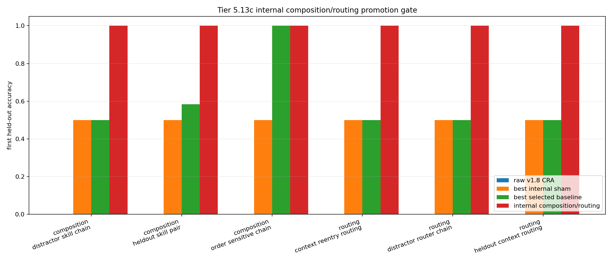

# Tier 5.13c Internal Composition / Routing Promotion Findings

- Generated: `2026-04-29T15:59:51+00:00`
- Status: **FAIL**
- Backend for CRA comparators: `mock`
- Composition steps: `720`
- Routing steps: `960`
- Seeds: `42, 43, 44`
- Composition tasks: `heldout_skill_pair,order_sensitive_chain,distractor_skill_chain`
- Routing tasks: `heldout_context_routing,distractor_router_chain,context_reentry_routing`
- Selected standard baselines: `sign_persistence,online_perceptron,online_logistic_regression,echo_state_network,small_gru,stdp_only_snn`
- Smoke mode: `False`
- Output directory: `<repo>/controlled_test_output/tier5_13c_20260429_155023`

Tier 5.13c tests whether the composition/router scaffolds from Tier 5.13 and 5.13b can be internalized into CRA as a bounded host-side mechanism with causal sham controls.

## Claim Boundary

- This is software evidence, not SpiNNaker hardware evidence.
- The mechanism is internal to the CRA host loop, but not native on-chip routing.
- This does not prove language reasoning, long-horizon planning, AGI, or autonomous tool use.
- A pass authorizes a new composition/routing candidate baseline only after compact regression also passes.

## Comparisons

| Suite | Task | Candidate first | Candidate heldout | Router acc | Raw first | Scaffold first | Best sham | Sham first | Best baseline | Baseline first | Edge vs raw | Edge vs sham | Edge vs baseline |
| --- | --- | ---: | ---: | ---: | ---: | ---: | --- | ---: | --- | ---: | ---: | ---: | ---: |
| composition | distractor_skill_chain | 1 | 1 | None | 0 | 1 | `internal_reset_ablation` | 0.5 | `sign_persistence` | 0.5 | 1 | 0.5 | 0.5 |
| composition | heldout_skill_pair | 1 | 1 | None | 0 | 1 | `internal_reset_ablation` | 0.5 | `online_perceptron` | 0.583333 | 1 | 0.5 | 0.416667 |
| composition | order_sensitive_chain | 1 | 1 | None | 0 | 1 | `internal_reset_ablation` | 0.5 | `online_logistic_regression` | 1 | 1 | 0.5 | 0 |
| routing | context_reentry_routing | 1 | 1 | 0.649123 | 0 | 1 | `internal_router_reset_ablation` | 0.5 | `sign_persistence` | 0.5 | 1 | 0.5 | 0.5 |
| routing | distractor_router_chain | 1 | 1 | 0.428571 | 0 | 1 | `internal_random_router_ablation` | 0.5 | `stdp_only_snn` | 0.5 | 1 | 0.5 | 0.5 |
| routing | heldout_context_routing | 1 | 1 | 0.548387 | 0 | 1 | `internal_random_router_ablation` | 0.5 | `stdp_only_snn` | 0.5 | 1 | 0.5 | 0.5 |

## Criteria

| Criterion | Value | Rule | Pass | Note |
| --- | --- | --- | --- | --- |
| full internal/scaffold/baseline/task/seed matrix completed | 243 | == 243 | yes |  |
| feedback timing has no leakage violations | 0 | == 0 | yes |  |
| internal candidate learned primitive module tables | 192 | > 0 | yes |  |
| internal candidate learned context router | 88 | > 0 | yes |  |
| internal candidate selected routed/composed features before feedback | 1581 | > 0 | yes |  |
| internal candidate reaches composition first-heldout threshold | 1 | >= 0.95 | yes |  |
| internal candidate reaches composition heldout threshold | 1 | >= 0.95 | yes |  |
| internal candidate reaches routing first-heldout threshold | 1 | >= 0.95 | yes |  |
| internal candidate reaches routing heldout threshold | 1 | >= 0.95 | yes |  |
| internal candidate route selection is correct | 0.428571 | >= 0.95 | no |  |
| internal candidate improves over raw CRA | 1 | >= 0.2 | yes |  |
| internal shams are worse than candidate | 0.5 | >= 0.2 | yes |  |
| internal candidate beats selected standard baselines | 0 | >= 0.1 | no |  |

Failure: Failed criteria: internal candidate route selection is correct, internal candidate beats selected standard baselines

## Artifacts

- `tier5_13c_results.json`: machine-readable manifest.
- `tier5_13c_report.md`: human findings and claim boundary.
- `tier5_13c_summary.csv`: aggregate task/model metrics.
- `tier5_13c_comparisons.csv`: candidate-vs-sham/baseline table.
- `tier5_13c_fairness_contract.json`: predeclared fairness/leakage rules.
- `tier5_13c_internal_composition_routing.png`: first-heldout plot.
- `*_timeseries.csv`: per-task/per-model/per-seed traces.

